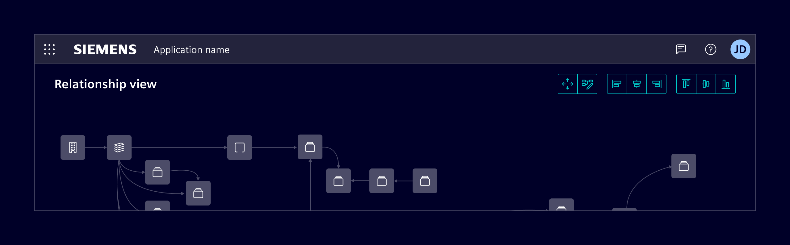
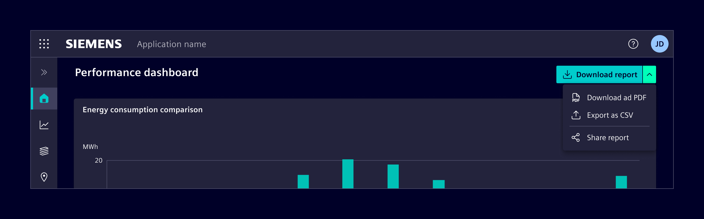
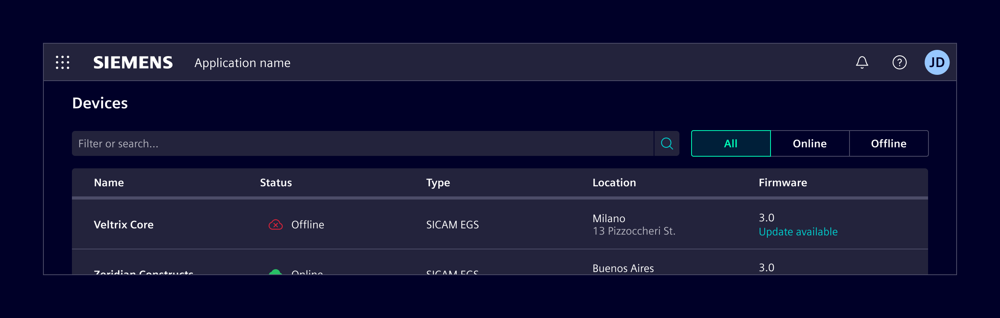
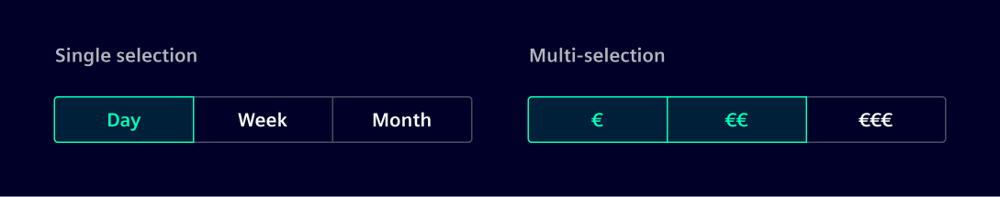
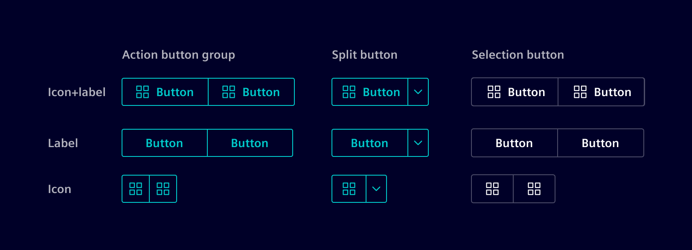
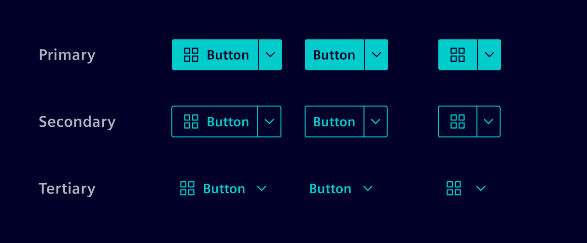
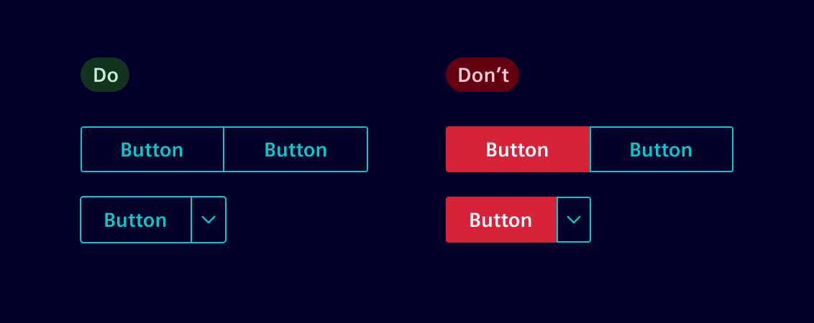

# Button group

A **button group** visually connects multiple related buttons into a single, unified control.
It helps users recognize that the buttons belong to the same context or task area.

## Usage ---

Button groups can contain standard buttons that perform **actions**, or **selection** buttons that represent modes or states.

### Action button group

An **action button group** organizes related commands that belong to the same workflow or functional area.
Each button performs its own action, and several buttons can be used in sequence.

An action button group is a simple row of independent buttons with no collapsing or overflow menu.
Unlike the [content action bar](../buttons-menus/content-actions.md), a unified responsive menu bar treated as one navigable unit,
each button in a button group receives focus individually when tabbing.

Use it for 2–4 direct, peer-level actions (e.g., Expand/Collapse)
when distinct focus and a fixed layout are required instead of unified menu behavior.

### Split button

A **split button** combines a primary action with a secondary dropdown of related options.
It is useful when one action is the default or most common, but additional alternatives are available.

Use it to provide a quick “default” action while still offering variations (e.g., Save / Save as…)

### Selection button

A **selection button** is used for switching between views, modes, or states, rather than executing direct actions.
The group visually connects related choices and communicates a selection state instead of triggering independent commands.

It supports both single and multi-selection, depending on the context:

- **Single selection:** only one option can be active at a time (radio behavior),
  e.g., switching between different views such as `All`, `Read` and `Unread`.
- **Multi-selection:** several options can be active simultaneously (checkbox behavior),
  e.g., filtering by `Temperature`, `Pressure`, and `Voltage`.

### Best practices

- For binary options, such as `yes/no` or `on/off` use a [switch](../forms-inputs/switch.md) component.
- If there are more than five options or not enough horizontal space, use
  the [select](../forms-inputs/select.md) component.
- For multi-select scenarios with unrelated options, prefer the
  [checkbox](../forms-inputs/checkbox.md) component.
- When switching between distinct content areas, such as sub-pages, use
  [tabs](../layout-navigation/tabs.md) component.
- Labels should be nouns or noun phrases that succinctly describe
the action or choice. Do not wrap the text over multiple lines.

## Design ---

### Variants

Button group supports label+icon, label only and icon only.

### Styles

The **action button group** and **split button**, inherits the same visual style and interaction states as
[standard buttons](../buttons-menus/buttons.md).

Although different hierarchies (e.g., primary, secondary, tertiary, or danger) can technically be
combined within the same group, this is not recommended.
**All items should share the same visual style** to maintain cohesion and clarity.

The **selection button** has a dedicated style and is only available in this variant.

### Sizes

The button group follows the same sizing system as standard buttons.
The default height size is `32px`, matching the default button height.

A large size at `40px` is also available for layouts that require increased prominence or touch-friendly targets.

A `28px` small size supports dense, desktop-focused interfaces.
Avoid using it in touch contexts (mobile or tablet) where larger tap areas are required.

### Responsive behavior

The button group component has by nature a horizontal layout and can't be
wrapped or stacked. Therefore, it is recommended to keep the number of items
low to avoid overflowing on smaller screens.

Alternatively, actions can be collapsed under a menu or replaced with a [select](../forms-inputs/select.md),
[radio](../forms-inputs/radio.md), or [checkboxes](../forms-inputs/checkbox.md) component,
depending on the interaction type.
