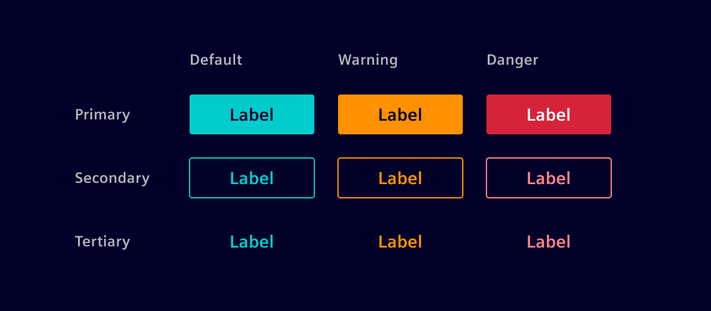
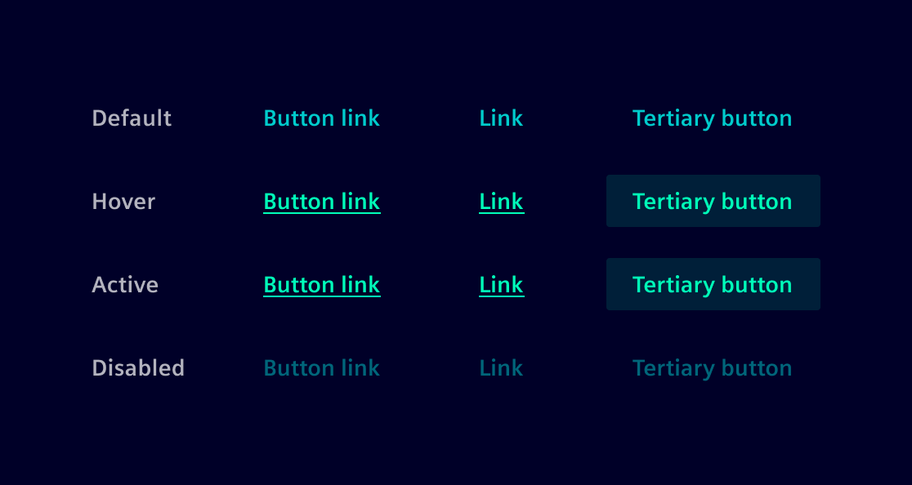
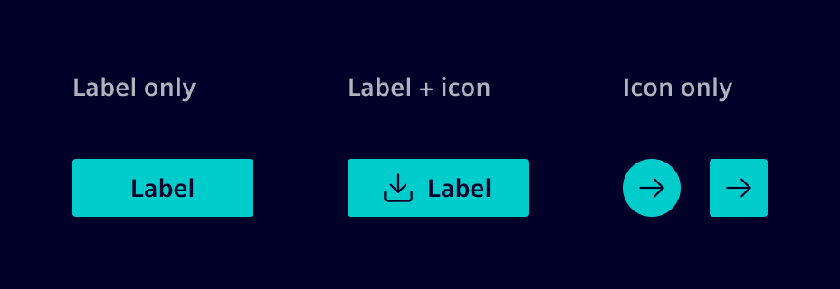
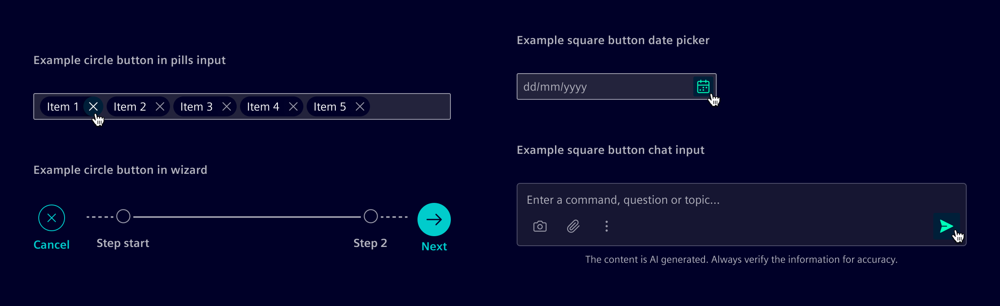

# Buttons

**Buttons** initiate actions and communicate their purpose through labels.

## Usage ---

Use buttons to trigger actions.
Labels should clearly describe the purpose and effect of the action, such as Add, Save, or Delete.

There are three semantic types:

- **Default buttons** for standard actions such as Save or Submit.
- **Warning buttons** for cautious decisions such as Overwrite or Restart.
- **Danger buttons** for destructive actions such as Delete or Remove.

Each button also carries a visual weight:

- **Primary buttons** highlight the main action of the page or task.
- **Secondary buttons** for supporting actions.
- **Tertiary buttons** for low-priority or less prominent actions.



### Button link

A **button link** is a button styled as a [link](../buttons-menus/links.md).

Despite its link-like appearance, its primary distinction lies in its function:
[Links](../buttons-menus/links.md), built with the `<a>` HTML element, are designed for navigation,
whereas button links, created using the `<button>` HTML element, are intended to trigger actions.
This distinction ensures correct semantics, accessibility, and behavior.

While visually similar to a tertiary button, button links work well in tight layouts or inline with text,
where a regular button would be too bulky.



### Best practices

- Use only one primary button per page.
- Ensure call-to-action labels are straightforward and concise.
- Use single-line text for button labels; avoid multi-line text.
- When truncating text, ensure at least three characters of the content remain visible.
- Use the loading button to indicate ongoing processes.
- Use `spacing-6` to define the space between buttons and other components/containers.

## Design ---

### Variants

Buttons support text, icon, or a combination of both.



Icon-only buttons adapt their shape based on layout constraints and visual context.

**Circle buttons** are used when the button is placed inside a circular container (e.g., pills) or in unconstrained,
free-form contexts for standalone actions (e.g., overlays, floating controls, wizard).
The circular shape signals a self-contained action and visually separates it from structured layouts.

**Square buttons** are used in structured layouts where consistent alignment is required (e.g., inputs, tables, cards).
The rectangular shape anchors the action to the surrounding layout and scales better when multiple actions are placed side by side.



### Size

Buttons are available in three height variants:

- **Small** (24px) for compact areas such as inside input fields.
- **Default** (32px) for general use across most layouts.
- **Large** (40px) for high-visibility actions or spacious layouts.

### Button placement

The position and alignment of buttons is defined in relationship to their container.
Buttons can be aligned right or center in relation to the parent container.

#### Related buttons

This is the case of two or more buttons that display related actions (e.g: save/cancel).

- Related buttons should all be the same width
- Spacing (margin) between related buttons is `spacing-s`

### Responsive grid

Typically, buttons are placed side by side. However, if the viewport becomes
too narrow to display all the text label, buttons should be stacked
following the responsive grid.

#### Text truncation

Text labels should be short and concise.
When a long label cannot be avoided, truncate it with an ellipsis `(…)` at the end of the line.
Only wrap the text when the full label is critical and truncation would cause loss of meaning.

## Code ---

### References

- **Bootstrap:** [Buttons](https://getbootstrap.com/docs/5.1/components/buttons/)

### Example

<si-docs-component example="buttons/buttons" height="330"></si-docs-component>

### Navigation buttons

There are cases in which a navigation links shall look like buttons. For example,
the link in the info page looks like a primary button to raise attention
and let the user navigate to a next page.

For these cases, use a `<a>` element styled as a button.

```html
<a class="btn btn-primary" href="https://siemens.com">Go back</a>
```

### Placement

In the following demo we showcase different button placements and dealing
with long text, using the bootstrap utilities classes.

First row shows the default buttons. All text is always visible. Decreasing container
width will increases the text lines.

Second row uses text truncation to keep button text in one line. Make sure the user
can read important text. Optionally, work with min-width.

Third row uses the responsive grid to for a vertical button placement if width
is smaller than 576px (see [Bootstrap Grid](https://getbootstrap.com/docs/5.1/layout/grid/)).

Row four and five show the same layout for task based dialogs like a modal dialog.
The first uses the `modal-footer` class, followed by the same CSS styling using
the [Bootstrap Utilities](https://getbootstrap.com/docs/5.1/utilities/api/).

<si-docs-component example="buttons/buttons-placement" height="450"></si-docs-component>
