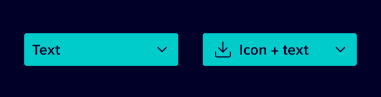
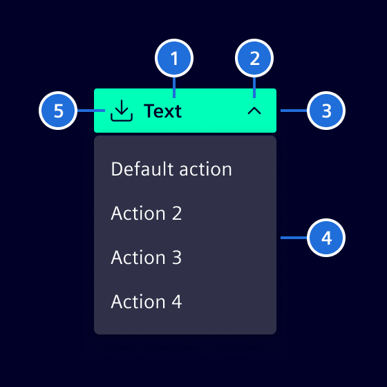
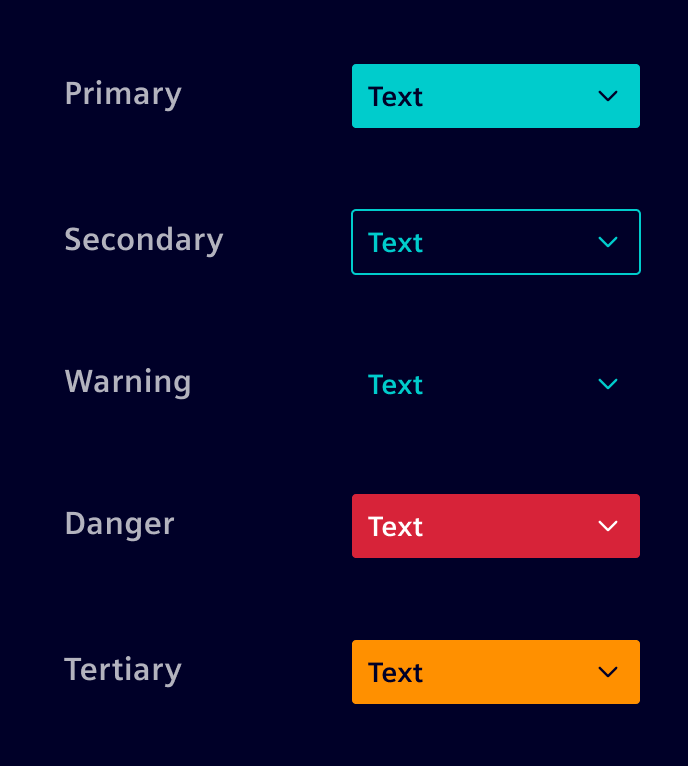

# Dropdowns

**Dropdowns** are toggleable, contextual overlays for displaying actions related to the content.

## Usage ---

They consist of a dropdown toggle and an overlay containing the actions.
The overlay is shown after clicking the dropdown toggle.
Dropdown are available with text only or with text and icon.



### When to use

- When there is a need for actions, which are related to each other
  (e.g. Export: PDF, Excel, Word, ...).
- When users need to make a choice among a list of mutually exclusive options.

### Best practices

- Minimal button width is `100px`.
- Menu container should be at least the same width as the button.

## Design ---

### Elements



> 1. Placeholder text, 2. Arrow, 3. Container, 4. [menu container](menu.md), 5. Icon (optional)

### Variants



Interaction states are identical to the [normal buttons](buttons.md).

## Code ---

!!! warning "Dropdown menu"

    If the overlay should show a contextual menu, please use the [menu component](menu.md).
    It already implements specific keyboard interactions and aria roles that are needed for a _dropdown menu_.

Use a [button](buttons.md) with the `dropdown-toggle` class as the trigger and place the content in a
`dropdown-menu`. Add a `dropdown-caret` icon to indicate that the button opens an overlay.

The theme provides the dropdown styles. Use the [CDK Overlay module](https://material.angular.io/cdk/overlay/overview)
to create, position, and dismiss the overlay. The CDK directives can also be used with content that does not use
the `dropdown-menu` class.

<si-docs-component example="dropdown/dropdown-with-overlay" height="200"></si-docs-component>

The overlay is toggled by the `open` property which needs to be updated properly.
We added a transparent backdrop to the overlay so that we can listen for `(backdropClick)` which should close the overlay.
The listener for `(detach)` is necessary for updating the `open` property after escape was pressed.
In a real world scenario, one has to be careful here, because `(detach)` is always called when the overlay is closed.

For having a proper keyboard interaction, we are using the [CDK Focus trap](https://material.angular.io/cdk/a11y/overview#focustrap).
It ensures that the focus will remain within the overlay while it is open.
Enabling `[cdkTrapFocusAutoCapture]="true"` ensures, that the focus will be moved into the overlay on creation and returned to the trigger when the overlay is closed.

### Menu content

Use `dropdown-item` for interactive actions. It supports the `active` and `disabled` states. Use
`dropdown-item-text` for non-interactive content and `dropdown-header` to label a group of items.
Use `dropdown-divider` to separate related groups.

```html
<div class="dropdown-menu show">
  <div class="dropdown-header">Export</div>
  <button type="button" class="dropdown-item active">PDF</button>
  <button type="button" class="dropdown-item">Excel</button>
  <button type="button" class="dropdown-item" disabled>Word</button>
  <div class="dropdown-divider"></div>
  <div class="dropdown-item-text">Exports include the current filters.</div>
</div>
```

For items with icons, place the icon before an `item-title`. A trailing `menu-end-icon` can communicate an
additional state or a follow-up action.

```html
<button type="button" class="dropdown-item">
  <si-icon class="icon" icon="element-download" />
  <span class="item-title">Download</span>
  <si-icon class="menu-end-icon icon" icon="element-right-2" />
</button>
```

### Long menus

`dropdown-menu` scrolls when its height exceeds the viewport. Add `dropdown-menu-scroller` to apply the
recommended bounded height for menus with many items.

```html
<div class="dropdown-menu dropdown-menu-scroller show">
  <!-- Dropdown items -->
</div>
```

### Related components

Use [button groups](button-group.md) to create split-button patterns. Use the [menu component](menu.md) when the
content, see [content actions](content-actions.md).

<si-docs-api directive="CdkConnectedOverlay"></si-docs-api>

<si-docs-api directive="CdkOverlayOrigin"></si-docs-api>

<si-docs-api directive="CdkTrapFocus"></si-docs-api>

<si-docs-types></si-docs-types>
