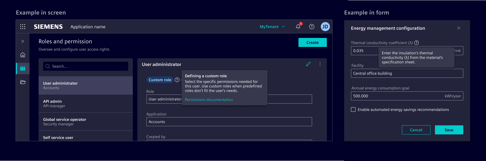
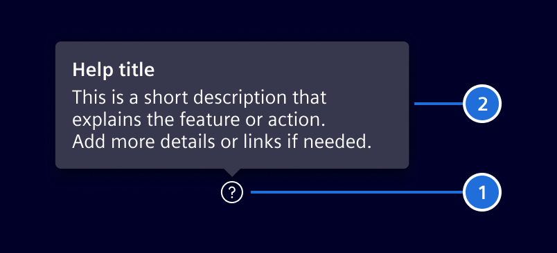
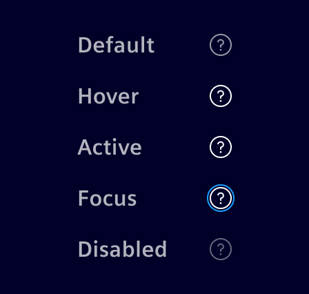

# Help button

The **help button** provides immediate, contextual assistance via a [popover](../status-notifications/popover.md).

## Usage ---

It is designed to help users understand specific actions or features on the current page without navigating away.
The button uses the `element-help` icon and is typically placed near form labels or interactive elements that require clarification.



### When to use

- When users may need clarification about a specific field, feature, or action.
- In forms, dashboards, or complex workflows.

### Best practices

- Keep content short and focused on the immediate context.
- Include links to more detailed information only when necessary.
- Position the help button to the right of the element it supports (or left for RTL languages).
- Avoid overusing help buttons across a page. When more complex or detailed information is required,
  refer to the other [help patterns](../../patterns/help.md).

## Design ---

### Elements



> 1. Help button, 2. Popover

### States



## Code ---

### Usage

```ts
import { SiHelpButtonComponent } from '@siemens/element-ng/help-button';

@Component({
  imports: [SiHelpButtonComponent, ...]
})
```

<si-docs-component example="si-help-button/si-help-button" height="230"></si-docs-component>

<si-docs-api component="SiHelpButtonComponent"></si-docs-api>

<si-docs-types></si-docs-types>
