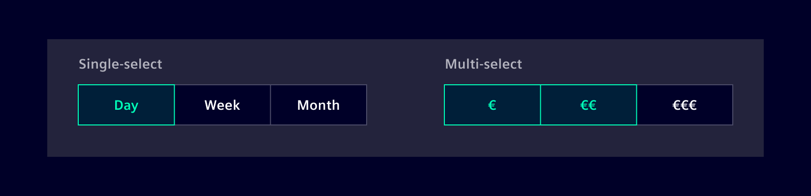

# Segmented Button

The **Segmented button** component is group of controls that can be used to
quickly switch between two and up to five views, options or states. By default
this component will always have one selected or active item.

## Usage ---

There are two types of segmented buttons: `Single-select` and `Multi-select`.

`Single-select` segmented buttons are used to select a single option, switch
between views or sort elements, while `Multi-select` ones are used to select
multiple options from a group of options.

### When to use

- Use segmented buttons to provide closely related choices that affect an
  object, state, or view. E.g. segmented buttons can help user to switch between
  different application views.
- To narrow down large groups of content. E.g. in a messaging application to
  divide messages into three different views such as `All`, `Read` and `Unread`.

### When not to use

- For `Multi-select` cases, if you have unrelated options to choose from, it's
  better to use a [checkbox](../forms-inputs/checkbox.md)-component.
- When navigating between **distinct content areas** like sub-pages, use
  [tabs](../layout-navigation/tabs.md)-component instead.
- For binary options, such as `yes/no` or `on/off` use a
  [switch](../forms-inputs/switch.md)-component instead.
- If there are more than five options or not enough horizontal space, then use
  the [select](../forms-inputs/select.md)-component.

### Dos and don'ts

- Avoid using the segmented button component to offer actions, such as adding,
  removing, or editing content.
- Avoid crowding the control with too many segments, optimally *2* or *3* items
  but not more than *5*.
- Try to size the content within each view similarly, so that users don’t
  encounter pages that are significantly different in each section.

## Design ---

### Variations

There are three different visual representations: `Text`, `Text + Icon` and
`Icon`.

Be consistent with the way visual cues are used in each button. Use either all
icons, all text labels, or all text labels with icons. If you can't find a
meaningful icon for all segments, don’t use icons at all. Keep the segment width
consistent. Only when all segments have and identical width, segmented buttons
feel balanced.

### Elements

> 1. Active state, 2. Inactive state, 3. Icon, 4. Label

Segmented button labels should be nouns or noun phrases that succinctly describe
the choice. Button labels shall not wrap over multiple lines.

### States

The component supports different button states: `Active`, `Hover`, `Default` and
`Focus`.

### Sizes

There are two sizes to choose from, `Regular` or `Small`. If there is a concern
regarding vertical space, use the `Small` version.

### Responsive Behavior

The segmented button component has by nature a `horizontal`-layout and can't be
wrapped or stacked. Therefore, it is recommended to keep the number of segments
low to avoid overflowing on smaller screens. Secondly, if there is still not
enough space, this component can be replaced by a [select](../forms-inputs/select.md),
[radio](../forms-inputs/radio.md) or [checkboxes](../forms-inputs/checkbox.md)-component.

## Code ---

### Example

<si-docs-component example="buttons/segmented-button" height="300"></si-docs-component>
