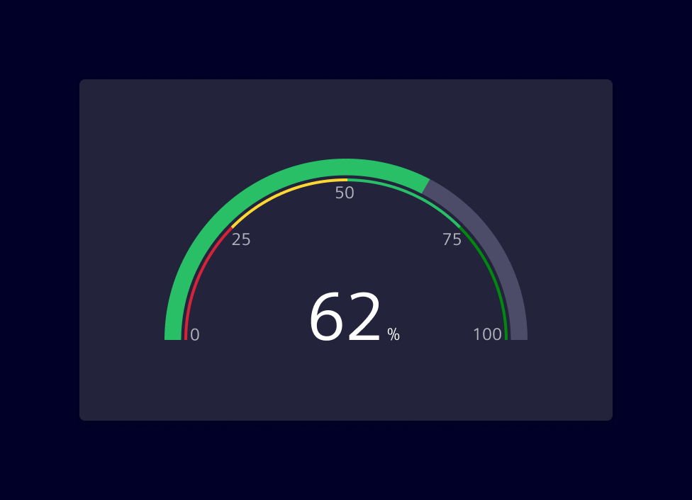
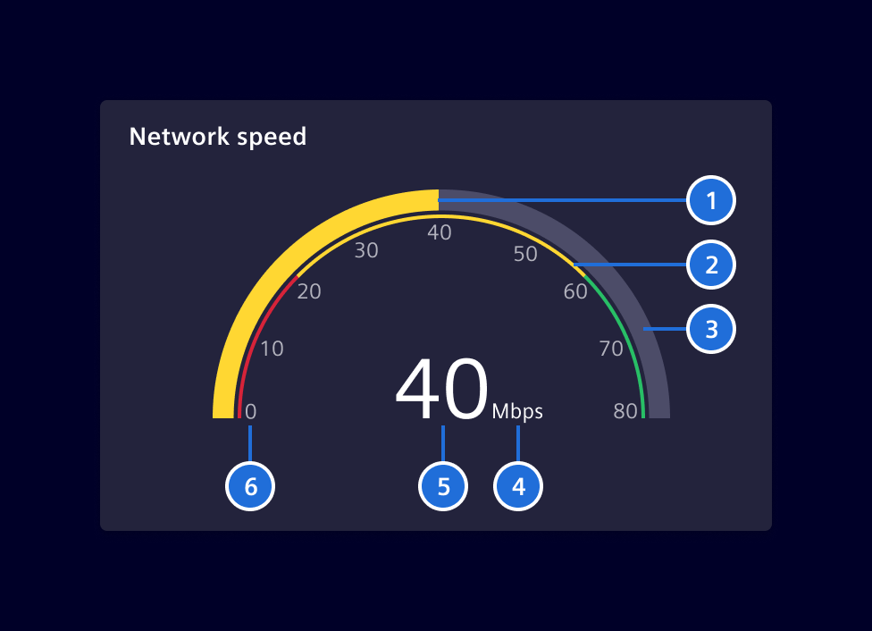

# Gauge chart

**Gauge charts** are data visualization elements that represent one or more
values as a position on a radial scale. They display a simple and concise
value in comparison to a maximum and minimum limit.

Element provides two gauge components:

- **ECharts-based gauge chart** (`SiChartGaugeComponent`) — a full-featured
  gauge built on [ECharts](https://echarts.apache.org/), part of
  `@siemens/charts-ng`.
- **Native gauge chart** (`SiNChartGaugeComponent`) — a lightweight,
  dependency-free gauge, part of `@siemens/native-charts-ng`.

## Usage ---

Gauge charts are commonly used to display performance metrics, such as
percentage completion, quality scores or to indicate real-time values like
temperature or speed.

The chart can be accompanied by color coding to indicate different ranges or
thresholds. The gauge shows the value and its position between the minimum and
maximum, highlighted with a color that corresponds to the range the value
currently falls into.



### Best practices

- Ensure that the numeric scale used is clear and easy to understand. It's
  helpful to include the maximum and minimum values, as well as any threshold or
  target values.
- Color-coding is a useful way to indicate different ranges or thresholds.
  Choose colors that are meaningful in relation to the data being represented.
- Keep it simple. Gauge charts are best suited for displaying simple,
  straightforward data.
- If there is a need to represent a crucial system status (e.g: `danger`,
  `warning` or `caution`) provide additional visual cues, such as text labels
  or icons, to support accessibility.

### Choosing a gauge component

Both components cover the same basic use case — showing a value against a
minimum/maximum range — but differ in features, dependencies and footprint.

Use the **ECharts-based gauge chart** when you rely on ECharts-specific configuration options and when the application already uses ECharts for other charts.

Use the **Native gauge chart** when bundle size or runtime performance is a concern, or when you need
to visualize multiple stacked values within a single ring.

## Design ---

### ECharts-based gauge chart

A gauge chart displays data similar to a circle chart, but with a needle or dial
to indicate where the data point(s) falls over a particular range.



> 1. Progress, 2. Qualitative Range (Optional), 3. Base, 4. Unit, 5. Value, 6. Scale (Optional)

### Native gauge chart

T.B.D

## Code ---

### ECharts-based gauge chart

??? info "Required Packages"

    - [echarts](https://www.npmjs.com/package/echarts)

```ts
import { SiChartGaugeComponent } from '@siemens/charts-ng/gauge';

@Component({
  imports: [SiChartGaugeComponent, ...]
})
```

<si-docs-component example="si-charts/gauge/si-chart-gauge" height="400"></si-docs-component>

<si-docs-api component="SiChartGaugeComponent" package="@siemens/charts-ng" hideImplicitlyPublic="true"></si-docs-api>

### Native gauge chart

```ts
import { SiNChartGaugeComponent } from '@siemens/native-charts-ng/gauge';

@Component({
  imports: [SiNChartGaugeComponent, ...]
})
```

#### Sum mode

Multiple series arcs are stacked on the gauge ring. The center shows their combined total.

<si-docs-component example="si-ncharts/si-nchart-gauge" height="400"></si-docs-component>

#### Single mode

A single arc covers the ring. Colored background segments can be layered beneath the arc to indicate qualitative ranges.

<si-docs-component example="si-ncharts/si-nchart-gauge-single" height="400"></si-docs-component>

<si-docs-api component="SiNChartGaugeComponent" package="@siemens/native-charts-ng" hideImplicitlyPublic="true"></si-docs-api>

<si-docs-types></si-docs-types>
