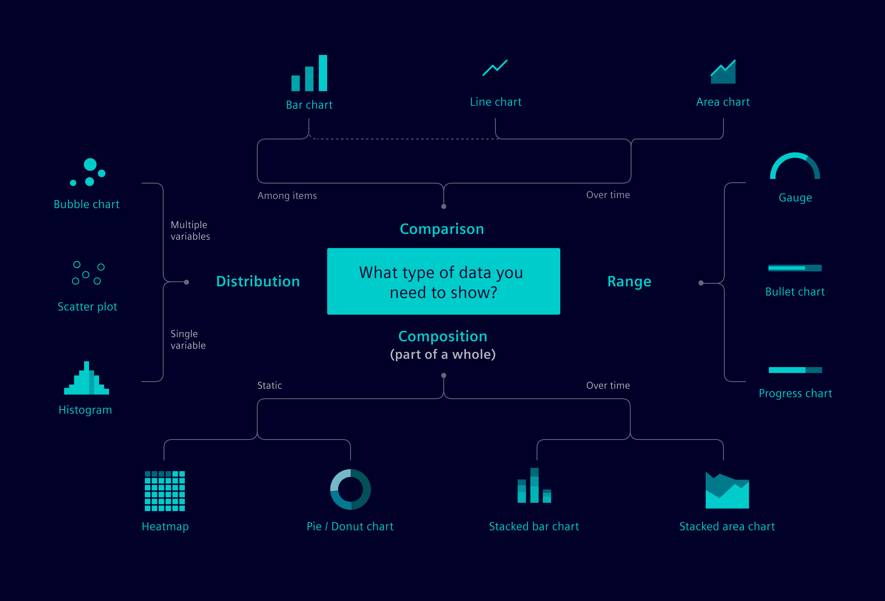
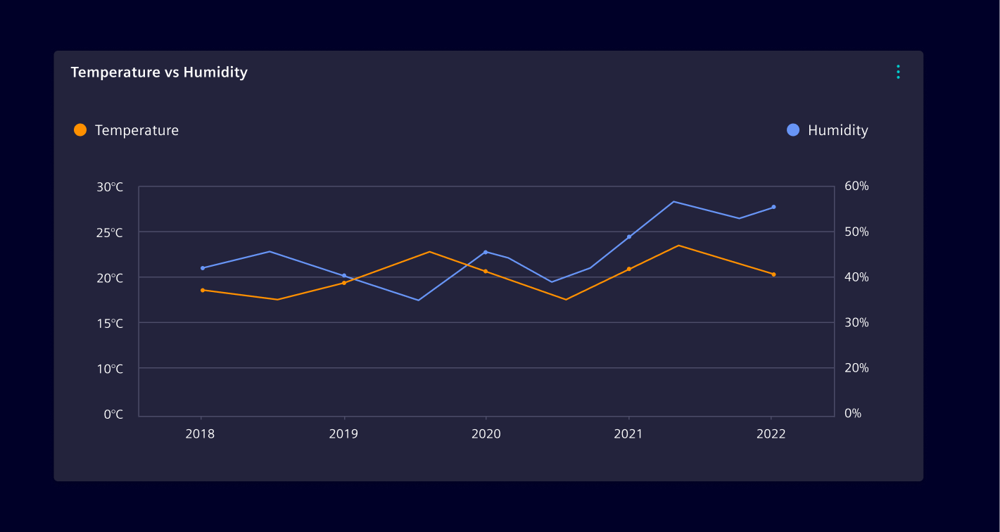
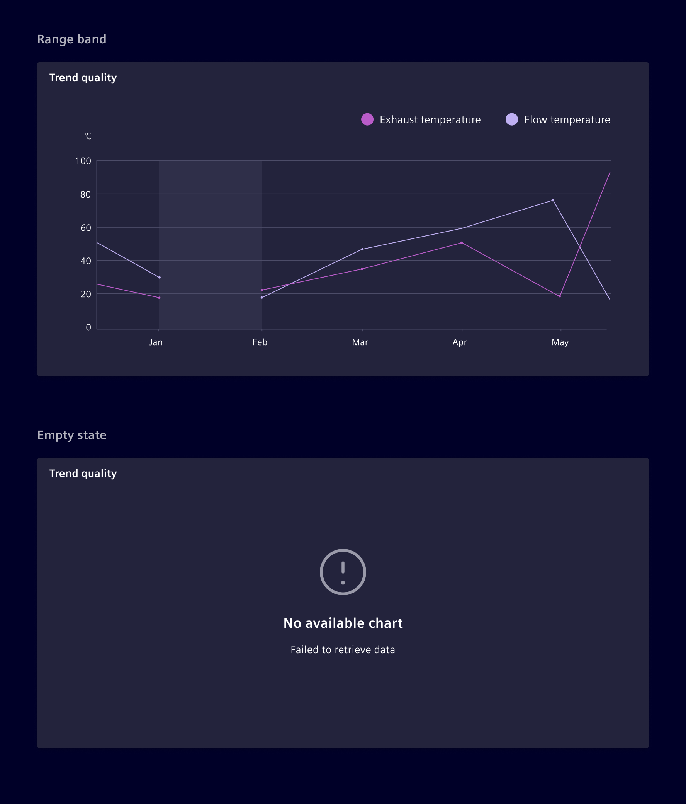
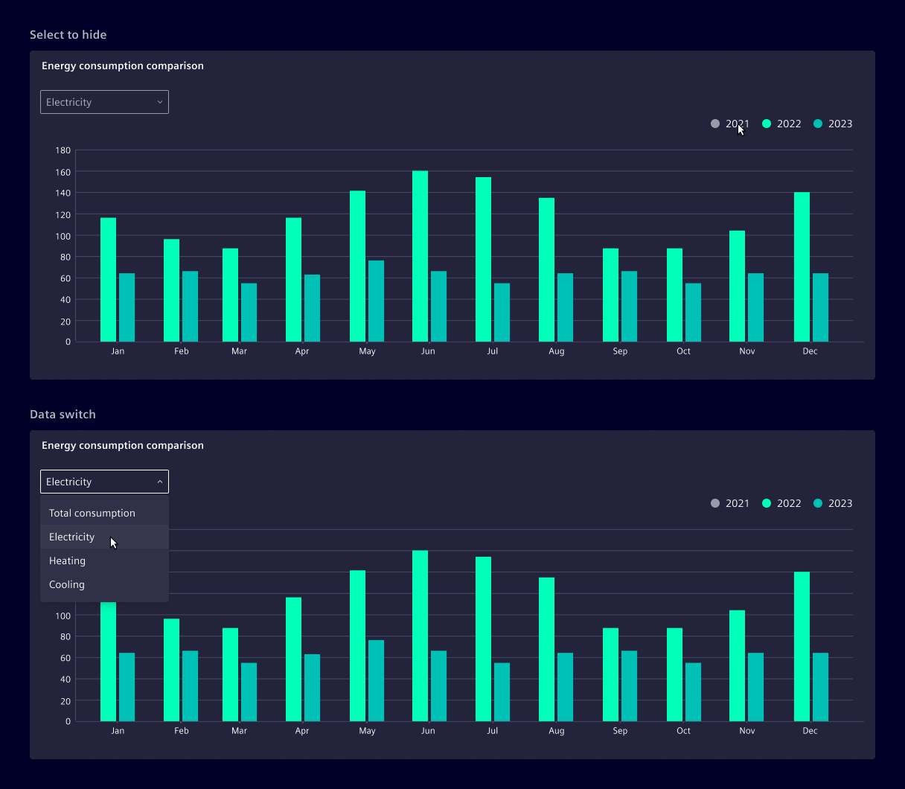

# Charts

The **Element Charts** library is a collection of charts based on [ECharts](https://echarts.apache.org/).
It features a variety of chart styles for different kind of datasets. The source
code can be found in the [charts-ng folder](https://github.com/siemens/element/blob/main/projects/charts-ng).

## Usage ---

The first step to select the correct type of chart is to understand the type of
data, use context and functionality of the chart.

Please take in consideration what do you want to communicate to the user and
select the chart based on your analysis. The following graphic is a suggested
chart usage. Use good judgement to select the best representation for the data
available.



- **Range**
    - [Gauge Chart](gauge-chart.md)
    - Bullet chart
    - Consumption chart

- **Comparison**
    - [Bar Chart](bar-chart.md)
    - [Line Chart](line-chart.md)
    - Area Chart

- **Distribution**
    - Bubble Chart
    - [Scatter Plot Chart](scatter-chart.md)
    - Histogram

- **Composition**
    - Heatmap
    - [Pie/Donut Chart](circle-chart.md)
    - Stacked Bar Chart
    - Stacked Area Chart

There is also a [*Generic Chart*](generic-chart.md) which provides full
flexibility by supporting all ECharts options.

More examples can be found in our [playground](https://element.siemens.io/element-examples/#/overview?q=si-charts)
by filtering for `si-charts`.

### Axis and Labels

The axis and labels of a chart are crucial to provide context and structure to
the data being displayed. Use **clear, concise and accurate metrics** to reflect
the information.

Up to two axis can be shown on a chart if needed. In this case, both axes should
be scaled consistently to ensure accurate comparison. Be mindful about using
two axis since they are more complex and difficult to interpret than single axis
charts.



### Missing Data

Use a **range band** to represent instances where there is no data available for
a specific time period.

Use [*Empty State*](../status-notifications/empty-state.md) if the data cannot
be retrieved for the whole chart.



### Legends

**Legends** are a key or explanatory notes that add context and meaning to data
represented within the chart.

The legends are positioned at the top right of the chart. Depending on the
context, it's possible to position the legends at the right bottom or right to
the graph.

- When possible, order the items in the legend to match the order of the data in
  the chart.
- Avoid using a legend if there is only one category of data.

### Interactions



#### Select to Hide

Data series can be hidden/shown by selecting the corresponding legend.

#### Data Switch

If needed, use a [*Select*](../forms-inputs/select.md) component to allow the
user to switch between different data sets or representations within the same
chart.

## Theming ---

There is no support for CSS styling. Element Charts uses EChart themes with
options defined as a simple JS object (no JSON). It is possible to load/register
a theme for each chart separately or to load a default theme for everything. Be
aware that if no theme is loaded, all styles of your charts are set to the
default styles of ECharts itself.

The desired default theme can be loaded anywhere in your project like this:

```typescript
import { themeSupport } from '@siemens/charts-ng';
import { themeNameA } from 'your/theme-a';
import { themeNameB } from 'your/theme-b';

themeSupport.registerTheme(themeNameA);
themeSupport.registerTheme(themeNameB);

themeSupport.setDefault(themeNameA);
```

`themeNameA` or `themeNameB` correspond with the name of the imported JS
objects.

For further details to define your own theme see also
[element.ts](https://github.com/siemens/element/blob/main/projects/charts-ng/src/shared/themes/element.ts)
as a reference.

## Resizing ---

Charts do have a static size, assumed during their initial rendering and are not
automatically refreshed in case their parent container changes size. It is the
responsibility of a consuming application to invoke a re-draw if such an event
occurs. Such a re-draw can be initiated by using the `resize()` function,
exposed by the component.

The easiest way to detect such a size-change event is by using Element's
`siResizeObserver`, which will invoke an action, if the attached DOM element
changes size. Combining those two aspects leads to following example, which
takes care of all re-sizing and re-drawing aspects:

```html
<si-chart
  #chart
  (siResizeObserver)="chart.resize()"
  [options]="options"
></si-chart>
```

> **Note:** This pattern is not only handy in case of a resize scenario but
> could actually be required in *some* cases to see any data at all. If a chart
> is getting initialized while it's not visible, wrong size values could lead to
> a blank component. Such scenarios include shadow DOMs, as it's the case with
> Ionic components.

### Minimum chart height

The charts have a defined minimum height of 200px. In edge cases where this is too small, the
minimum can be overridden with the CSS variable `--si-chart-min-height`.
