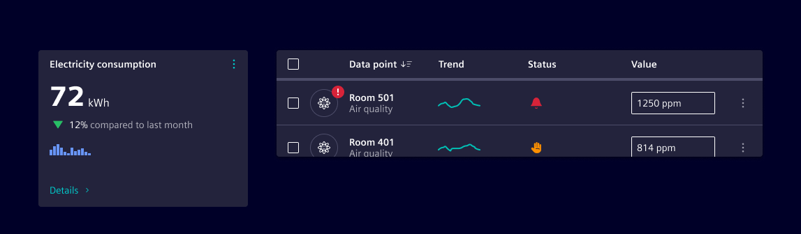
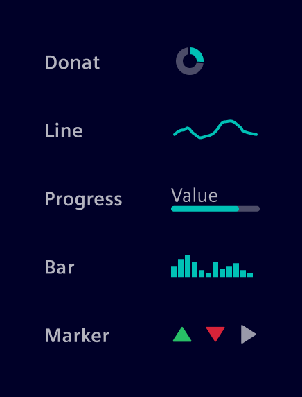
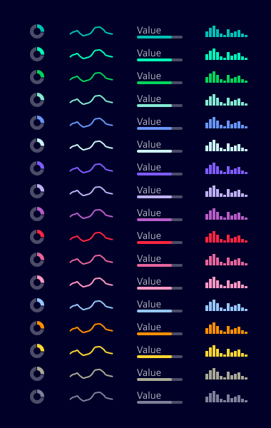

# Micro charts

**Micro charts** are compact, visual elements designed to convey trends, comparisons, and progress at a glance.

## Usage ---

They are ideal for dashboards, tables, and summary views where space is limited but insight is essential.



### When to use

- To show data trends or comparisons in a compact space.
- Users benefit from visual context without needing full chart interactivity.
- Summarizing performance metrics, KPIs, or status indicators.
- Common use cases: Table rows with performance data, dashboard widgets, inline summaries in reports or cards.

### Best practices

- Micro charts are typically non-interactive and represent a single value or series.
- All micro charts should follow a standard size for uniformity.
- Pair micro charts with clear labels or tooltips for context.
- Use consistent chart types across similar data sets.
- Don’t use micro charts for complex datasets or detailed analysis.
- Don’t rely solely on color to convey meaning—ensure accessibility, use aria labels, alternative text or tooltips.
- Don’t overcrowd the interface with too many micro charts.

## Design ---

They are minimalistic in design and keep visual noise low to maintain clarity.

### Types of micro charts



- **Donut:** Displays proportional data.
- **Line:** Shows trends over time.
- **Progress:** Indicates completion or status.
- **Bar:** Compares discrete values.
- **Marker:** Green/red up/down marker - Highlights positive or negative change.

### Colors

Make use of data visualization [categorial colors](../../fundamentals/colors/data-visualization-colors.md/#categorical-colors).



## Code ---

### Usage

```ts
import { SiMicroBarComponent } from '@siemens/native-charts-ng/micro-bar';
import { SiMicroDonutComponent } from '@siemens/native-charts-ng/micro-donut';
import { SiMicroLineComponent } from '@siemens/native-charts-ng/micro-line';
import { SiMicroProgressComponent } from '@siemens/native-charts-ng/micro-progress';

@Component({
  imports: [SiMicroBarComponent, SiMicroDonutComponent, SiMicroLineComponent, SiMicroProgressComponent, ...]
})
```

### Micro charts

<si-docs-component example="si-ncharts/si-micro-charts" height="400"></si-docs-component>

<si-docs-api component="SiMicroBarComponent" package="@siemens/native-charts-ng" hideImplicitlyPublic="true"></si-docs-api>

<si-docs-api component="SiMicroDonutComponent" package="@siemens/native-charts-ng" hideImplicitlyPublic="true"></si-docs-api>

<si-docs-api component="SiMicroLineComponent" package="@siemens/native-charts-ng" hideImplicitlyPublic="true"></si-docs-api>

<si-docs-api component="SiMicroProgressComponent" package="@siemens/native-charts-ng" hideImplicitlyPublic="true"></si-docs-api>

<si-docs-types></si-docs-types>
