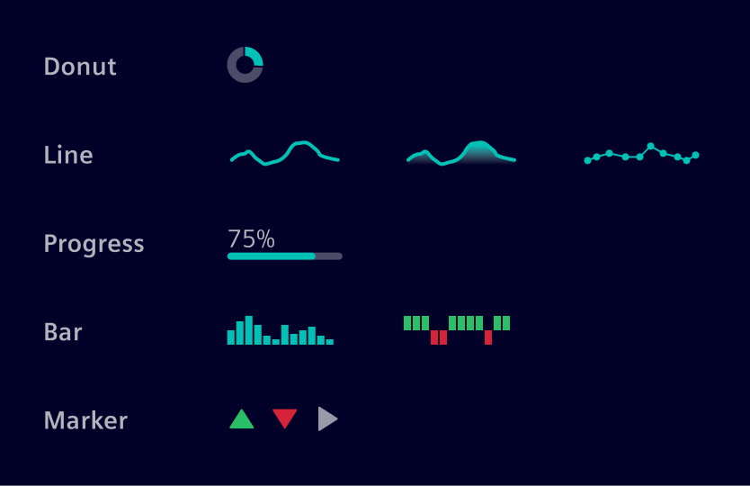
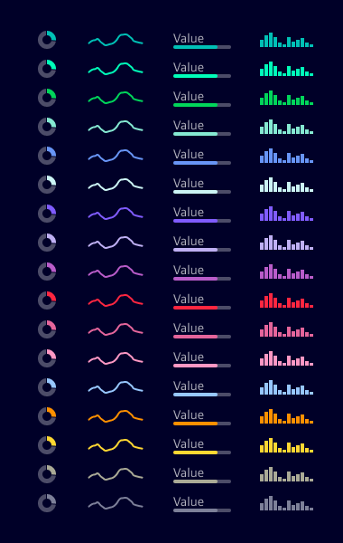

# Micro charts

**Micro charts** are compact, data-rich visual elements designed to convey trends, comparisons, and progress at a glance. They are ideal for dashboards, tables, and summary views where space is limited but insight is essential.

## Usage ---

### When to use

- You need to show data trends or comparisons in a compact space.
- Users benefit from visual context without needing full chart interactivity.
- You’re summarizing performance metrics, KPIs, or status indicators.
- Common use cases: Table rows with performance data, dashboard widgets, inline summaries in reports or cards.

### Best practices for micro charts

- All micro charts should follow a standard size for uniformity.
- Pair micro charts with clear labels or tooltips for context.
- Use consistent chart types across similar data sets.
- Don’t use micro charts for complex datasets or detailed analysis.
- Don’t rely solely on color to convey meaning—ensure accessibility, use aria labels, alternative text or tooltips .
- Don’t overcrowd the interface with too many micro charts.

## Design ---

Micro charts are typically non-interactive and represent a single value or series.
They are minimalistic in design and keep visual noise low to maintain clarity.

### Types of micro charts

- **Line:** Shows trends over time.
- **Bar:** Compares discrete values.
- **Donut:** Displays proportional data.
- **Progress:** Indicates completion or status.
- **Marker:** Green Up / Red Down Marker – Highlights positive or negative change.

### Colors

Make use of data visualization colors.

## Code ---

Will be implemented soon.
