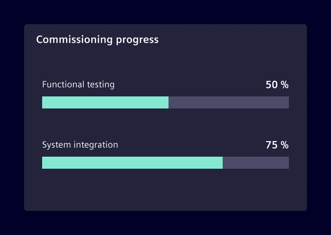
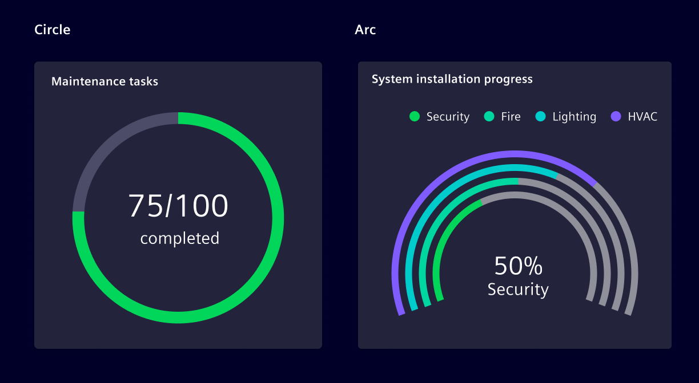
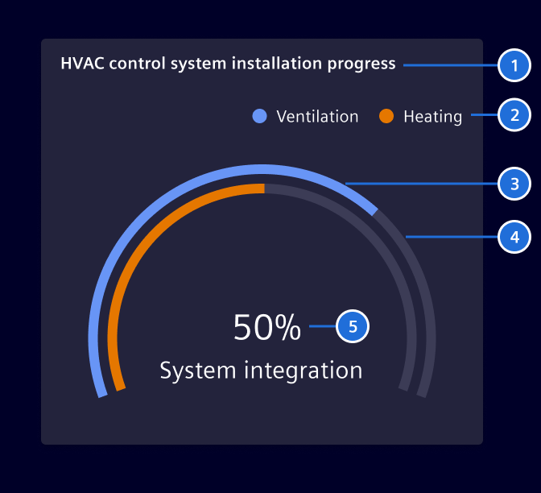

# Progress chart

**Progress charts** are a graphical representation of progress towards a
specific goal or metric.

## Usage ---

This chart displays the progress made toward a certain goal. It allows to
monitor objectives, providing critical data for strategic decision-making and
more.

### Bar chart representation

A **progress charts** chart uses a linear format to represent progress,
typically as a bar that grows from left to right. This type of chart works
better for layouts that take more horizontal space.

Consider using it when there is a need to display detailed information, such as
specific values or long labels, as this information can be displayed alongside
the bar.



### Radial chart representation

This variation of the chart shows the amount of progress made as a portion of a
circle. Use it to display data in a compact and visually appealing way, and to
save space on a dashboard or report.

Consider using it to show a general representation of progress, without too many
details.

The chart can be configured to be a **360° circle** or an **arc**.



### Best practices

- The default arc angle is `220°`. If needed, it can also be configured to
  `360°`, `90°` or `270°`.
- Take the context into consideration when selecting colors. Use colors that are
  a good match and represent the situation.
- Don't use it if the end of the progress cannot be determined.
- Don't layer more than **4** arcs on the same chart.
- Provide context by including labels or annotations that explain what the chart
  represents.

## Design ---



> 1. Chart title, 2. Legend, 3. Progress, 4. Base, 5. Value (optional)

## Code ---

### Usage

??? info "Required Packages"
    - [echarts](https://www.npmjs.com/package/echarts)

```ts
import { SiChartProgressComponent } from '@siemens/charts-ng';

@Component({
  imports: [SiChartProgressComponent, ...]
})
```

<!-- markdownlint-disable-next-line MD024-->
### Progress chart

A progress chart displays data values as a simple progress bar shown with arcs
instead of bars. Every arc is used to visualize the progression of an item.

<si-docs-component example="si-charts/si-chart-progress" height="400"></si-docs-component>

<si-docs-api component="SiChartProgressComponent" package="@siemens/charts-ng" hideImplicitlyPublic="true"></si-docs-api>

### Progress bar chart

A more traditional progress chart using horizontal bars.

<si-docs-component example="si-charts/si-chart-progress-bar" height="400"></si-docs-component>

<si-docs-api component="SiChartProgressBarComponent" package="@siemens/charts-ng" hideImplicitlyPublic="true"></si-docs-api>

<si-docs-types></si-docs-types>
