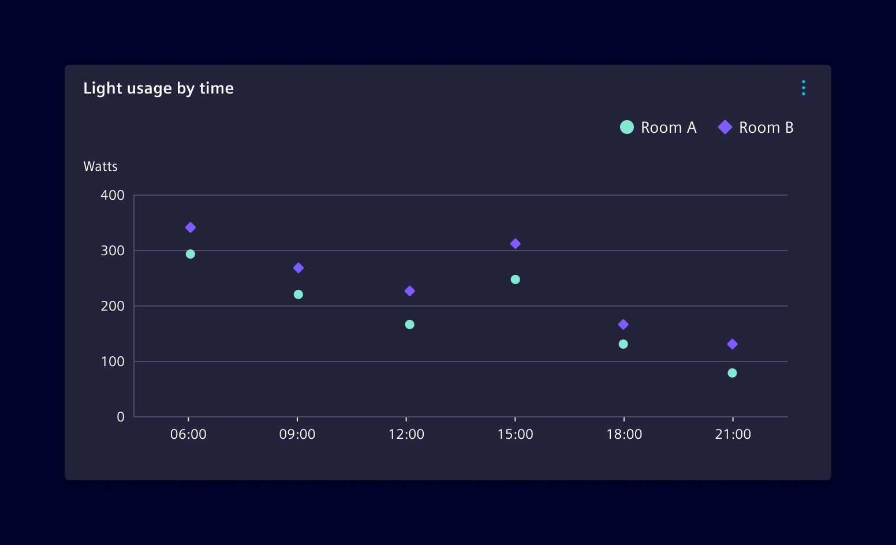

# Scatter chart

A **Scatter chart** uses dots to represent values for two different numeric
variables. The position of each dot on the horizontal and vertical axis
represents the values of an individual data point.

## Usage ---

Use this chart to show the correlation between two variables, to identify a
distribution pattern or potential outliers.

Different shapes can be used to make the information more accessible. The circle
is the default shape, but it can be combined with rectangle, triangle or diamond
shapes as needed.



### Best practices

- Use colors and shapes to help differentiate between data points.
- Provide context for the data by including relevant annotations and explaining
  the significance of trends and highlighted patterns.
- Avoid overcrowding the chart by limiting the number of data points displayed
  or by using a subset of data that is representative of the overall trend.
- Consider the distribution of the data on both the X and Y axes and choose an
  appropriate axis scale that accurately reflects the relationships between the
  variables.
- Keep the design of the chart simple and uncluttered. Avoid adding unnecessary
  elements that can distract from the data.

## Design ---

If you want to display values as a collection of points, a scatter chart would
be your best choice.


> 1. Chart title, 2. Legend, 3. Points, 4. X axis, 5. Y axis

## Code ---

### Usage

??? info "Required Packages"
    - [echarts](https://www.npmjs.com/package/echarts)

```ts
import { SiChartCartesianComponent } from '@siemens/charts-ng';

@Component({
  imports: [SiChartCartesianComponent, ...]
})
```

<si-docs-component example="si-charts/si-chart-scatter" height="400"></si-docs-component>

<si-docs-api component="SiChartCartesianComponent" package="@siemens/charts-ng" hideImplicitlyPublic="true"></si-docs-api>

<si-docs-types></si-docs-types>
