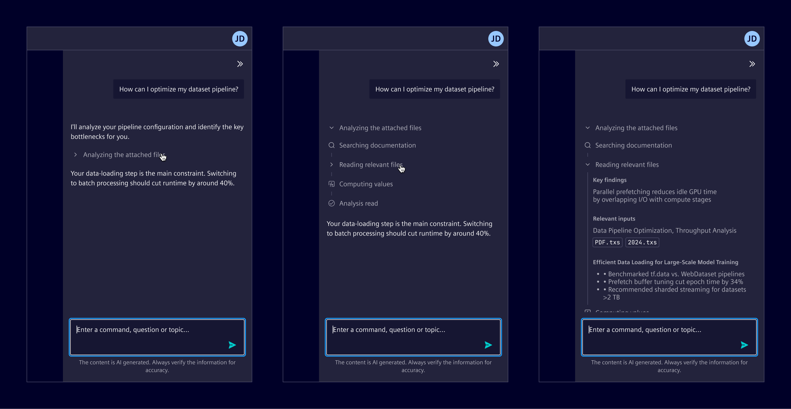
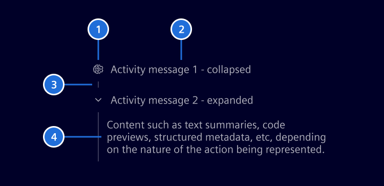
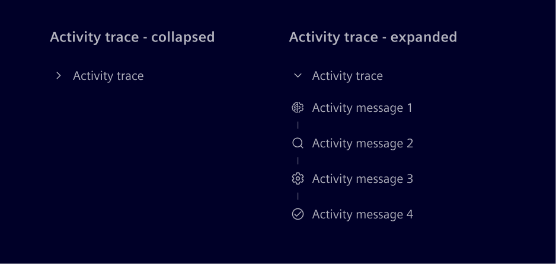
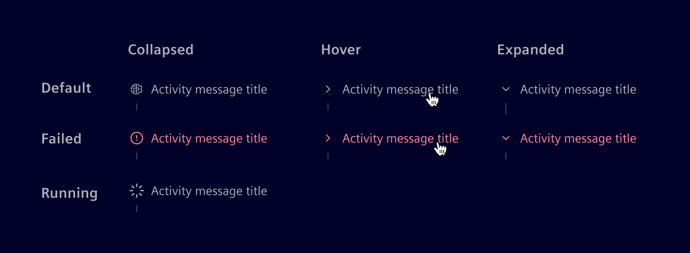
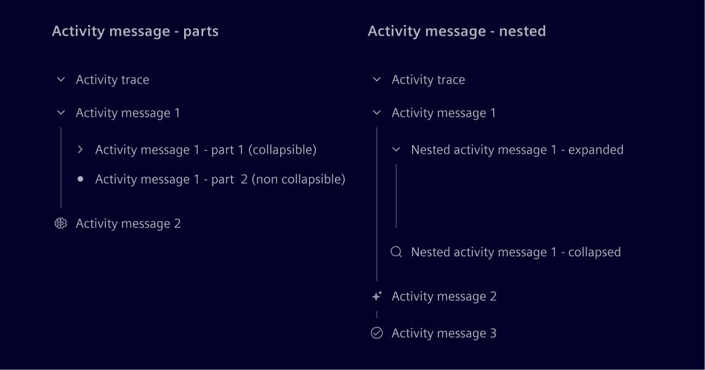

# Activity message

> **Note:** The activity message component is currently experimental and may undergo changes in future releases.

**Activity message** is a single, self-contained unit that
represents one meaningful step or phase in an AI activity.
It exposes progress, intermediate actions, and the path that leads to an
outcome.

## Usage ---

Activity messages are used when the system performs multi-step or non-instant
operations and the intermediate work has to stay visible for transparency,
progress, or auditability.

When several activity messages are stacked in execution order, they form an
activity trace: one collapsible group that tells how a result was produced.



### When to use

- For AI generation where progress stays visible while the answer is produced.
- For agent-based execution such as file edits, commands, or other system actions.
- For tool-calling flows where the input and the output of each call matter.
- When intermediate steps increase trust in the outcome or have to be
  auditable afterwards.

### Best practices

- Emit one activity message per meaningful step,
  and avoid mapping every internal call to its own message.
- Derive headings from the step itself, such as the tool being called,
  rather than from free-form model output.
- Keep supporting detail collapsed by default,
  and expand it only when the detail is the point of the step.
- Surface the reason of a failure in the content of the failed activity,
  not only in its heading.
- Avoid nesting activity messages,
  unless a step contains meaningful intermediate activities.

## Design ---

### Anatomy



- **1. Icon(optional)**: Communicates the type of activity.
- **2. Title:** Names the step the activity represents.
- **3. Segment:** A vertical line that connects consecutive activity messages
- **4. Content:** The detail of the activity.

When a sequence needs to be shown or hidden as a whole, all the activity
messages can be wrapped in an activity trace, which expands and collapses all
of them under a single heading.



### Icons

Element recommends a base set of icons and meanings.
They are not enforced: the mapping can be adapted, and additional types
can be introduced if needed.

- Reasoning: `element-self-learning`
- Retrieval: `element-search`
- Computation: `element-function`
- Generation: `element-generate`
- System action: `element-settings`
- Workflow: `element-maintenance`
- Read: `element-document`
- Summary: `element-checked`
- Generic: use the default icon

### States

- The default state shows its icon and title.
- A failed activity replaces the icon with an error icon.
- A running activity shows a spinner icon and cannot be expanded until the
  step completes.
- On hover and while expanded, the icon is prelaced with the expand and
  collapse control.



### Parts and nested instances

Each activity message can be divided into multiple parts.
Parts are optional and can be made collapsible independently.

Nesting activity messages is optional and should be reserved for niche,
advanced cases where a step has meaningful intermediate activities.



## Code ---

The activity UI is built from three components.

- **`si-activity-message`**: the main building block, representing one step of the activity.
  It has a heading, an optional icon and a state (`running` or `failed`), and its
  projected content is collapsible. In most cases the detail of a step is
  placed directly inside the activity message. Activity messages can be **nested**
  inside another activity message when a step has meaningful intermediate activities.
- **`si-activity-trace`** (optional): a collapsible container that groups a sequence of activity
  messages under one heading and expands or collapses them as a whole.
- **`si-activity-message-part`** (optional): a titled block inside an activity message,
  optionally collapsible on its own. Only needed when the detail of a step has to be split
  into separately titled sections, for example the input and output of a tool call.
  Parts are **leaves**, they carry content and never contain further activity messages.

```text
si-activity-trace                     optional group, collapses everything
├── si-activity-message               step 1: detail directly inside
├── si-activity-message               step 2: detail split into parts
│   ├── si-activity-message-part      leaf, e.g. "Input"
│   └── si-activity-message-part      leaf, e.g. "Output"
└── si-activity-message               step 3
    └── si-activity-message           nested step (advanced cases only)
```

<si-docs-component example="si-chat-messages/si-activity-message"></si-docs-component>

<si-docs-api component="SiActivityTraceComponent"></si-docs-api>

<si-docs-api component="SiActivityMessageComponent"></si-docs-api>

<si-docs-api component="SiActivityMessagePartComponent"></si-docs-api>

<si-docs-types></si-docs-types>
