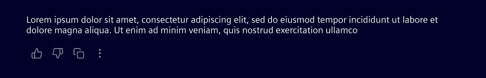

# AI message

The **AI message** component displays the AI system’s response to a user’s input.

## Usage ---

The AI message component visually distinguishes automated responses from user input.
It supports optional actions or other content relevant to the user.

### When to use

- Displaying AI-generated content in chat interfaces
- Providing system-driven assistance or explanations
- Offering structured follow-up steps after user input
- Surfacing links to related documents or knowledge sources

### Best practices

- Allow user interaction (feedback, retry, copy) when appropriate.
- Always place the AI message directly in the background. Do not wrap it in an additional container.
- Constrain the AI message to a maximum width of 720px for readability.

## Design ---

### Elements

> 1. AI message, 2. Actions (optional)

### Actions

When actions are present, they’re always positioned below the text area.
Is possible to display up to 4 actions inline; any additional actions will be collapsed into a menu.

### Responsive behavior

For breakpoints sm (≥576px), the layout remains the same.
The text reflows to fit the available space while preserving hierarchy and alignment.

## Code ---

Angular component is coming soon.
