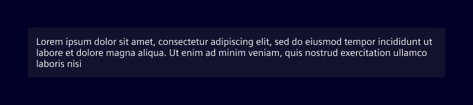
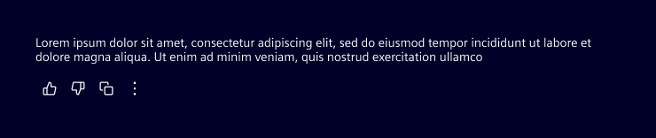
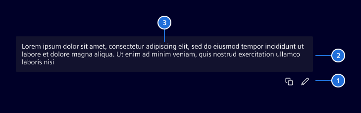
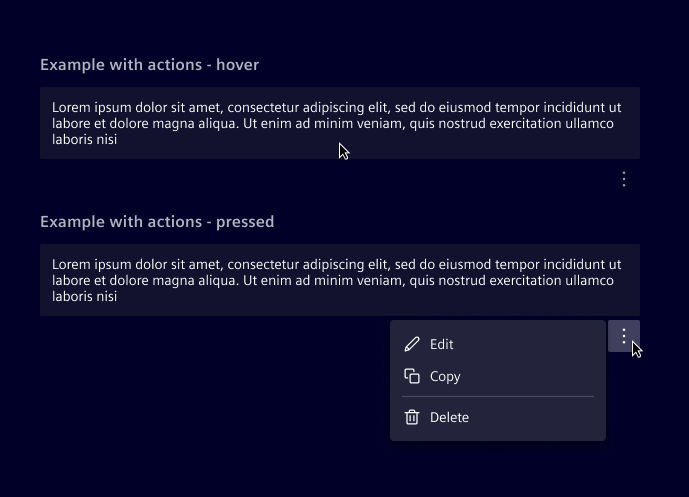
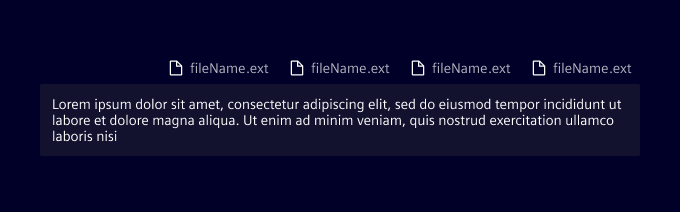
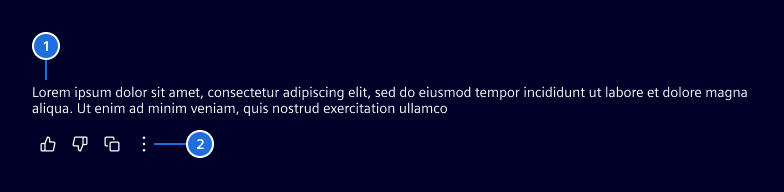
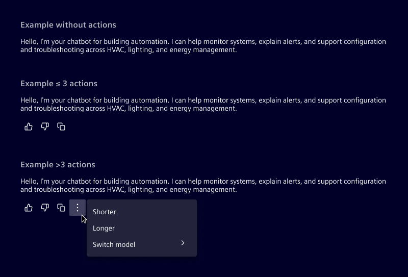
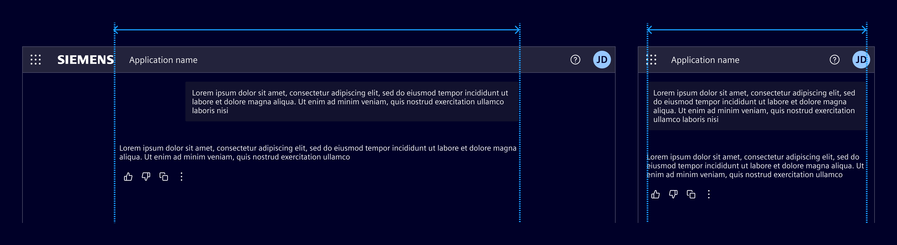

# Chat message

The **chat message** represents an individual message in a conversational interface.

## Usage ---

The chat message displays conversational content exchanged between participants.
It helps users follow the dialogue and distinguish who sent each message.

There are two variants:

- **User message:** represents the message sent by the user
- **AI message:** represents the automated or system-generated response

### User message

Displayed as a text bubble, the **user message** visually represents the user’s contribution to a conversation.
It may support contextual actions such as copy, edit, or delete.

Use it in chat interfaces where user input is shown as part of a dialogue,
or in conversation histories and transcripts.

### AI message

The **AI message** visually distinguishes automated responses from user input.
It can include optional actions or related content relevant to the user.

Use it to display AI-generated content in chat interfaces,
or to provide system-driven assistance, explanations, or follow-up actions.

#### Source citations

AI messages can optionally surface the sources that informed a response.
Two presentation styles are available:

- **Inline source chip:** appears at the end of the message body, embedded in the text flow.
  Pass the `sources` input to `si-ai-message` and it renders automatically.
  Shows the title of the first cited source, with a `+N` suffix when multiple sources are present.
- **Summary source chip:** appears in the actions row below the message.
  Use a standard `si-summary-chip` and place it there with the `siAiMessageAction` directive.

Both open a popover that lists all cited sources with their title, excerpt, and a link.

### Best practices

- Allow user interaction (feedback, retry, copy) when appropriate.
- Always place the AI message directly in the background. Do not wrap it in an additional container.
- Constrain the AI message to a maximum width of 720px for readability.

## Design ---

### User message

> 1. Actions (optional), 2. Message bubble, 3. User message

**Actions** are revealed on hover for desktop users, and on tap for mobile users where hover interactions aren’t supported.

When **attachments** are included in a user message, they should appear above the message bubble.
Attachments are arranged horizontally and wrap to the next line when they exceed the available space.

For general attachment errors (e.g., file not supported), display an inline error message above the field,
following the [AI pattern guidelines](../../patterns/ai/ai-chat.md).

### AI message

> 1. AI icon, 2. AI message, 3. Actions (optional)

When **actions** are present, they’re always positioned below the text area.
Is possible to display up to 4 actions inline; any additional actions will be collapsed into a menu.

#### Source chip

The **inline source chip** sits at the end of the last paragraph of the AI message body.
It renders as a compact pill with the first source's title.
When more than one source is cited, a `+N` count is appended.

For the **summary** style, place a standard `si-summary-chip` in the actions row using the
`siAiMessageAction` directive. A globe icon and a "Sources" label are the recommended defaults.

Both open a popover on click that lists each source with its title, a short excerpt,
and a link that opens in a new tab.
Only one style should be shown at a time: use the inline chip while the response is
being streamed, and switch to the summary chip once streaming is complete.

### Responsive behavior

For all breakpoints, the layout remains the same.
The text reflows to fit the available space while preserving hierarchy and alignment.

## Code ---

<si-docs-component example="si-chat-messages/si-user-message"></si-docs-component>

<si-docs-api component="SiUserMessageComponent"></si-docs-api>

<si-docs-component example="si-chat-messages/si-ai-message"></si-docs-component>

<si-docs-api component="SiAiMessageComponent"></si-docs-api>

### Base chat message

Use these base components to build custom chat message interfaces.

The **si-chat-message** component is a wrapper component, it has slots for different parts of a chat message.

The slots are:

- `si-attachment-list/si-badge` - For displaying attachments related to the message.
- `si-avatar/si-icon/img` - For the avatar or icon representing the message sender.
- `siChatMessageAction (helper directive)` - For actions related to the message.

<si-docs-component example="si-chat-messages/si-chat-message"></si-docs-component>

<si-docs-api component="SiChatMessageComponent"></si-docs-api>

### Attachment list

<si-docs-component example="si-chat-messages/si-attachment-list"></si-docs-component>

<si-docs-api component="SiAttachmentListComponent"></si-docs-api>

### Source chips

> **Note:** The source chip components are currently experimental and may undergo changes in future releases.

Pass the `sources` input directly to `si-ai-message` to render the inline chip automatically.
To show a summary chip in the actions row, project a `si-summary-chip` using the `siAiMessageAction` directive
and connect a popover template to it.

<si-docs-api component="SiSourceChipInlineComponent"></si-docs-api>

<si-docs-api component="SiAiMessageActionDirective"></si-docs-api>

### Markdown renderer

> **Note:** The markdown renderer is currently experimental and may undergo changes in future releases.

<si-docs-component example="si-markdown-renderer/si-markdown-renderer"></si-docs-component>

<si-docs-api component="SiMarkdownRendererComponent"></si-docs-api>

<si-docs-types></si-docs-types>
