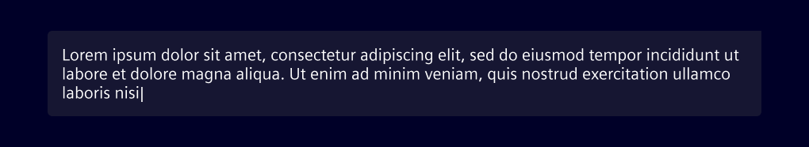
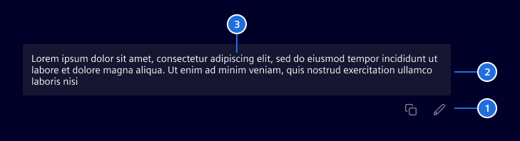
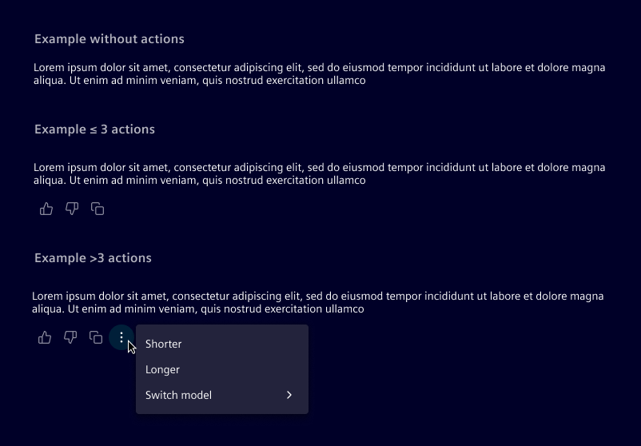

# Chat message

The **chat message** represents an individual message in a conversational interface.

## Usage ---

The chat message displays conversational content exchanged between participants.
It helps users follow the dialogue and distinguish who sent each message.

There are two variants:

- **User message:** represents the message sent by the user
- **AI message:** represents the automated or system-generated response

### User message

Displayed as a text bubble, the **user message** visually represents the user’s contribution to a conversation.
It may support contextual actions such as copy, edit, or delete.

Use it in chat interfaces where user input is shown as part of a dialogue,
or in conversation histories and transcripts.

### AI message

The **AI message** visually distinguishes automated responses from user input.
It can include optional actions or related content relevant to the user.

Use it to display AI-generated content in chat interfaces,
or to provide system-driven assistance, explanations, or follow-up actions.

### Best practices

- Allow user interaction (feedback, retry, copy) when appropriate.
- Always place the AI message directly in the background. Do not wrap it in an additional container.
- Constrain the AI message to a maximum width of 720px for readability.

## Design ---

### User message

> 1. Actions (optional), 2. Message bubble, 3. User message

**Actions** are revealed on hover for desktop users, and on tap for mobile users where hover interactions aren’t supported.

When **attachments** are included in a user message, they should appear above the message bubble.
Attachments are arranged horizontally and wrap to the next line when they exceed the available space.

For general attachment errors (e.g., file not supported), display an inline error message above the field,
following the [AI pattern guidelines](../../patterns/ai/ai-chat.md).

### AI message

> 1. AI icon, 2. AI message, 3. Actions (optional)

When **actions** are present, they’re always positioned below the text area.
Is possible to display up to 4 actions inline; any additional actions will be collapsed into a menu.

### Responsive behavior

For all breakpoints, the layout remains the same.
The text reflows to fit the available space while preserving hierarchy and alignment.

## Code ---

<si-docs-component example="si-chat-messages/si-user-message"></si-docs-component>

<si-docs-api component="SiUserMessageComponent"></si-docs-api>

<si-docs-component example="si-chat-messages/si-ai-message"></si-docs-component>

<si-docs-api component="SiAiMessageComponent"></si-docs-api>

### Base chat message

Use these base components to build custom chat message interfaces.

The **si-chat-message** component is a wrapper component, it has slots for different parts of a chat message.

The slots are:
- `si-attachment-list/si-badge` - For displaying attachments related to the message.
- `si-avatar/si-icon/img` - For the avatar or icon representing the message sender.
- `siChatMessageAction (helper directive)` - For actions related to the message.

<si-docs-component example="si-chat-messages/si-chat-message"></si-docs-component>

<si-docs-api component="SiChatMessageComponent"></si-docs-api>

### Attachment list

<si-docs-component example="si-chat-messages/si-attachment-list"></si-docs-component>

<si-docs-api component="SiAttachmentListComponent"></si-docs-api>

### Markdown renderer

<si-docs-component example="si-markdown-renderer/si-markdown-renderer"></si-docs-component>

<si-docs-api component="SiMarkdownRendererComponent"></si-docs-api>

<si-docs-types></si-docs-types>
