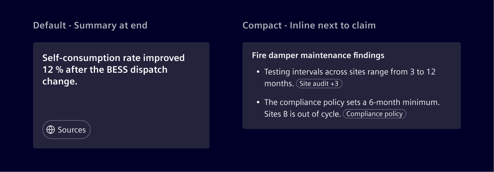
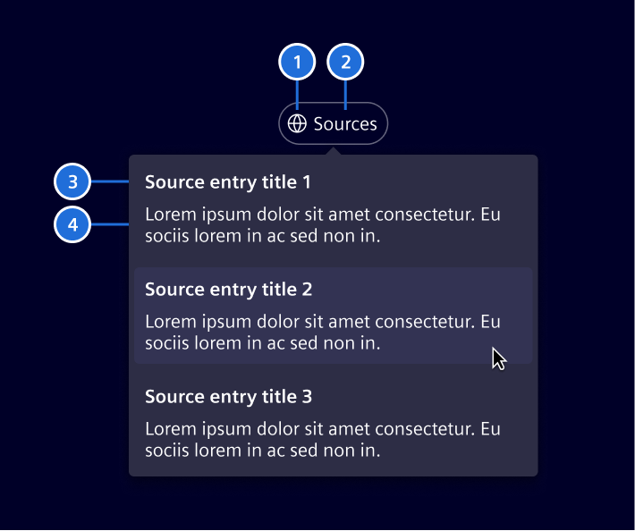
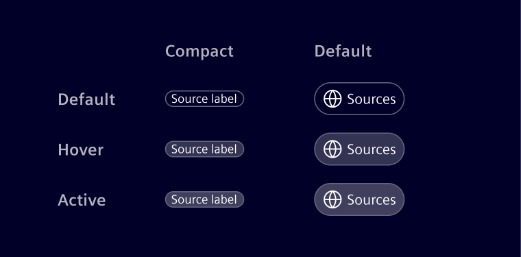

# Source chips

The **source chip** allows users to inspect the origins of generated or referenced content.

## Usage ---

Use source chips to keep a response transparent about its references.
Selecting a chip opens a popover with the source entry and a short excerpt.

- Use the **default source chip** when one source supports the whole response. It appears as a summary chip at the end.
- Use the **compact source chip** when a claim needs a source next to it. It appears inline with the text it supports.
  Use a `+n` counter when several sources support the same claim.



### When to use

- In [AI answers](../../patterns/ai/ai-chat.md), research summaries, or
  any content grounded in documents or external data.

## Design ---

### Anatomy



1. **Source label:** Shows the source title for a single source, or `Sources` when the chip groups multiple sources.
2. **Icon (optional):** Marks the source as a web link. Include it when the source is external.
3. **Source entry title:** The title shown for each source in the popover list.
4. **Relevant excerpt:** Short snippet showing the exact passage the AI used.

### States



## Code ---

Provide the sources through the `sources` input and handle `sourceClicked` to open the selected
source or show it in the application.

```ts
import { Component } from '@angular/core';
import { SiSourceChipComponent, type SourceReference } from '@siemens/element-ng/source-chip';

@Component({
  imports: [SiSourceChipComponent],
  template: `<si-source-chip compact [sources]="sources" (sourceClicked)="openSource($event)" />`
})
export class SourceChipExampleComponent {
  protected readonly sources: SourceReference[] = [
    {
      name: 'Annual Report 2025',
      url: 'https://example.com/annual-report',
      quote: 'Revenue increased by 12% in 2025.'
    }
  ];

  protected openSource(source: SourceReference): void {
    window.open(source.url, '_blank', 'noopener');
  }
}
```

Use `showLabel` to always display **Sources** instead of a source name, and `showIcon` to display
the source icon. Set `disabled` when source details must not be available.

<si-docs-component example="si-source-chip/si-source-chip" height="700"></si-docs-component>

<si-docs-api component="SiSourceChipComponent"></si-docs-api>

<si-docs-types></si-docs-types>
