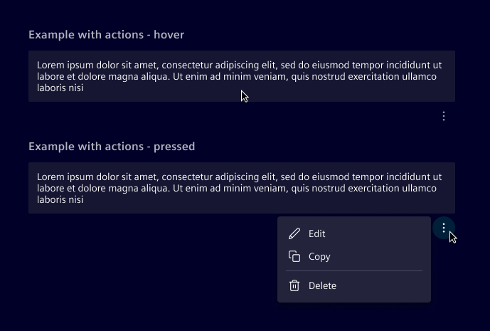

# User message

The **user message** displays input submitted by the user in conversational interfaces.
It can appear in interactions with an AI assistant or in peer-to-peer conversations,
helping to maintain context and continuity within the chat.

## Usage ---

Displayed as a text bubble, the user message visually represents the user’s contribution to a conversation.
It may support contextual actions such as copy, edit, or delete.

### When to use

- In chat interfaces where user input is shown as part of a dialogue.
- In conversation histories or transcripts.
- In AI chat functions.

## Design ---

## Elements

> 1. Actions (optional), 2. Message bubble, 3. User message

### Actions

Actions are revealed on hover for desktop users, and on tap for mobile users where hover interactions aren’t supported.

### Attachments

When attachments are included in a user message, they should appear above the message bubble.
Attachments are arranged horizontally and wrap to the next line when they exceed the available space.

For general attachment errors (e.g., file not supported), display an inline error message above the field,
following the AI pattern guidelines.

## Code ---

<si-docs-component example="si-chat-messages/si-user-message"></si-docs-component>

<si-docs-api component="SiUserMessageComponent"></si-docs-api>

### Base Chat Message

Use these base components to build custom chat message interfaces.

The **si-chat-message** component is a wrapper component, it has slots for different parts of a chat message.

The slots are:
- `si-attachment-list/si-badge` - For displaying attachments related to the message.
- `si-avatar/si-icon/img` - For the avatar or icon representing the message sender.
- `siChatMessageAction (helper directive)` - For actions related to the message.

<si-docs-component example="si-chat-messages/si-chat-message"></si-docs-component>

<si-docs-api component="SiChatMessageComponent"></si-docs-api>

### Attachment List

<si-docs-component example="si-chat-messages/si-attachment-list"></si-docs-component>

<si-docs-api component="SiAttachmentListComponent"></si-docs-api>

### Markdown Renderer

<si-docs-component example="si-markdown-renderer/si-markdown-renderer"></si-docs-component>

<si-docs-api component="SiMarkdownRendererComponent"></si-docs-api>

<si-docs-types></si-docs-types>
