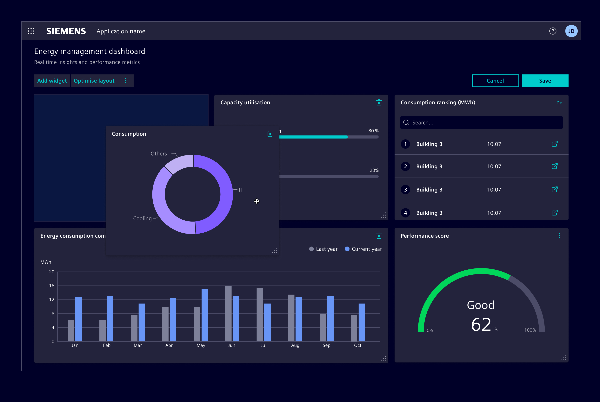
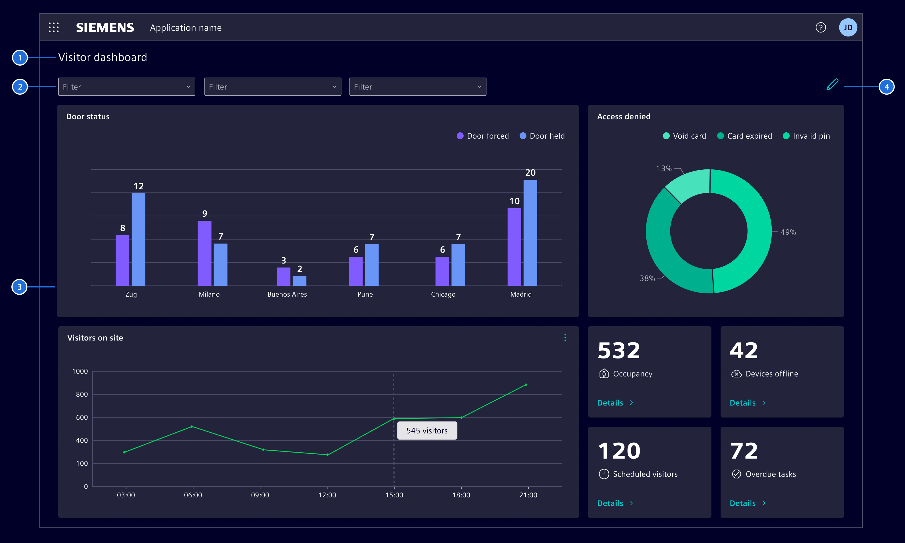
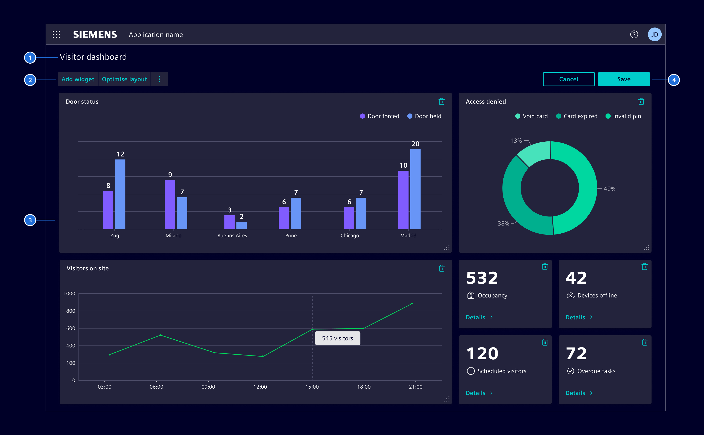
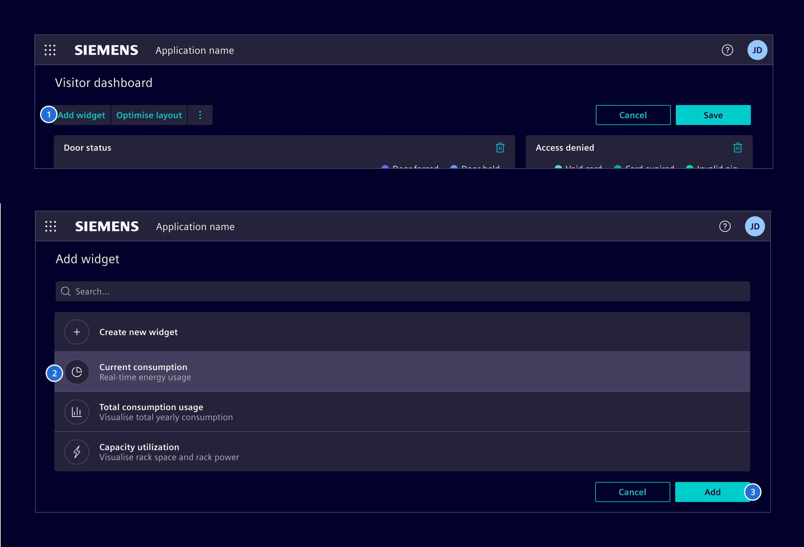
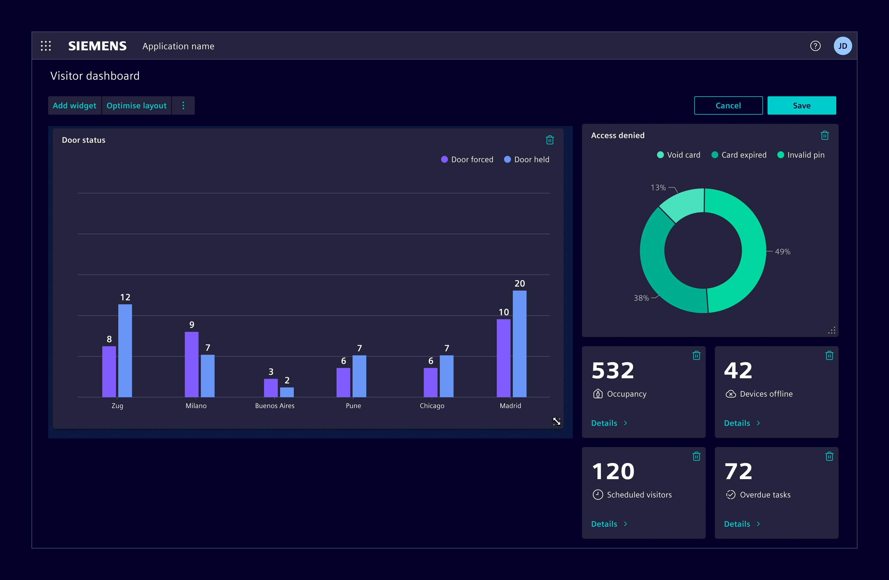

# Flexible dashboard

**Flexible dashboards** are an extension of [static dashboards](./dashboard.md)
that allow users to customize the content according to their specific needs.

## Usage ---

Flexible dashboards offers a personalized experience by enabling users to tailor
the dashboards content itself.

Users can enter the edit mode to add, move and remove widgets, as well as
restoring the dashboard to its default settings.

### When to use

- Use it when there is a large amount of widgets that users can choose from.
- Use it if the application is used by a diverse group of users with different
  needs and goals.
- Use it if users may need to prioritize certain types of information over
  others based on their current tasks or goals.
- Be mindful about its use. Providing too many customization options can
  overwhelm users and make the dashboard more difficult to use.

## Design ---

### Default mode

In **default mode**, the dashboard displays a pre-defined set of widgets,
providing users with a view of the data and insights based on their chosen
configuration.

> 1. Title (optional), 2. Dashboard options (optional), 3. Content area 4. Edit mode button

The *dashboard options* area on top of the widgets can be used for actions such
as filtering, which affect the whole dashboard.

### Edit mode

In **edit mode**, users can customize the dashboard to fit their specific needs.
The *dashboard options* area is replaced by *editing options* that allow users
to add widgets and perform other actions.

> 1. Title (optional), 2. Editing options (optional), 3. Content area, 4. Save and cancel button

#### Add widget

1. Select `Add widget` to open the widget library.
1. Select the desired widget.
1. Click `Add`. The library will be closed and the new widget will be added at
   the bottom of the page.

#### Resize

Users can use the resize handler at the bottom right corner and drag
horizontally to change the width, vertically to change the height, or diagonally
to change both dimensions. A light blue box appears to indicate the area a
widget will snap to, once the user releases the resize handle.

#### Move

Users can select a widget within the content area and drag it to the desired
location. As with resizing, a light blue box appears to indicate where the
widget will be positioned upon letting it go.

## Code ---

The Flexible Dashboards are based on [gridstack.js](http://gridstackjs.com).

See [README](https://github.com/siemens/element/blob/main/projects/dashboards-ng/README.md) for details
about including to your app.

<iframe class="component-preview" src="https://element.siemens.io/dashboards-demo/#/dashboard" height="991px" width="100%" allowfullscreen="true"></iframe>

Direct [Link](https://element.siemens.io/dashboards-demo/#/dashboard) to dashboard demo.

<si-docs-api component="SiFlexibleDashboardComponent" package="@siemens/dashboards-ng" hideImplicitlyPublic="true"></si-docs-api>

<si-docs-api component="SiGridComponent" package="@siemens/dashboards-ng"></si-docs-api>

### Persistence of dashboard configuration

<si-docs-type name="SiWidgetStorage" package="@siemens/dashboards-ng"></si-docs-type>

<si-docs-api component="SiWidgetCatalogComponent" package="@siemens/dashboards-ng"></si-docs-api>

<si-docs-api component="SiWidgetInstanceEditorDialogComponent" package="@siemens/dashboards-ng"></si-docs-api>

<si-docs-types></si-docs-types>
