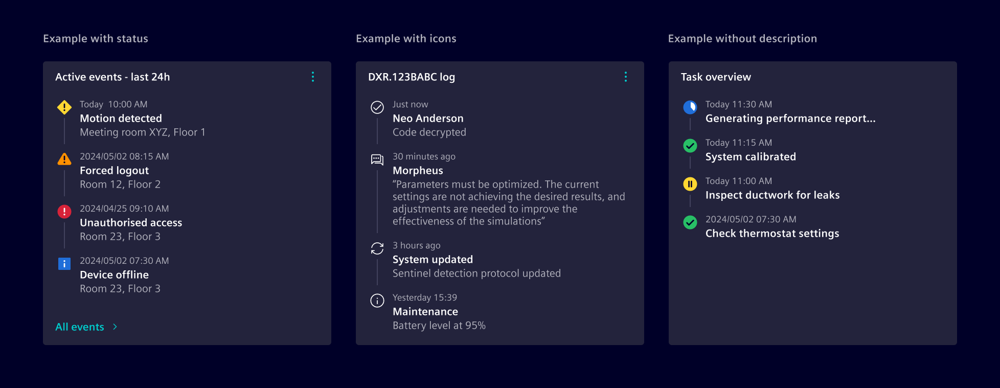
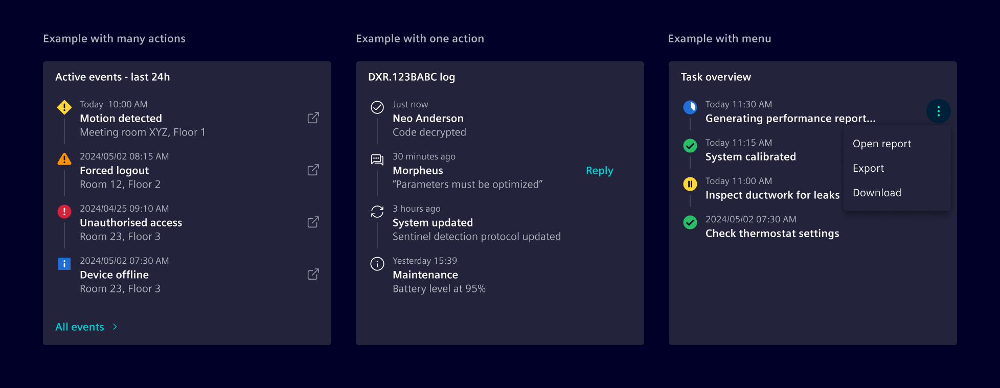

# Timeline dashboard widget

The **timeline dashboard widget** offers users a chronological view of events, tasks, or milestones, enabling them to quickly scan items by date.

## Usage ---

The timeline dashboard widget displays time-sensitive data and ordered events, allowing users to view key updates without leaving the current page.


### When to use

- In dashboards and [tile layouts](../../fundamentals/layouts/content.md#tile-layout).
- When displaying frequently updated chronological data.
- When users need an at-a-glance overview of past and present events.
- To highlight time-sensitive updates, such as comments, milestones, or activities.

### Best practices

- Use appropriate timestamps, such as full dates for history and relative time (e.g., "2 hours ago") for recent events.
- Use the footer link to direct users to more detailed information about the timeline items.
- Make effective use of indicators (icons or status) to provide quick visual cues about the nature of each event.
- Ensure that the timeline is regularly updated with accurate and relevant information, to maintain user trust.
- Use [empty state](../status-notifications/empty-state.md) to represent empty values.

## Design ---

### Elements


> 1. Heading, 2. Header action (optional), 3. Footer link (optional), 4. Indicator, 5. Timestamp, 6. Title, 7. Description (optional), 8. Action (optional)

The indicator displays an icons or status.
The header action can support any action as needed.



Content overflow is managed with an internal scrollbar,
and the widget height can be configured to either full or fixed height to fit layout requirements.

This component is flexible enough to accommodate additional options, allowing for tailored solutions.

### Item actions

Each timeline item can have an associated action, which can be configured to navigate to the related item or
perform additional operations (e.g., update or redo).
If multiple actions are available, they should be collapsed into a menu.



## Code ---

We support the timeline widget in two ways:

- Angular components that are configured by data objects to support minimum
  effort on the application development.
- HTML and CSS-based to support maximum flexibility.

### Timeline widget component

To simplify the usage and reduce the code, Element offers a Angular component as wrapper
with streamlined inputs. The component is a wrapper around the [card](../layout-navigation/cards.md)
and the `<si-timeline-widget-body>`.

```ts
import { SiTimelineWidgetComponent } from '@siemens/element-ng/dashboard';


@Component({
  :
  imports: [SiTimelineWidgetComponent],
  standalone: true
}) 
```

<si-docs-component example="si-dashboard/si-timeline-widget" height="620"></si-docs-component>

<si-docs-api component="SiTimelineWidgetComponent"></si-docs-api>

### Timeline widget body component

The body of the `<si-timeline-widget>` is implemented in the component `<si-timeline-widget-body>`.
You can use it for compositions.

<si-docs-component example="si-dashboard/si-timeline-widget-body" height="450"></si-docs-component>

<si-docs-api component="SiTimelineWidgetBodyComponent"></si-docs-api>

### CSS class usage

For more flexibility and control, use the CSS classes directly in the `<si-card>` component.

<si-docs-component example="si-dashboard/si-timeline-widget-css" height="400"></si-docs-component>

<si-docs-types></si-docs-types>
