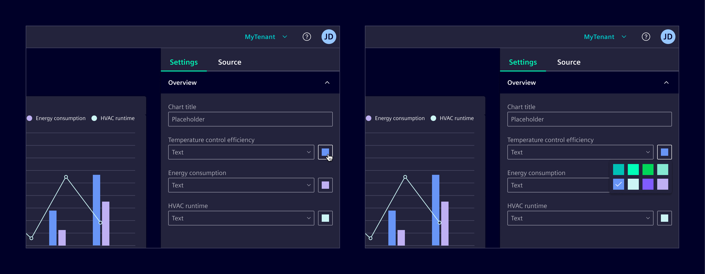
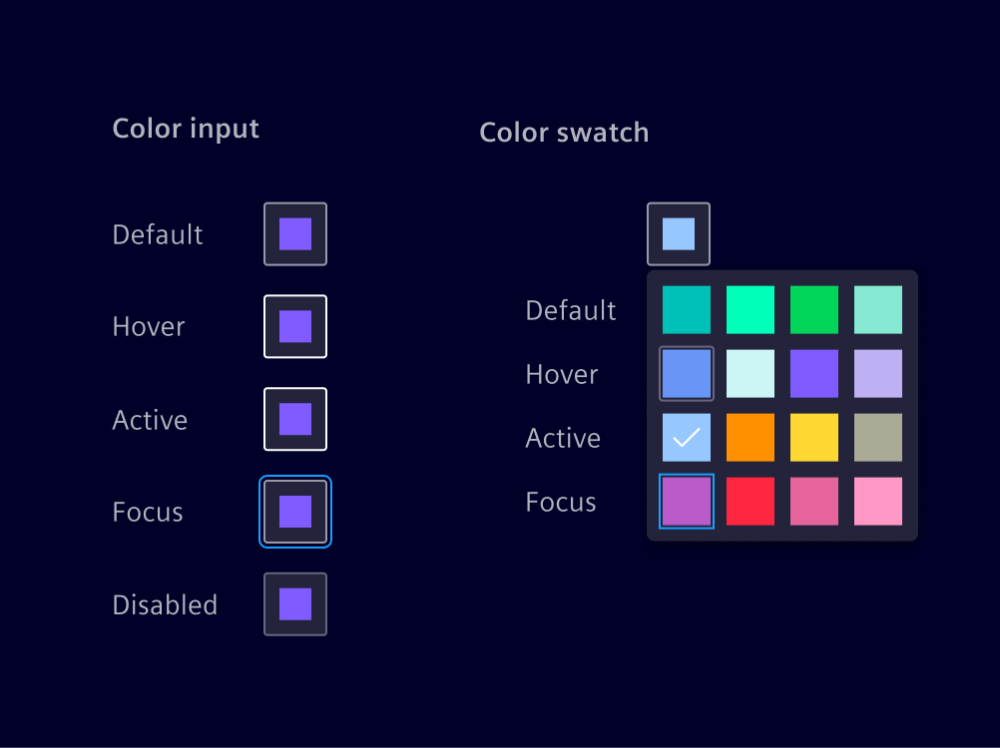

# Color Picker

The **Color Picker** is an input element for selecting a color from a set of predefined swatches.

## Usage ---

This component enables users to select a color from a customizable set of swatches.
The specific colors and the number of swatches can be adjusted according to the use case.



### When to use

- When users need the flexibility to customize colors to suit their specific preferences or needs.
- When color selection is integral to the user’s workflow, such as in dashboards, or customization interfaces.

### Best practices for Color Picker

- Limit the number of swatches to avoid overwhelming users.
- When using the component for dashboards or chart configurations, use the palette defined
  for [data visualization](../../fundamentals/colors/data-visualization-colors.md).
- Any color from the [Element palette](../../fundamentals/colors/color-palette.md) can be used, but be mindful of
  the context and how colors are applied.
- Carefully consider the palette offered to users, ensuring it aligns with the context and use case.

## Design ---

### Elements


> 1. Color input, 2. Container, 3. Color swatch

### Interaction states



## Code ---

The color picker component allows users to choose a color from a predefined palette. The color picker component can also be used within forms.
All element colors are available for being used in the color palette. For their names see:

- [Data visualization palette](../../fundamentals/colors/data-visualization-colors.md)
- [Element palette](../../fundamentals/colors/color-palette.md)

By default the data visualization palette is used. UX recommends only using colors
from that palette. To modify the color palette use the respective input and provide the token names without the leading $:

```html
<si-color-picker [colorPalette]="['element-data-1']"
```

To use custom colors that are not part of element you need to provide them as CSS variables for dark and light in the global style sheet:

```scss
:root {
  --my-custom-color: #11g671;

  &.app--dark: {
    --my-custom-color: #da1611;
  }
}
```

Then just provide the name in the color palette:

```html
<si-color-picker [colorPalette]="['my-custom-color']"
```

### Usage

```ts
import { SiColorPickerComponent } from '@siemens/element-ng/color-picker';

@Component({
  imports: [SiColorPickerComponent, ...]
})
```

<si-docs-component example="si-color-picker/si-color-picker" height="250"></si-docs-component>

<si-docs-api component="SiColorPickerComponent"></si-docs-api>

<si-docs-types></si-docs-types>
