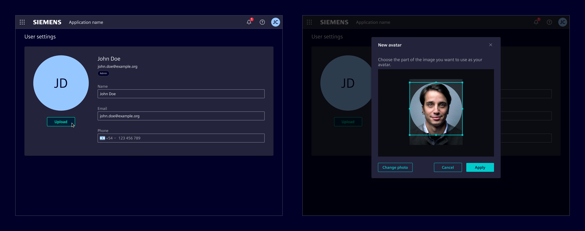
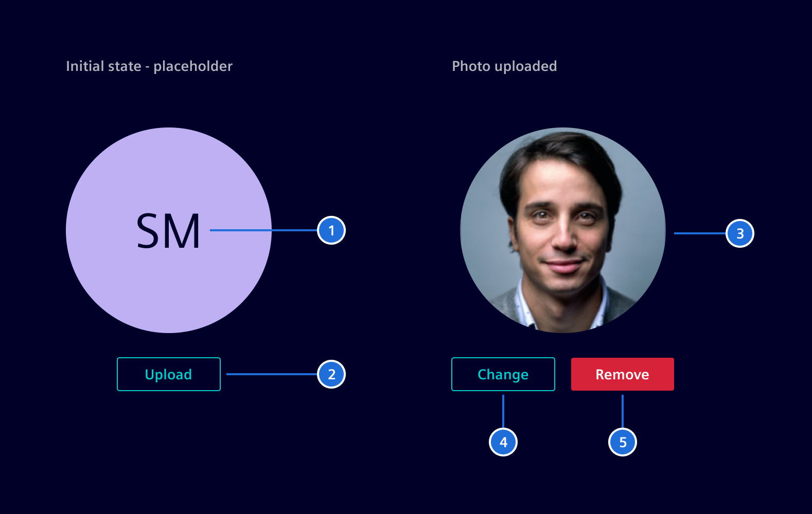
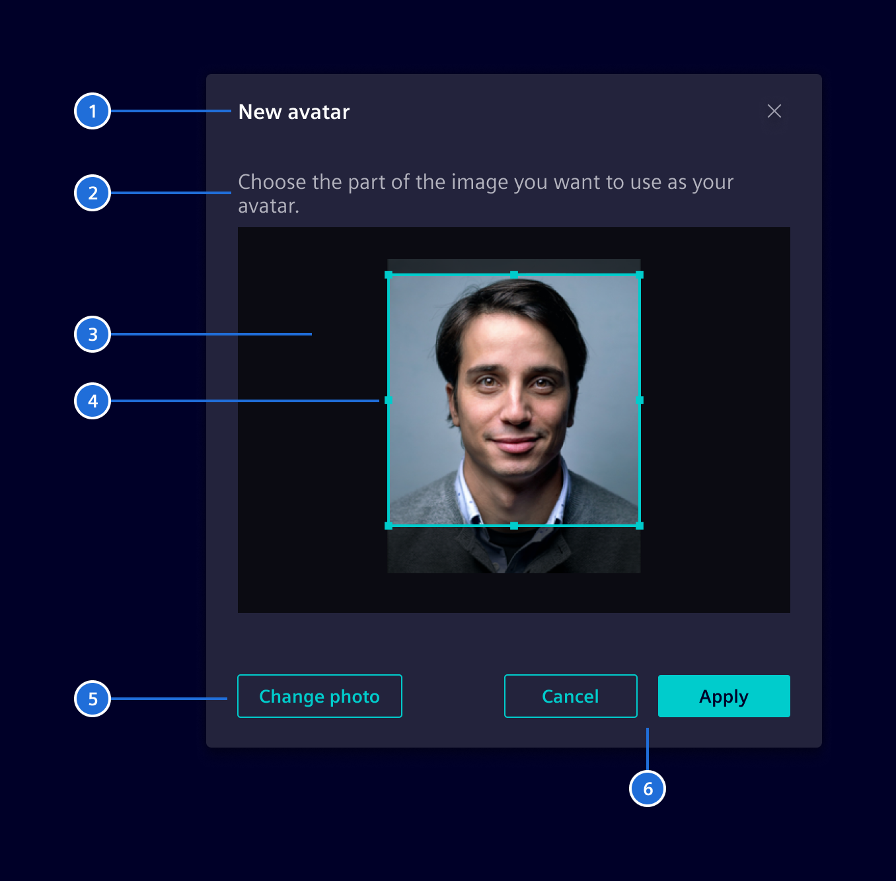
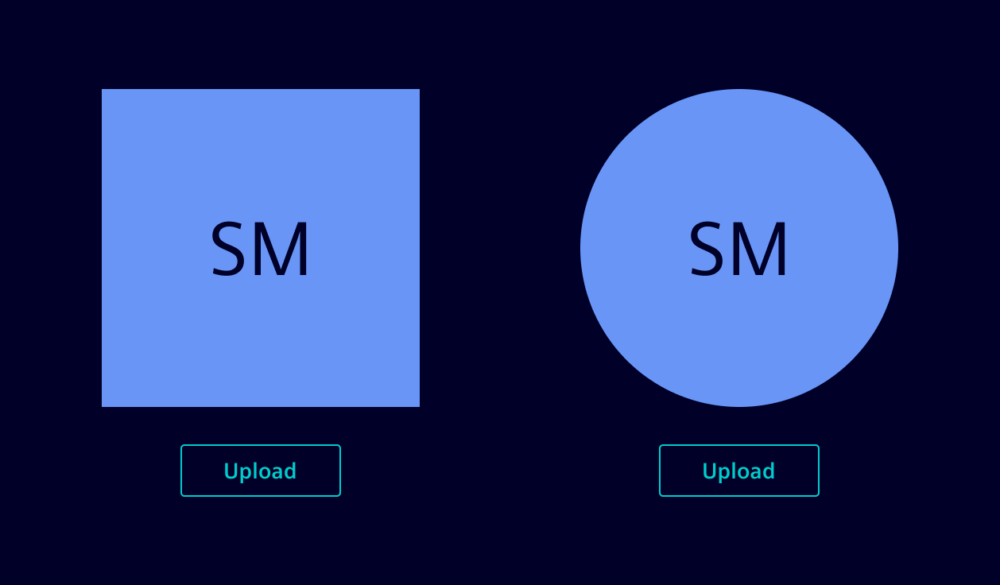
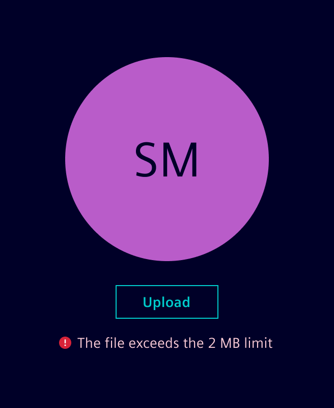

# Photo Uploader

**Photo uploader** allows users to upload and manage an image used as avatar.

## Usage ---

The photo uploader allows users to upload an image via file browser.
It optionally provides an edit dialog for cropping the image.



### When to use

- In the user profile so the user can choose/change his avatar.
- When a user is created.

### Best practices

- The original image is kept (if necessary, a compressed version of it) so the user can undo the cropping.
- Display the compressed version of the image in the preview if compression is required.
- Adjust the size according to layout needs.
- The placeholder can use any of the [avatar](../status-notifications/avatar.md) colors.

## Design ---

### Elements

The photo uploader has different states based on the upload status:

- Initial state: When no image is uploaded, a placeholder with the user's initials will be shown.
- Image uploaded: Once a image is uploaded, options to remove or change the image will be displayed.



> 1. Initials, 2. Upload button, 3. Image, 4. Change button, 5. Remove button

Additionally, a dialog can be enabled to allow users to crop the image if necessary.



> 1. Title, 2. Description, 3.Image, 4.Crop mask, 5. Change image button, 6.Cancel and Apply button

### Mask shape

The image mask can be set to a square or rounded shape according to the layout.



### Validation

 If the user tries to upload a file that exceeds the allowed limit, the component
 will not upload the new image and will display an error message.



## Code ---

### Usage

The component `SiPhotoUploadComponent` makes use of the open source software
[ngx-image-cropper](https://github.com/Mawi137/ngx-image-cropper). You need
to add the [npm package](https://www.npmjs.com/package/ngx-image-cropper) to
your project, before you can make use of the photo upload component.

Import the `SiPhotoUploadComponent` in your standalone component that shall provide a photo upload.

??? info "Required Packages"
    - [ngx-image-cropper](https://www.npmjs.com/package/ngx-image-cropper)
    The currently supported dependency versions can be found in the [package.json of the demo app](https://github.com/siemens/element/blob/main/package.json).

```ts
import { Component } from '@angular/core';
import { SiPhotoUploadComponent } from '@siemens/element-ng/photo-upload';

@Component({
  selector: 'app-sample',
  template: `<si-photo-upload />`,
  standalone: true,
  imports: [SiPhotoUploadComponent]
})
export class SampleComponent {}
```

#### Adjust size

Consuming applications can customize the component size via the following CSS variables:

- `--si-photo-upload-photo-width` (default: `200px`)
- `--si-photo-upload-photo-height` (default: `200px`)

The snippet below shows how to use the Angular component styles attribute to adjust the size to `300px` x `300px`:

```ts
import { Component } from '@angular/core';
import { SiPhotoUploadComponent } from '@siemens/element-ng/photo-upload';

@Component({
  selector: 'app-sample',
  template: `<si-photo-upload />`,
  standalone: true,
  imports: [SiPhotoUploadComponent],
  styles: 'si-photo-upload { --si-photo-upload-photo-width: 300px; --si-photo-upload-photo-height: 300px; }'
})
export class SampleComponent {}
```

### Example

<si-docs-component example="si-photo-upload/si-photo-upload" height="600"></si-docs-component>

<si-docs-api component="SiPhotoUploadComponent"></si-docs-api>

<si-docs-types></si-docs-types>
