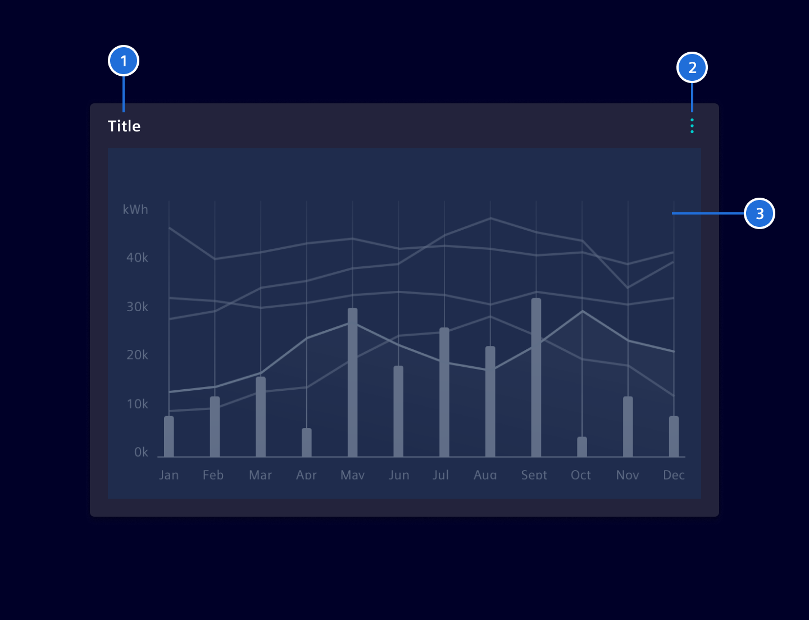

# Cards

A card is a content container to display important and useful information, e.g. trend charts, key data etc.

## Usage ---


### When to use

- To cluster information.

### Best practices

- Only include the most relevant information.
- Set an appropriate size (height and width) of the card to give the content the space needed to convey the information.

## Design ---

### Elements

Every card contains the following elements:

1. Title: The title may either be static, dynamically adapted based on the content or user defined.
   By dragging the title bar, a user can move the card to another position.
2. Content action (Optional): A click on the icon opens the content action menu.
3. Content area: Cards may also contain multiple types of content (e.g. a graph and an infobox).



### Content actions (optional)

The content actions component is specified on [this page](../buttons-menus/content-actions.md).

The available options depend on the content, typical ones are:

- Immediately available actions (e.g. expand / reduce)
- Changing the view (e.g. toggle between data table and chart)
- Direct actions (e.g. download, export, share)
- Configuration (access to configuration mode)

### Images

Cards can include an image and be placed either vertically or horizontally.


### Accent line

An accent line can be used to highlight general, non-critical information.
This approach should be reserved for cases where it improves clarity or reinforces the card's purpose.

To prevent overuse and maintain its impact, the accent line should be applied selectively rather than to every card.
Use distinct colors, such as `$element-ui-0`, to emphasize information without implying urgency.


For status indication, refer to the [value widget](../dashboards/value-widget.md).

### Action cards

Action cards are interactive elements where the entire container is selectable and triggers a single action.
They support hover, pressed, focus, and disabled states.
They can also retain a selection state, behaving like a toggle.

Action cards do not include other interactive elements to prevent conflicting interactions.


### Card sizes


To ensure an aligned visual grid and proper aesthetic of dashboards, card sizes follow the underlying 12 column grid of the work area.
The card can span over 3, 4, 6, 9 or 12 columns.


The card's width is defined by a horizontal grid system. The necessary height is primarily driven by the content.
For visual aesthetic and reordering reasons, the number of height-sizes should be kept low and consistent.

### Full-screen view

Cards can be enlarged via the content action menu to get more detailed information. The card then uses the whole working area.
This makes sure that primary navigation, statusbar, notifications or other important information for the users are still accessible.
Dashboard wide settings like e.g. time-range filter shall not be visible. If `Expand` is the only content action, then the expand icon
is directly accessible, otherwise it will be part of the content actions list.

### Responsive behavior

With the column grid system in place, cards will first vary their width within certain breakpoints. As the screen size gets smaller and smaller cards will be stacked more and more.

## Code ---

Cards support various content structures to organize information effectively. Choose the appropriate pattern based on your content needs.

Below are examples of what’s supported. Consumer can either choose to use a pure CSS approach or the [SiCardComponent](#sicardcomponent).

For the maximize/restore functionality to work correctly the cards container/working area needs to have `position: relative;`.

### SiCardComponent

```ts
import { SiCardComponent } from '@siemens/element-ng/card';

@Component({
  imports: [SiCardComponent, ...]
})
```

The `si-card` component makes use of the card classes. The header
is configurable by input properties (see API). A header icon and the card body are
provided using content projection, with the selectors `headerIcon` and `body`.

When using header icon, make sure to include spacing between the icon and the heading. In
addition, the heading and text within the body should be left aligned.

Try to avoid content overflows in cards. In case of overflows, make sure the scrollbar
is placed on the edge of the card and padding is set internally.

<si-docs-component example="si-card/si-card" height="300"></si-docs-component>

<si-docs-api component="SiCardComponent"></si-docs-api>

### Action cards

Action cards function as interactive buttons that can perform actions when clicked.
Use `si-action-card` when you need cards that trigger specific actions.

The component includes a `selectable` input that enables selection state on the card.

<si-docs-component example="si-card/si-action-card" height="300"></si-docs-component>

<si-docs-api component="SiActionCardComponent"></si-docs-api>

### Native HTML markup

The pure CSS approach structures a card into three distinct sections for optimal content organization:

- **Header (optional)**: Apply `.card-header` to `<h*>` elements or `<div>` for titles and top-level information
- **Body (required)**: Apply `.card-body` for the main content area with proper padding and spacing
- **Footer (optional)**: Apply `.card-footer` for additional information that sticks to the bottom

```html
<div class="card">
  <div class="card-header">Card header</div>
  <div class="card-body">
    <h5 class="card-title">Special title treatment</h5>
    <p class="card-text">With supporting text below as a natural lead-in to additional content.</p>
  </div>
  <div class="card-footer">Card footer</div>
</div>
```

Style content elements like titles and text within cards using the semantic classes.
Always place these elements inside a `.card-body` container for proper padding and alignment.

**Available content classes:**

| Class            | Element         | Purpose           | Usage                                                             |
| ---------------- | --------------- | ----------------- | ----------------------------------------------------------------- |
| `.card-title`    | `<h1>` - `<h6>` | Primary heading   | Main title or heading for the card content                        |
| `.card-subtitle` | `<h1>` - `<h6>` | Secondary heading | Supporting text below the main title, typically smaller and muted |
| `.card-text`     | `<p>`           | Body text         | Main content paragraphs and descriptive text                      |

**Best practices:**

- Use `.card-title` for the most important heading in each card
- Apply `.card-subtitle` for supporting information that enhances the title
- Wrap body content in `.card-text` for consistent typography

```html
<div class="card">
  <div class="card-body">
    <h5 class="card-title">Card title</h5>
    <h6 class="card-subtitle mb-2 text-secondary">Card subtitle</h6>
    <p class="card-text">
      Some quick example text to build on the card title and make up the bulk of the card’s content.
    </p>
  </div>
</div>
```

To properly integrate an image with a card, apply the `.card-img-top` or `.card-img-bottom` class to your `` element.
This automatically rounds the image's top or bottom corners to match the card's border radius.

```html
<div class="card">
  
  <div class="card-body">
    <h5 class="card-title">Card title</h5>
    <p class="card-text">
      Some quick example text to build on the card title and make up the bulk of the card’s content.
    </p>
  </div>
</div>
```

Create organized lists within cards using flush list groups that integrate seamlessly with card styling.

```html
<div class="card">
  <ul class="list-group list-group-flush">
    <li class="list-group-item">An item</li>
    <li class="list-group-item">A second item</li>
    <li class="list-group-item">A third item</li>
  </ul>
</div>
```

Combine list groups with card headers for better content organization.

```html
<div class="card">
  <div class="card-header">Header text</div>
  <ul class="list-group list-group-flush">
    <li class="list-group-item">An item</li>
    <li class="list-group-item">A second item</li>
    <li class="list-group-item">A third item</li>
  </ul>
</div>
```

Add footers to provide additional context or actions for list content.

```html
<div class="card">
  <ul class="list-group list-group-flush">
    <li class="list-group-item">An item</li>
    <li class="list-group-item">A second item</li>
    <li class="list-group-item">A third item</li>
  </ul>
  <div class="card-footer">Card footer</div>
</div>
```

Cards assume no specific width to start, so they’ll be 100% wide unless otherwise stated. You can change this as needed with custom CSS, grid classes or utilities.

### Card layouts

Element provides different container patterns to organize and manage multiple cards effectively:

- **Card groups** - Connected cards with equal dimensions
- **Grid cards** - Flexible grid-based card arrangements

Card groups create cohesive card layouts where cards are connected and maintain equal dimensions. Ideal for showcasing related content side-by-side. All cards automatically match the height of the tallest card.

```html
<div class="card-group">
  <div class="card">
    <div class="card-body">
      <p class="card-text">
        This is a wider card with supporting text below as a natural lead-in to additional content.
        This content is a little bit longer.
      </p>
    </div>
  </div>
  <div class="card">
    <div class="card-body">
      <p class="card-text">
        This card has supporting text below as a natural lead-in to additional content.
      </p>
    </div>
  </div>
</div>
```

When card groups include footers, they automatically align at the bottom regardless of content height differences.

```html
<div class="card-group">
  <div class="card">
    <div class="card-body">
      <p class="card-text">
        This is a wider card with supporting text below as a natural lead-in to additional content.
        This content is a little bit longer.
      </p>
    </div>
    <div class="card-footer">
      <small class="text-muted">Last updated 3 mins ago</small>
    </div>
  </div>
  <div class="card">
    <div class="card-body">
      <p class="card-text">
        This card has supporting text below as a natural lead-in to additional content.
      </p>
    </div>
    <div class="card-footer">
      <small class="text-muted">Last updated 3 mins ago</small>
    </div>
  </div>
</div>
```

<si-docs-component example="si-card/card-group" height="300"></si-docs-component>

Use the grid system to create responsive card layouts. Wrap cards in columns and rows to control their positioning and spacing.

For example, here’s `.row-cols-1` laying out the cards on one column, and `.row-cols-md-2` splitting four cards to equal width across multiple rows, from the medium breakpoint up.

```html
<div class="row row-cols-1 row-cols-md-2 g-4">
  <div class="col">
    <div class="card">
      <div class="card-body">
        <p class="card-text">
          This is a longer card with supporting text below as a natural lead-in to additional
          content. This content is a little bit longer.
        </p>
      </div>
    </div>
  </div>
  <div class="col">
    <div class="card">
      <div class="card-body">
        <p class="card-text">
          This is a longer card with supporting text below as a natural lead-in to additional
          content. This content is a little bit longer.
        </p>
      </div>
    </div>
  </div>
  <div class="col">
    <div class="card">
      <div class="card-body">
        <p class="card-text">
          This is a longer card with supporting text below as a natural lead-in to additional
          content.
        </p>
      </div>
    </div>
  </div>
  <div class="col">
    <div class="card">
      <div class="card-body">
        <p class="card-text">
          This is a longer card with supporting text below as a natural lead-in to additional
          content. This content is a little bit longer.
        </p>
      </div>
    </div>
  </div>
</div>
```

<si-docs-component example="si-card/card-grid" height="300"></si-docs-component>

<si-docs-types></si-docs-types>
