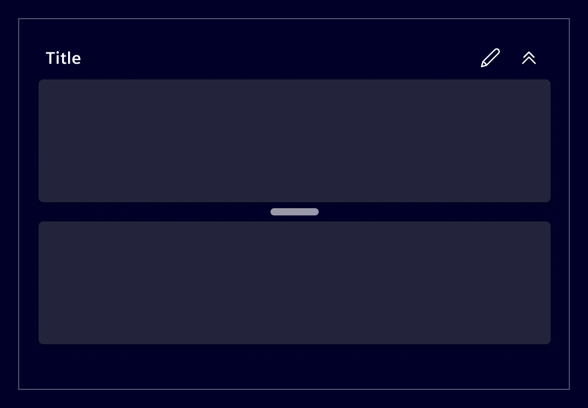
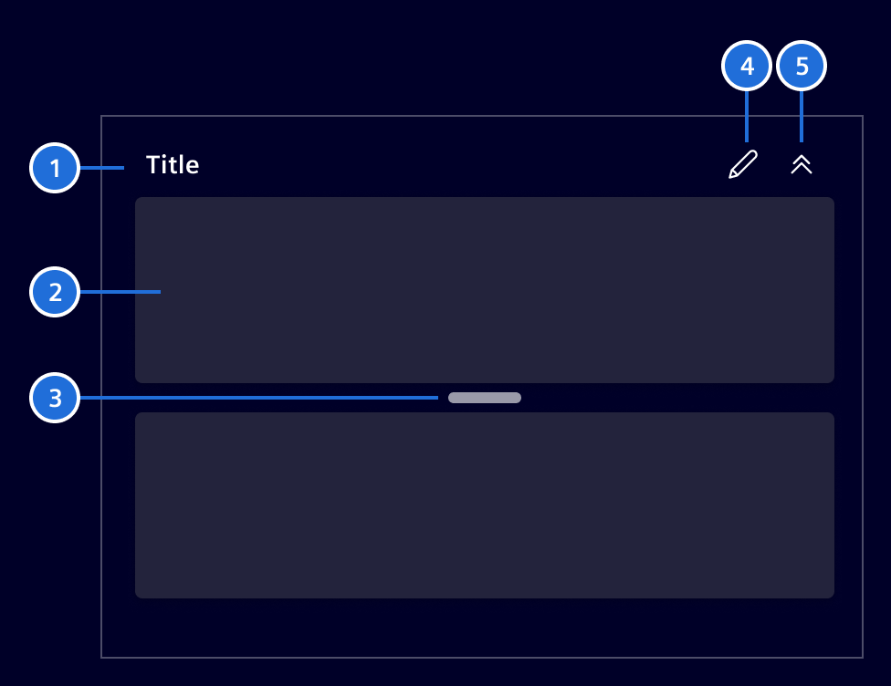
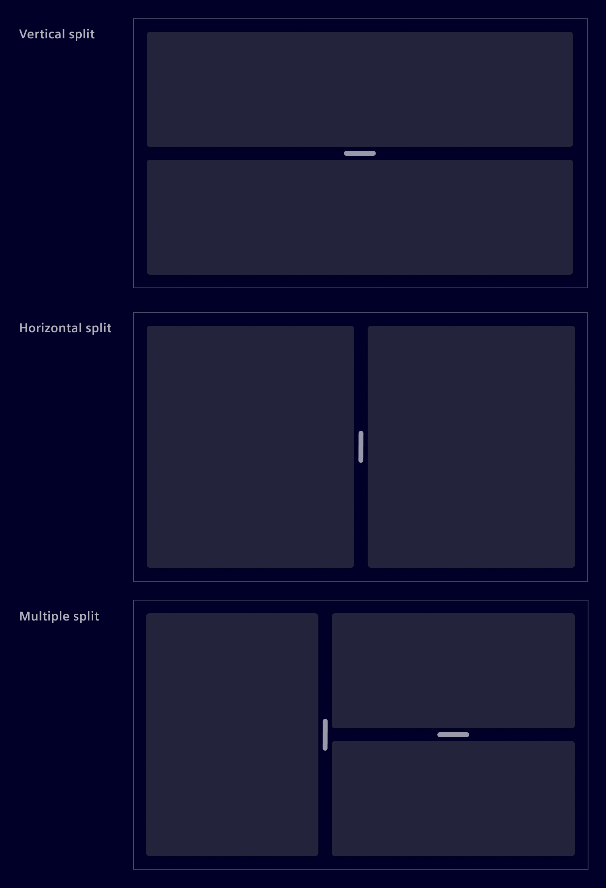
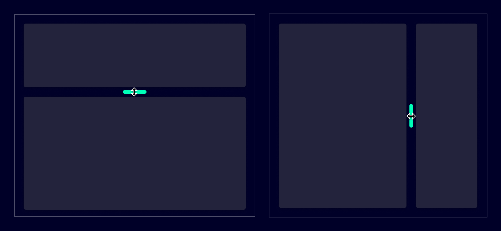
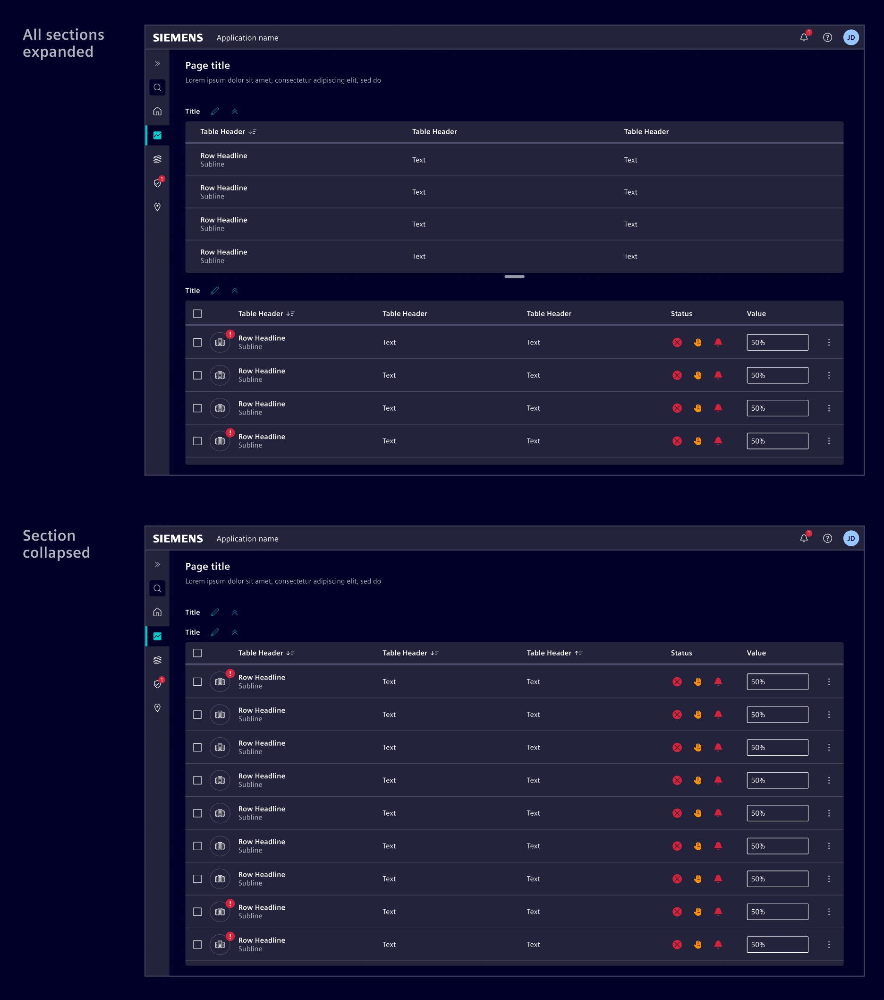

# Split

The **split** component enables the division of the content area in two or more
distinct sections, with a draggable handlebar between them. Parts can be
resized, collapsed and expanded accordingly.

## Usage ---



The split component allows the creation of dynamic layouts, divided in adjacent
panes. Each pane can contain a variety of components, such as tables, lists,
images, or maps. Panes are separated by the handlebar that support a dragging
action for resizing.

### When to use

- Use it when the content needs to be divided in different sections, allowing
  users some freedom in regards of viewport arrangement (e.g. give more space to
  a map or a table).
- Use it when part of the content needs to be hidden or being partially reduced
  in size so users can focus on their current task.
- Use it when all sections are relevant in combination to each other.

### Best practices

- Be mindful about its use. Content can quickly become overly partitioned,
  increasing the interaction cost. Don't split the content in more than three
  sections.
- Define minimum and maximum pane sizes. Make sure to use sizes that keep the
  handlebar visible. If a pane gets too small, it can become too difficult to
  interact with.
- Allow users to hide a pane when it makes sense. E.g: If a design includes an
  edit function, consider letting users hide other panes to reduce distractions.

## Design ---

### Elements



> 1. Title (optional), 2. Pane, 3. Handlebar, 4. Additional actions (optional), 5. Expanse/collapse button (optional)

Panes are structural placeholders that divide content into sections.
According to the [layout guidelines](../../fundamentals/layouts/overview.md),
content should be grouped into cards with 4px rounded corners.

Given that panes are used to organize content, the same principle applies.
To maintain consistency, use the [card component](../layout-navigation/cards.md) inside panes.
If that's not feasible, apply the `element-radius-2` class for 4px rounded corners to align with design standards.

### Layout orientation

The component can be use to divide the screen horizontally, vertically or both.
The orientation should be chosen based on the content type and the to be
expected screen size.



### Resizable containers

Users can change a pane's width or height by sliding the handlebar in either
direction.



### Expand and collapse

Optionally, panes can be expanded or collapsed to show or hide information, if
the application allows said actions.



### Responsive layout

Ensure that the chosen layout works well on all device types. For small screen
sizes, consider changing the layout to an interactive one where users can switch
between panes. See the [list-details](../layout-navigation/list-details.md)
pattern's responsive behavior as an example.

## Code ---

### Usage

`si-split` can be imported using the module

```ts
import { RouterModule } from '@angular/router';

import { SiSplitModule } from '@siemens/element-ng/split';

@NgModule({
  imports: [SiSplitModule, RouterModule, ...]
})
```

or as a standalone component:

```ts
import { SiSplitComponent, SiSplitPartComponent } from '@siemens/element-ng/split';

@Component({
  imports: [
    SiSplitComponent,
    SiSplitPartComponent,
    ...
  ]
})
```

### Horizontal split with auto scale

<si-docs-component example="si-split/si-split-auto"></si-docs-component>

### Horizontal split with mixed scale (none/auto)

<si-docs-component example="si-split/si-split-mixed"></si-docs-component>

### Vertical split

<si-docs-component example="si-split/si-split-vertical"></si-docs-component>

### Nested splits

<si-docs-component example="si-split/si-split-nested"></si-docs-component>

### Custom collapse icons

<si-docs-component example="si-split/si-split-icons"></si-docs-component>

### Hide the collapse button

<si-docs-component example="si-split/si-split-hide-collapse"></si-docs-component>

### Hide the header

<si-docs-component example="si-split/si-split-hide-header"></si-docs-component>

<si-docs-api component="SiSplitComponent"></si-docs-api>

<si-docs-api component="SiSplitPartComponent"></si-docs-api>

<si-docs-types></si-docs-types>
