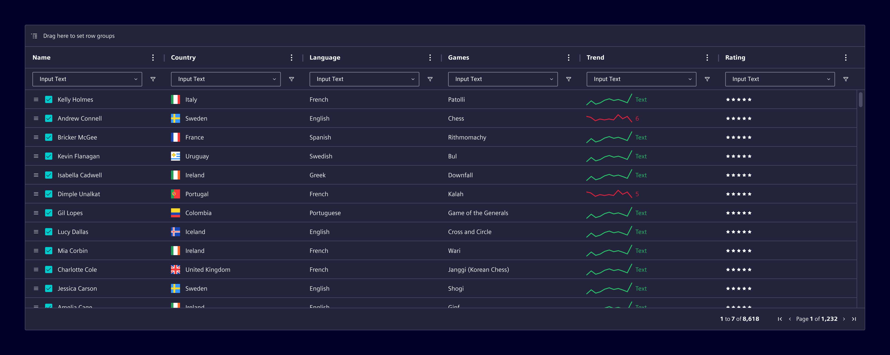

# AG Grid

**AG Grid** is intended for highly complex, enterprise-level data grid use cases.

## Usage ---

It should be used only when requirements exceed what datatable can reasonably support,
such as spreadsheet-like behavior, advanced cell logic, or highly customized interactions.

**AG Grid requires a paid license and introduces higher implementation and maintenance costs**
Adoption should be justified by clear functional needs.

For AG Grid, we provide an Element theme to ensure visual alignment with Element.
However, styling and behavior are partially constrained by AG Grid itself, so not all Element patterns
and interactions can be fully enforced.

## Code ---

