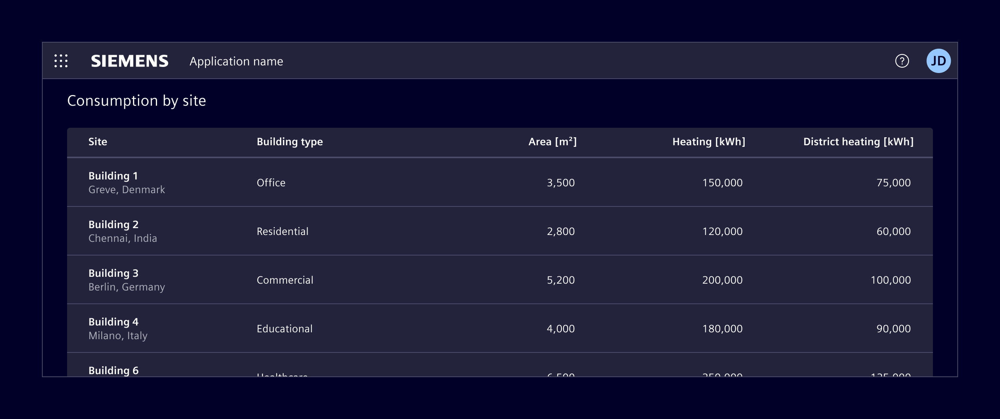

# HTML table

**HTML tables** are based on the native HTML table element and are intended for simple, mostly static data.

## Usage ---

HTML table is the lowest-complexity option. Because it is based on the native HTML table element,
it comes with some inherent limitations.

- The header is not sticky when vertical scrolling is used.
- Column widths cannot be resized by users.
- Pagination is not supported.
- There is no built-in support for DOM or data virtualization, unlike ngx-datatable.
- Performance degrades with larger datasets, depending on DOM complexity and hardware.



### When to use

- Use it when the dataset is small.
- When the content is mostly read-only.
- When advanced interactions are not required.

## Code ---

Element styles native HTML tables with CSS classes. Apply the `.table` class to a `<table>` element.

<si-docs-component example="datatable/html-table" height="500"></si-docs-component>

### Usage

Use semantic table markup with a caption, table headers, and table body. Add `scope="col"` to column headers and `scope="row"` to row headers so assistive technologies can associate headers with their cells.

```html
<table class="table">
  <caption>Device status</caption>
  <thead>
    <tr>
      <th scope="col">Device</th>
      <th scope="col">Status</th>
    </tr>
  </thead>
  <tbody>
    <tr>
      <th scope="row">Cooling unit</th>
      <td>Operational</td>
    </tr>
  </tbody>
</table>
```

<si-docs-component example="datatable/html-table-basic" height="330"></si-docs-component>

### Variants

Add `.table-sm` to use condensed rows. Add `.table-striped` to distinguish alternating body rows, and `.table-hover` to provide hover feedback for body rows.

Apply `.table-active` to a row or cell to highlight it. Use `.table-success`, `.table-info`, `.table-warning`, or `.table-danger` on a row or cell to communicate its status.

```html
<table class="table table-sm table-striped table-hover">
  <!-- Table content -->
</table>

<tr class="table-active">
  <!-- Table cells -->
</tr>

<tr class="table-warning">
  <!-- Table cells -->
</tr>
```

<si-docs-component example="datatable/html-table-variants" height="330"></si-docs-component>

### Captions

Captions are displayed below the table by default. Add `.caption-top` to the `<table>` element to display the caption above it.

```html
<table class="table caption-top">
  <caption>Device status</caption>
  <!-- Table content -->
</table>
```

<si-docs-component example="datatable/html-table-caption" height="330"></si-docs-component>

### Responsive tables

Wrap a wide table in `.table-responsive` to allow horizontal scrolling. Use a breakpoint variant such as `.table-responsive-md` to enable scrolling only below that breakpoint.

```html
<div class="table-responsive">
  <table class="table">
    <!-- Table content -->
  </table>
</div>
```

<si-docs-component example="datatable/html-table-responsive" height="330"></si-docs-component>
