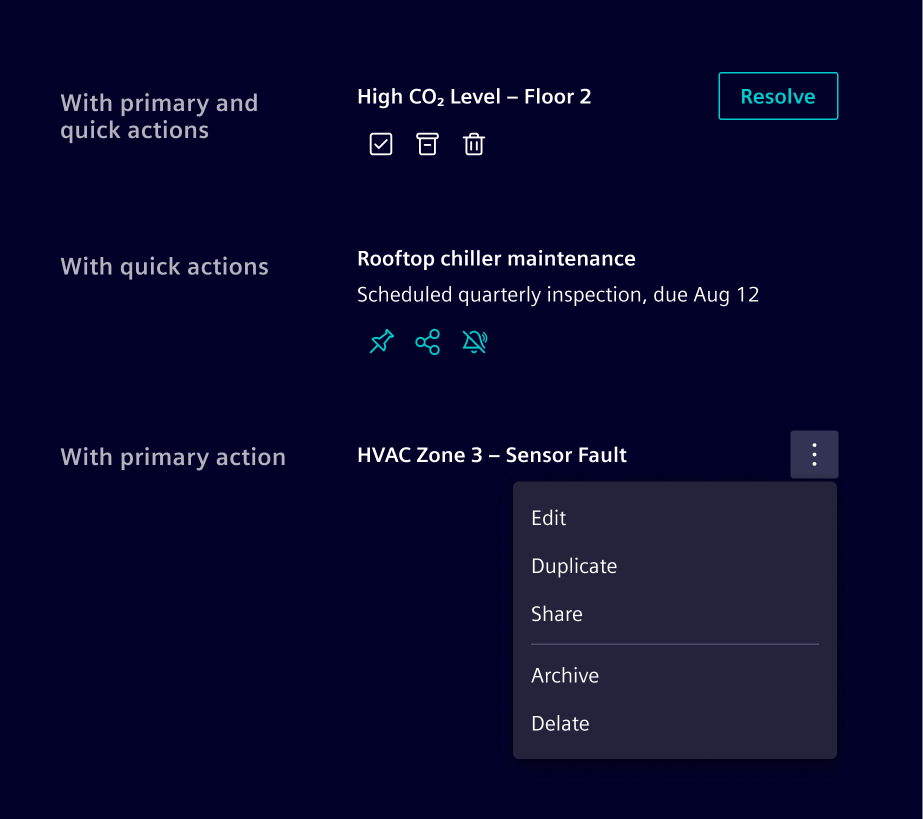

# List item

The **list item** is the building block used to compose lists.
Each item represents a single row of content and can contain a heading,
description, timestamp, metadata, indicators, and actions.

## Usage ---

List items are designed to be flexible
and can be used in different containers depending on the context. For example:

- With [cards](../layout-navigation/cards.md)
  to stack related information together in a compact space.
- With [popovers](../status-notifications/popover.md)
  to show items inside a floating container.
- With [side panels](../layout-navigation/side-panel.md),
  used when the list is part of the application frame, or contextual to the current page.
- With [list groups](../lists-tables-trees/list-group.md),
  to represent a single-column layout that behaves like a simplified table.

The list item can be **read-only** or **support interactions**.

### When to use

- To construct the [notification pattern](../../patterns/notifications.md).
- To construct the chat history pattern.
- When content needs to be shown as a repeatable, scannable row.
  For complex data, use a [table](../lists-tables-trees/overview.md).
- Keep structure consistent across all list items in the same list.

### Best practices

- When content needs to be shown as a repeatable, scannable row.
  For complex data, use a [table](../lists-tables-trees/overview.md).
- Keep structure consistent across all list items in the same list.

## Design ---

### Anatomy

> 1\. Indicator, 2. Timestamp, 3. Heading, 4. Description, 5. Primary action
  6. Metadata, 7. Quick actions

With the exception of the heading, all items are optional.

### Indicator

The indicator can support icons, [circle status](../status-notifications/circle-status.md),
or an [avatar](../status-notifications/avatar.md), depending on the content needs.

It also supports an unread state, typically used for
[notifications](../../patterns/notifications.md).

### Actions

The list item supports a primary action aligned with the heading, or quick
actions placed below the description. 
Actions can use any button style needed. When there are too many to show inline, condense them into an overflow menu.

### Metadata

It is typically displayed as text-based informational attributes.
Icons may be added when they improve recognition.
[Badges](../status-notifications/badges.md) can be used for explicit states or applied labels that should stand out visually.

The metadata does not include an intrinsic overflow behavior.
How overflow is handled should change according to the layout constraints and information priorities.

## Code ---

### Example

<si-docs-component example="list-item/list-item" height="400"></si-docs-component>

### Action list items

If the entire item is clickable, wrap the content inside a `<button>` or `<a>` element and apply the `.list-item-action` helper class for hover and focus styling.
Use `<a>` when the action navigates to another page or resource, and `<button>` when it triggers an in-page action.

The item should be placed inside a `<ul>` + `<li>` structure to preserve list semantics.

Use `aria-labelledby` and `aria-describedby` on the interactive element to provide a concise accessible name (the title) and description, instead of exposing all inner text as the accessible name.

<si-docs-component example="list-item/list-item-action" height="400"></si-docs-component>

### Metadata

Use `.list-item-metadata` to display supplementary contextual information below the description, such as workspace names, contributor counts, document links, or status badges.
Items within the metadata row can be separated with `.list-item-metadata-divider`, which renders a small dot separator.

### Unread state

Use the `.unread` class on `.list-item-title` to indicate unread items with a bold title and a dot indicator.

<si-docs-component example="list-item/list-item-unread" height="400"></si-docs-component>
