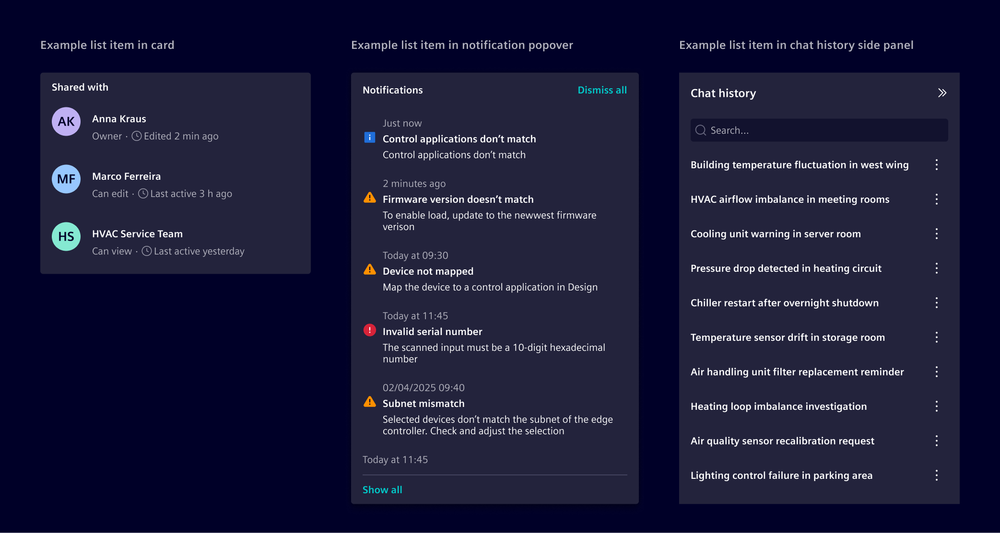
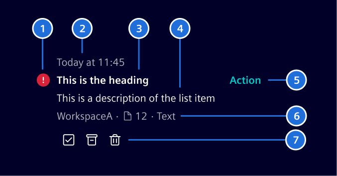
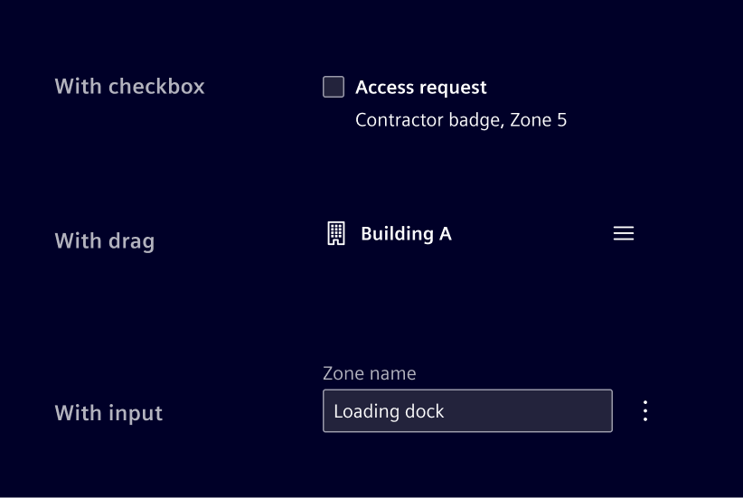
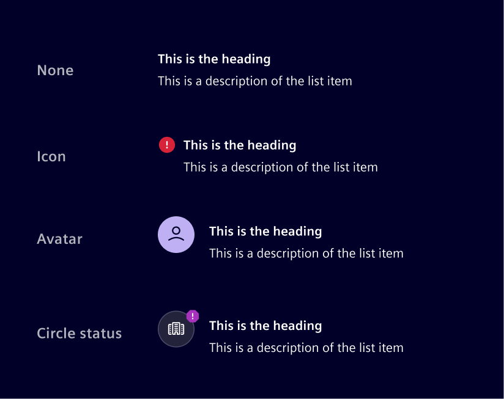
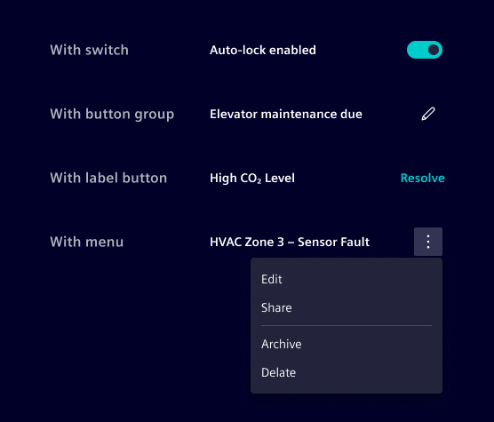
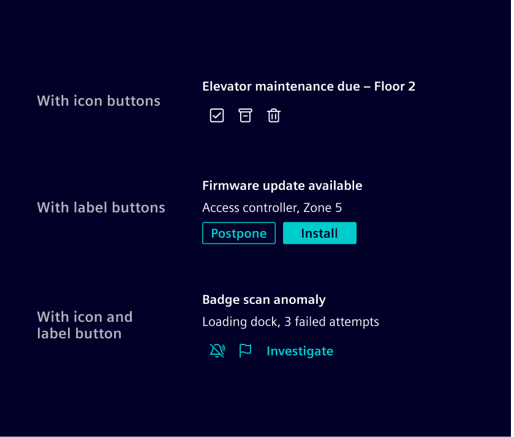
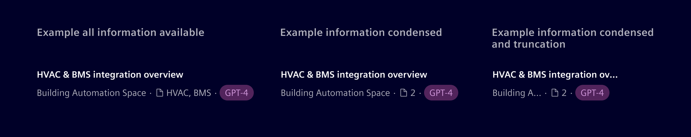

# List item

The **list item** is the building block used to compose lists.
Each item represents a single row of content and is flexible to support
different content type.

## Usage ---

List items are designed to be flexible
and can be used in different containers depending on the context. For example:

- With [cards](../layout-navigation/cards.md)
  to stack related information together in a compact space, use filled or outline version.
- With [popovers](../status-notifications/popover.md)
  to show items inside a floating container.
- With [side panels](../layout-navigation/side-panel.md),
  used when the list is part of the application frame, or contextual to the current page.
- With [list groups](../lists-tables-trees/list-group.md),
  to represent a single-column layout that behaves like a simplified table.

The list item can be **read-only** or **support interactions**.

### When to use

- To construct the [notification pattern](../../patterns/notifications.md).
- To construct the chat history pattern.
- When content needs to be shown as a repeatable, scannable row.

### Best practices

- For complex data, use a [table](../lists-tables-trees/overview.md) instead of a list.
- Keep structure consistent across all list items in the same list.

## Design ---

### Anatomy

The following is an example of the most common layout.

> 1\. Indicator, 2. Timestamp, 3. Heading, 4. Description, 5. Primary action, 6. Metadata, 7. Quick actions

The anatomy above is a default example, but every slot can be swapped for a different control depending on the interaction the list needs to support. For example:

- Add checkboxes to support multi-select and bulk actions,
  or radio buttons for single-select.
- Add a drag handle to support manual reordering.
- Replace the heading text with an input to support inline editing.

### Indicator

The indicator can support icons, [circle status](../status-notifications/circle-status.md),
or an [avatar](../status-notifications/avatar.md), depending on the content needs.

It also supports an unread state, typically used for
[notifications](../../patterns/notifications.md).

### Actions

The list item supports two distinct action slots:

The primary action is most directly tied to the item's purpose.
Works best as a single action, though it can hold more.

Quick actions are usually for operations performed on the item itself, such as pinning, archiving, sharing, or deleting. Works best when several need to be exposed at once.

Use a menu when there are more than three or four.

### Metadata

It is typically displayed as text-based informational attributes.
Icons may be added when they improve recognition.
[Badges](../status-notifications/badges.md) can be used for explicit states or applied labels that should stand out visually.

The metadata does not include an intrinsic overflow behavior.
How overflow is handled should change according to the layout constraints and information priorities.

## Code ---

### Example

<si-docs-component example="list-item/list-item" height="400"></si-docs-component>

### Action list items

If the entire item is clickable, wrap the content inside a `<button>` or `<a>` element and apply the `.list-item-action` helper class for hover and focus styling.
Use `<a>` when the action navigates to another page or resource, and `<button>` when it triggers an in-page action.

The item should be placed inside a `<ul>` + `<li>` structure to preserve list semantics.

Use `aria-labelledby` and `aria-describedby` on the interactive element to provide a concise accessible name (the title) and description, instead of exposing all inner text as the accessible name.

<si-docs-component example="list-item/list-item-action" height="400"></si-docs-component>

### Metadata

Use `.list-item-metadata` to display supplementary contextual information below the description, such as workspace names, contributor counts, document links, or status badges.
Items within the metadata row can be separated with `.list-item-metadata-divider`, which renders a small dot separator.

### Unread state

Use the `.unread` class on `.list-item-title` to indicate unread items with a bold title and a dot indicator.

<si-docs-component example="list-item/list-item-unread" height="400"></si-docs-component>
