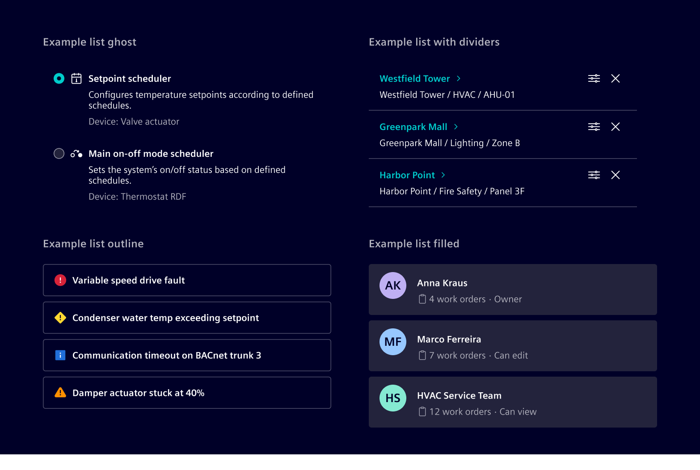
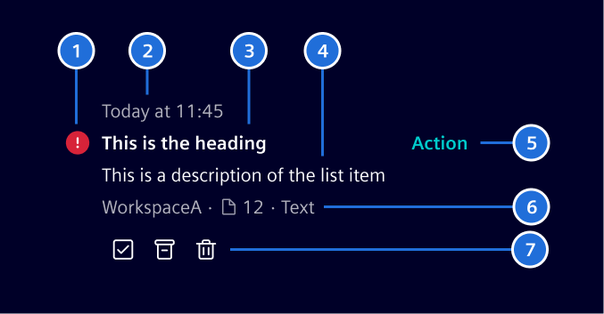
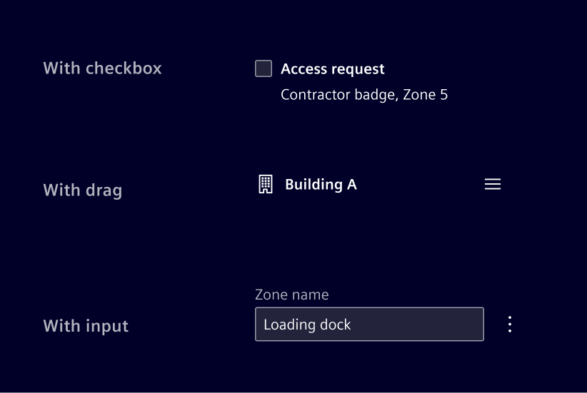
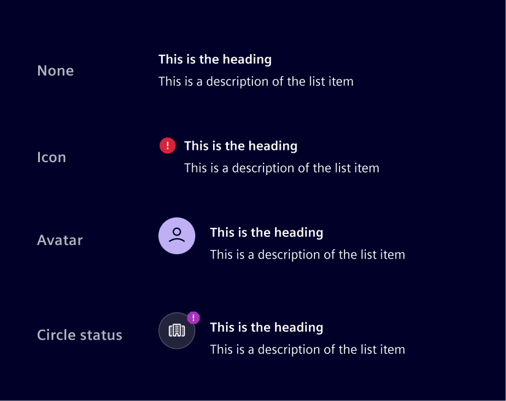
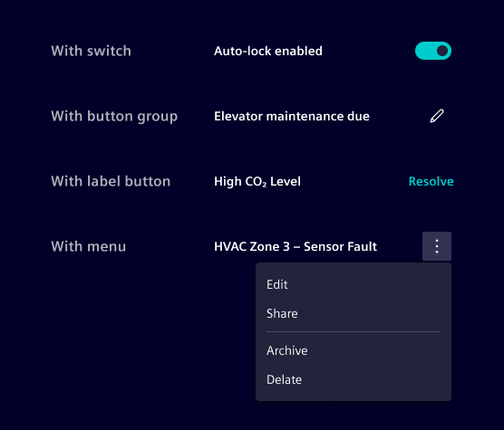
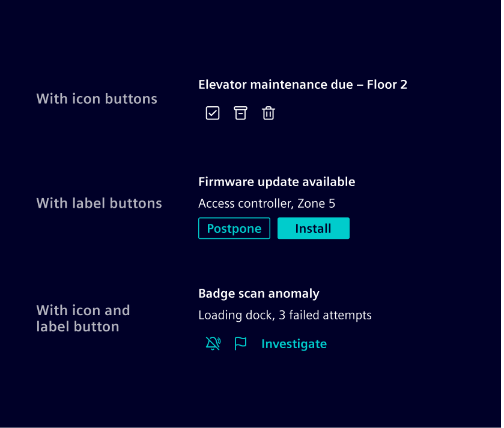
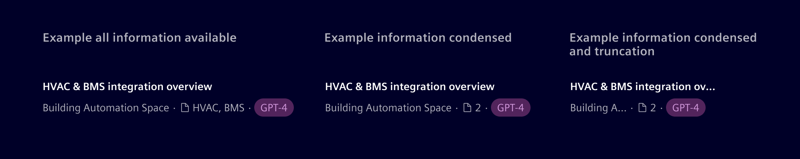

# List

Lists organize related content into rows that are easy to scan.

## Usage ---

Lists are designed to be flexible
and can be used with different styles depending on the context.
They can be **read-only** or **support interactions**.

- Use a **ghost** list when the items should blend into the surrounding
  content and stay lightweight.
- Use a **divider** list when the items need separation but the list
  should still feel quiet and compact.
- Use a **filled** list when the list should stand out as a distinct section or card.
- Use an **outline** list when you want a clear container around the items
  without the stronger weight of a filled surface.



### When to use

- When content needs to be shown as a repeatable, scannable row.

### Best practices

- For complex data, use a [table](../lists-tables-trees/overview.md) instead of a list.
- Keep structure consistent across all list items in the same list.

## Design ---

### Anatomy

**List items** are flexible building blocks that can support differentcontent types.
The following example shows the most common layout.



> 1\. Indicator, 2. Timestamp, 3. Heading, 4. Description, 5. Primary action, 6. Metadata, 7. Quick actions

The anatomy above is a default example, but every slot can be swapped for a different control depending on the interaction the list needs to support. For example:

- Add checkboxes to support multi-select and bulk actions,
  or radio buttons for single-select.
- Add a drag handle to support manual reordering.
- Replace the heading text with an input to support inline editing.



### Indicator

The indicator can support icons, [circle status](../status-notifications/circle-status.md),
or an [avatar](../status-notifications/avatar.md), depending on the content needs.



### Actions

The list item supports two distinct action slots:

The primary action is most directly tied to the item's purpose.
Works best as a single action, though it can hold more.



Quick actions are usually for operations performed on the item itself, such as pinning, archiving, sharing, or deleting. Works best when several need to be exposed at once.



Use a menu when there are more than three or four.

### Metadata

It is typically displayed as text-based informational attributes.
Icons may be added when they improve recognition.
[Badges](../status-notifications/badges.md) can be used for explicit states or applied labels that should stand out visually.

The metadata does not include an intrinsic overflow behavior.
How overflow is handled should change according to the layout constraints and information priorities.



## Code ---

### Example

<si-docs-component example="list-item/list-item" height="400"></si-docs-component>

### Action list items

If the entire item is clickable, wrap the content inside a `<button>` or `<a>` element and apply the `.list-item-action` helper class for hover and focus styling.
Use `<a>` when the action navigates to another page or resource, and `<button>` when it triggers an in-page action.

The item should be placed inside a `<ul>` + `<li>` structure to preserve list semantics.

Use `aria-labelledby` and `aria-describedby` on the interactive element to provide a concise accessible name (the title) and description, instead of exposing all inner text as the accessible name.

<si-docs-component example="list-item/list-item-action" height="400"></si-docs-component>

### Metadata

Use `.list-item-metadata` to display supplementary contextual information below the description, such as workspace names, contributor counts, document links, or status badges.
Items within the metadata row can be separated with `.list-item-metadata-divider`, which renders a small dot separator.

### Unread state

Use the `.unread` class on `.list-item-title` to indicate unread items with a bold title and a dot indicator.

<si-docs-component example="list-item/list-item-unread" height="400"></si-docs-component>

### List in a card

A list can be placed directly inside a [card](../layout-navigation/cards.md).
The card provides the surrounding container, so use the plain `.list`,
optionally with `.list-divider`, instead of `.list-outline` or `.list-filled`.
The list adopts the rounded corners of the card and its items align with the
card header and footer padding.

```html
<div class="card">
  <div class="card-header">Header text</div>
  <ul class="list list-divider">
    <li class="list-item"><span class="list-item-title">An item</span></li>
    <li class="list-item"><span class="list-item-title">A second item</span></li>
  </ul>
</div>
```

### Migrating from the list group

The Bootstrap based list group (`.list-group`) is deprecated in favor of the list.
The list group is only a bordered container and has no notion of the list anatomy,
so migrating means restructuring the markup, it is not a plain class rename.

| Deprecated                          | Replacement                                                                                                |
| ----------------------------------- | ---------------------------------------------------------------------------------------------------------- |
| `.list-group`                       | `.list`, optionally with `.list-divider`, `.list-filled` or `.list-outline`                                |
| `.list-group-item`                  | `.list-item`, wrap the content in the slot classes such as `.list-item-title` and `.list-item-description` |
| `.list-group-item-action`           | `.list-item.list-item-action` on a `<button>` or `<a>`                                                     |
| `.list-group-flush`                 | `.list.list-divider` to preserve dividers; otherwise `.list`, which has no outer border                    |
| `.list-group-md`, `.list-group-lg`  | No replacement, the height of a list item follows its content                                              |
| `.list-group-horizontal*`           | No replacement, use flex or grid utilities                                                                 |
| `.list-group-numbered`              | No replacement, use an ordered list with a custom counter because `.list-item` removes list markers        |
| `.list-group-item-*` color variants | No replacement, use the background and text utilities, or an [indicator](#indicator)                       |
| `.list-header`                      | No replacement, use a heading element                                                                      |

The list group styles remain available so existing applications keep working,
but they are no longer recommended and will not receive further design updates.
