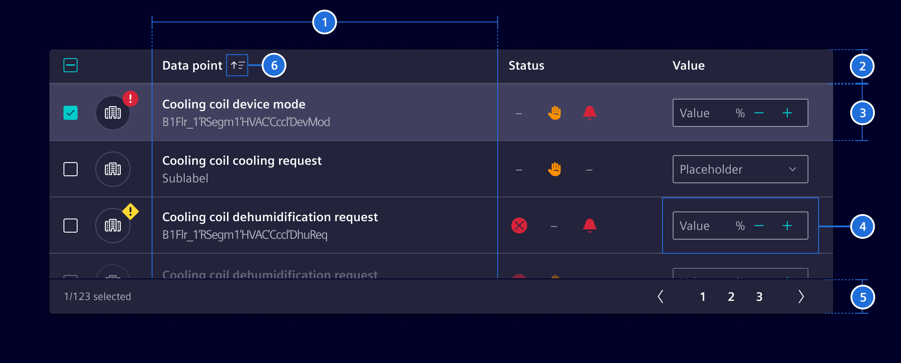
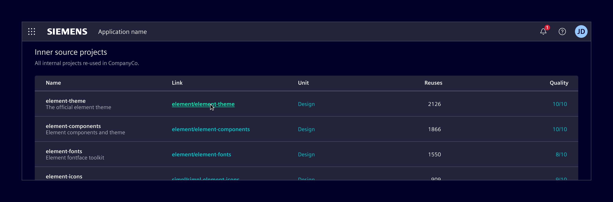
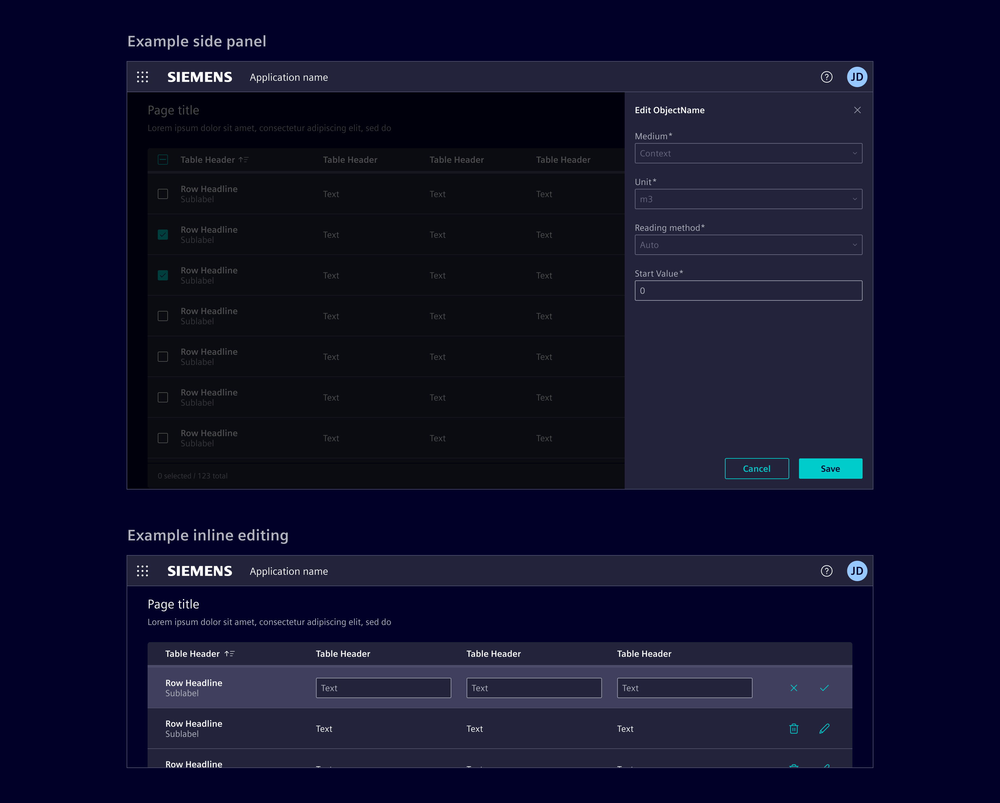
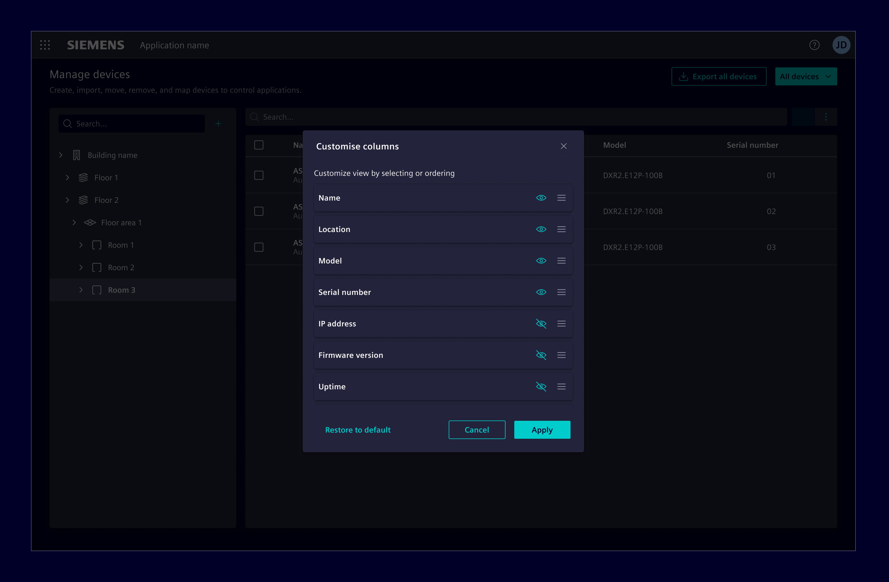
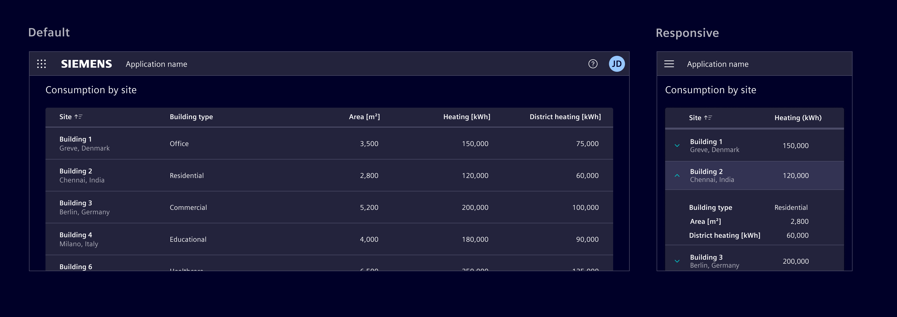

# Tables & datatables

Tables and datatables are used to organize and display structured information in rows and columns,
enabling users to scan, compare, and analyze data efficiently.

## Usage ---

Element covers three different implementations, each suited to different levels of complexity and scale:

- [Bootstrap table](../lists-tables-trees/bootstrap-table.md): simple, static, HTML-based tables.
- [Datatable (ngx-datatable)](../lists-tables-trees/datatable.md): interactive tables for large datasets.
- [AG Grid](../lists-tables-trees/ag-grid.md): advanced data grid for complex, enterprise-level use cases (paid license required).

### When to use

- To view or process a large amount of information at once.
- To make it easy to compare data points between rows or columns.
- When data is easy to understand in a flat hierarchy.

## Best practices

- Order rows intuitively.
- Minimize the number of columns.
- Keep column headers short. Use concise labels for clarity.
- Shorten data to make scanning easier.
- Left-align text and right-align numeric values. Don’t use center alignment.
- Use hyphen (-) to represent empty values.
- Use [empty state](../status-notifications/empty-state.md) to represent an empty table.
- Don't use expandable rows with more than 1 level.
- When possible, avoid repeating the title in every cell of a given column.
- Use [skeleton](../progress-indication/skeleton.md) to represent the loading state.

## Design ---

All three implementations share the same overall look and feel.
The main differences lie in the features and interaction capabilities they support.

### Elements

> 1. Columns, 2. Header, 3. Row, 4. Cell, 5. Footer (optional), 6. Sort button (optional)

### Row states

### Row density

The data table is available in different row sizes: default, small, extra-small.

### Row selection

Selection methods can be explicit or implicit.

**Explicit selection** uses checkboxes or radio buttons.
Use it for more complex choices that need clear user acknowledgment or for batch actions.

**Implicit selection** allows users to select a row by simply interacting with it.
It is possible to use `shift` or `command` (on macOS) to enable multi-selection.
Use it for simpler, more intuitive interactions, such as viewing details in a
[side panel](../layout-navigation/side-panel.md) or navigating to a new screen

When selection is not required, do not apply a hover effect to rows.
Allow interaction only within specific cell elements, such as buttons or menus.

### Placement

Tables should be positioned directly in the main content area.
Avoid layering tables within non-functional container elements.

When tables are placed inside other containers, such as [modals](../layout-navigation/modals.md)
and [side panel](../layout-navigation/side-panel.md), no elevation should be applied.
Additionally, in these contexts, avoid using tables with more than two or three columns to prevent overcrowding.
Consider using [list group](../lists-tables-trees/list-group.md) instead.

### Search and actions placement

Place the search field directly above the data table, aligned to the left (RTL).
It can stretch the entire table width or be smaller for short search terms.

Position table actions to the right of the search field.
When possible, limit to 3-4 actions, collapsing less frequent ones in a menu.

### Inline actions

Inline actions are specific functions performed on a table row.
Display up to two actions. If more actions are needed, consider collapsing them into a menu.

### Edit table content

Consider the following methods for editing row content.
Choose and adapt the method based on the use case and requirements.

- [side panel](../layout-navigation/side-panel.md): Use it for row editing without losing context.
- [modal dialog](../layout-navigation/modals.md): Use it to focus user attention on editing tasks or require complex input forms.
- Inline editing: Use it for quick, in-place edits directly within table cells.
- Full page: Redirect to a dedicated page for editing providing a full-screen, focused space for complex edits.
  Use it for highly detailed edits.

### Column management

Enable users to choose what data is included in the table with the
[column selection dialog](../layout-navigation/modals.md).
This functionality allows users to hide and reorder columns based on their use case.

### Footer

Use the footer to display the total number of entries in the table, for example `125 entries`.
When row selection is enabled, the footer can also reflect the selection state, for example `12 of 125 selected`.
The count always refers to the entire dataset, not just the current visible items.

If needed, it can be combined with [pagination](../layout-navigation/pagination.md).
Pagination is only available in ngx-datatable and AG Grid.

### Responsive behavior

Ensure tables are accessible on all screen sizes by prioritizing essential
information and hiding less critical data on smaller screens.

Consider the following strategies and adapt according to the use case:

- **Expandable rows:** Collapses less critical columns under an expandable row.

- **Reflow:** Displays data horizontally until a minimum size, then stack row content vertically.

- **Transform:** Changes the content layout by transforming each row into individual cards.

- **Move:** Enable horizontal scrolling to accommodate more columns, allowing users to access all data.
  However, be mindful about this approach as it can make it difficult to view and compare data.

For bootstrap tables, responsive behavior is limited.
The primary supported approach is horizontal scrolling by placing the table inside a scroll container.
