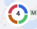
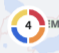

# Element Maps

**Element Maps** is Element's high-level Angular map component based on
[OpenLayers](https://openlayers.org/). It provides points, grouping, clusters,
labels, tooltips, and popovers out of the box.

## Usage ---

Use Element Maps when an application needs a ready-to-use map component with
Element-specific behavior instead of assembling map features individually.

### When to use

- To display and group location points with a predefined Element presentation.
- When built-in clustering, labels, tooltips, or popovers are required.
- When a high-level component is preferable to direct interaction with a map library.

## Code ---

The `si-map` component uses the [OpenLayers](https://openlayers.org/) library.
OpenLayers is a high-performance, feature-rich library for creating interactive
geographical maps. It can display map tiles, vector data, and markers loaded from
a wide range of sources.

The API documentation can be found in the official
[OpenLayers API docs](https://openlayers.org/en/latest/apidoc/), with further useful
examples on the [OpenLayers examples page](https://openlayers.org/en/latest/examples/).
The source code is available in the
[OpenLayers GitHub repository](https://github.com/openlayers/openlayers).

For cluster functionality and other additional features,
[ol-ext](https://viglino.github.io/ol-ext/) is used. More information and
documentation can be found in the
[ol-ext GitHub repository](https://github.com/Viglino/ol-ext).

The OpenLayers [ol-mapbox-style](https://github.com/openlayers/ol-mapbox-style)
library is used to create OpenLayers maps from Mapbox Style Specification objects.

### Usage

??? info "Required Packages"

    - [ol](https://www.npmjs.com/package/ol)
    - [ol-ext](https://www.npmjs.com/package/ol-ext)
    - [ol-mapbox-style](https://www.npmjs.com/package/ol-mapbox-style)

```sh
npm install --save @siemens/maps-ng @siemens/map-styles

# Also install the needed peer dependencies
npm install --save ol ol-ext ol-mapbox-style
```

Add library assets and CommonJS dependencies in `angular.json` under the build options:

```json
{
  "architect": {
    "build": {
      "options": {
        "assets": [
          {
            "glob": "**/*",
            "input": "./node_modules/@siemens/maps-ng/assets",
            "output": "/assets/"
          }
        ],
        "allowedCommonJsDependencies": [
          "xml-utils/find-tags-by-name.js",
          "xml-utils/get-attribute.js",
          "web-worker",
          "pbf",
          "earcut",
          "rbush"
        ]
      }
    }
  }
}
```

Import the OpenLayers styles into the main global stylesheet:

```scss
@use 'ol/ol.css';
```

Import `SiMapComponent` into the component that displays the map:

```ts
import { Component } from '@angular/core';
import { SiMapComponent } from '@siemens/maps-ng';

@Component({
  selector: 'app-map',
  imports: [SiMapComponent],
  template: '<si-map maptilerKey="REPLACE_WITH_YOUR_MAPTILER_KEY" />'
})
export class MapComponent {}
```

Provide a MapTiler key when using the default map style:

```html
<si-map maptilerKey="REPLACE_WITH_YOUR_MAPTILER_KEY"></si-map>
```

### Features

#### Grouping

Points on the map can be grouped so they share the color provided in `groupColors`.
While clustered, points are grouped in a donut chart.

To group points, specify the `group` property on a point object. The value of
`group` is used to match the color from the default palette or `groupColors`, if
provided. While `groupColors` is optional, the default color palette is `status`.

A custom color palette can be defined with the following code:

```html
<si-map [points]="points" [groupColors]="{ 1: 'red', 2: 'green', 3: 'blue', 4: 'black'}"></si-map>
```

!!! warning "Accessibility of custom colors"

    The usage of Element color definitions is strongly recommended to fulfill accessibility standards.
    Involve your UX specialist when using custom colors to ensure accessibility,
    especially important are appropriate contrasts for different themes.

To override a group color, specify a marker color on the point object itself:

```ts
const point: MapPoint = {
  name: 'Point 1',
  lon: 11,
  lat: 10,
  group: 1,
  marker: {
    color: 'orange'
  }
};
```

##### Examples

**Grouping with default status palette:**

```html
<si-map [points]="points"></si-map>
```

```ts
const points: MapPoint[] = [
  {
    name: 'Point 1',
    lon: 11,
    lat: 10,
    group: 1 // $element-status-information
  },
  {
    name: 'Point 2',
    lon: 11,
    lat: 10,
    group: 2 // $element-status-success
  },
  {
    name: 'Point 3',
    lon: 11,
    lat: 10,
    group: 3 // $element-status-warning
  },
  {
    name: 'Point 4',
    lon: 11,
    lat: 10,
    group: 4 // $element-status-danger
  }
];
```



**Grouping with Element palette colors:**

```html
<si-map [points]="points" groupColors="element"></si-map>
```

```ts
const points: MapPoint[] = [
  {
    name: 'Point 1',
    lon: 11,
    lat: 10,
    group: 1 // $element-red-500 / 300 (depending on theme)
  },
  {
    name: 'Point 2',
    lon: 11,
    lat: 10,
    group: 2 // $element-orange-500
  },
  {
    name: 'Point 3',
    lon: 11,
    lat: 10,
    group: 3 // $element-blue-500
  },
  {
    name: 'Point 4',
    lon: 11,
    lat: 10,
    group: 4 // $element-yellow-500
  }
];
```



#### Custom Mapbox style

The map appearance can be changed by passing a custom Mapbox style to the
component as the `styleJson` input. In this case, `maptilerKey` is not needed as
the custom style overrides it.

```html
<si-map [styleJson]="styleJson"></si-map>
```

See the official [Mapbox documentation](https://docs.mapbox.com/) for more information.

#### Customize tooltip length

Customize the tooltip width with `maxLabelLength`:

```html
<si-map
  class="flex-fill"
  [points]="points"
  [displayTooltipOnHover]="true"
  [maptilerKey]="maptilerKey"
>
  <si-map-tooltip [maxLabelLength]="50" />
</si-map>
```

### Map example

<si-docs-component example="si-map/si-map-default-style" height="580"></si-docs-component>

<si-docs-api component="SiMapComponent" package="@siemens/maps-ng" hideImplicitlyPublic="true"></si-docs-api>

#### Methods

| Name        | Type                                  | Description                                                                 |
| ----------- | ------------------------------------- | --------------------------------------------------------------------------- |
| **clear**   | `clear() => void`                     | Remove all points from map.                                                 |
| **refresh** | `refresh(points: MapPoint[]) => void` | Updates the map with new set of points provided in argument.                |
| **select**  | `select(point: MapPoint) => void`     | Zoom in the provided point and display popover with additional information. |

### MapTiler API key

Element Maps currently supports MapTiler as an OSM tile source. An API key is
required to use this service. The API key is unique per project and its use is
limited to certain URLs through an HTTP Origin Header allow-list.

As with most map services, commercial use of the API is a paid service and
requires an account with an active subscription. Element does not provide such
an account for all of Siemens.

### Testing

When running automated tests, do not load map tiles. This drastically reduces the
number of MapTiler requests, which are limited by contract. Tests should cover the
application's map functionality rather than the map data.

- **Unit tests:** Do not provide an API key.
- **Playwright tests:** Stub the `tiles.json` request and related requests using
  [`page.route(...)`](https://github.com/siemens/element/tree/main/playwright/e2e/element-examples/maps/static.spec.ts).

<si-docs-types></si-docs-types>
