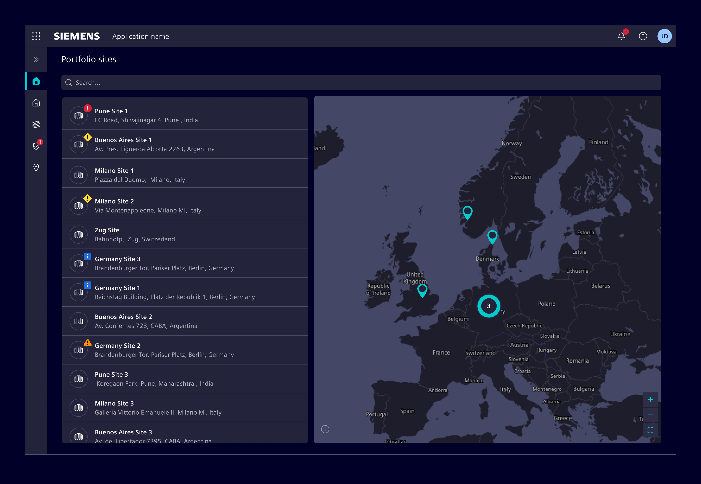
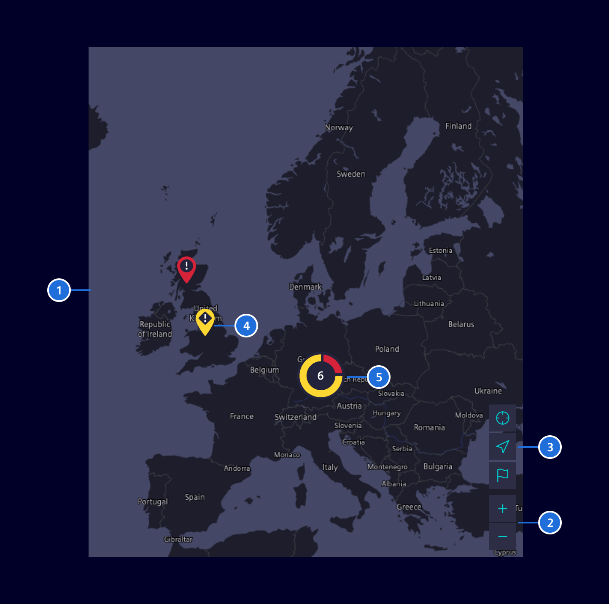
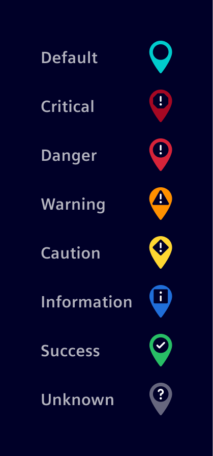
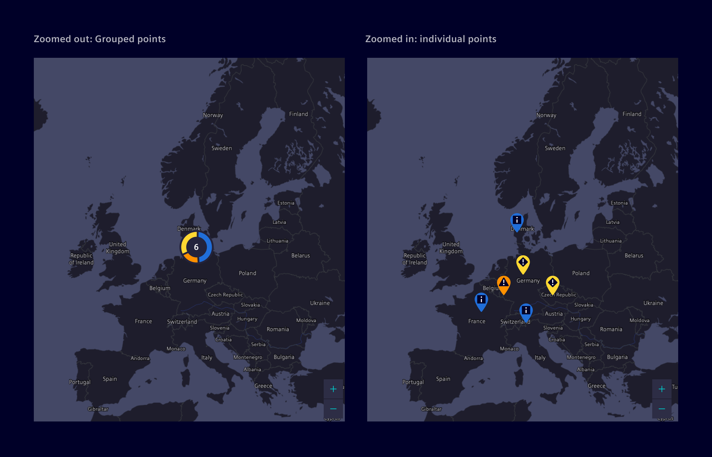
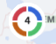
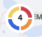

# Maps

The **Map** component is used to represent geographical information.

## Usage ---

A map provides location aware context and helps users to understand the spatial
relationship between a specific point, like a site or building and other
landmarks,

Interactive maps allow users to select, pan and zoom to obtain further
information.



### When to use

- Use it when users need to manage a large amount of locations that are
  geographically dispersed.
- Use it to provide an overview about the current status of all the locations.
- Use it to help users better understand the surrounding environment of a
  specific location like a site or building.
- Maps are particularly useful for users that need to physically visit a
  location, such as facility managers.

### Best Practices for Maps

- Maps require a large amount of screen space to be readable. If space is
  limited, provide options to collapse/expand or hide it.
- If a specific location is not the main focus of the information being
  displayed, using a map for representation might not be required, since it
  doesn't provide any additional benefit to the user. Using a textual
  representation to display a location's address is more efficient.
- Try to limit the number of map actions, like *zoom* and *find my location* to
  *5*.

## Design ---

### Elements



> 1. Map, 2. Zoom actions, 3. Additional actions (optional), 4. Map pin, 5. Grouped locations

### Location representation

A *Map pin* is used to represent a single location.
If needed, *Map pins* can also be used to represent different status.
Avoid mixing the
[Status color palette](https://element.siemens.io/fundamentals/colors/ui-colors/#status)
with the default color.



Locations are clustered together and represented by a donut chart when
geographically close, allowing an efficient visualization of the locations and
their status. When zoomed in, they are displayed as individual *Map pins* to provide
a more accurate view.

The number represents the amount of locations that are grouped in that chart. The
size of each slice indicates the relative quantity of locations in a specific state.



## Code ---

The *Element-Map* component uses the [OpenLayers](https://openlayers.org/)
library. OpenLayers is a high-performance, feature-rich library for creating
interactive geographical maps. It can display map tiles, vector data and markers
loaded from a wide range of sources.

The API documentation can be found on the official website [API docs](https://openlayers.org/en/latest/apidoc/)
and further useful examples on their [Examples Page](https://openlayers.org/en/latest/examples/).
The source code is located in the [OpenLayers GitHub repository](https://github.com/openlayers/openlayers).

For the cluster functionality and other additional features, the [ol-ext](https://viglino.github.io/ol-ext/)
extension is used. More info and documentation can be found in
the [ol-ext GitHub repository](https://github.com/Viglino/ol-ext).

The OpenLayers [ol-mapbox-style](https://github.com/openlayers/ol-mapbox-style)
library is used to create OpenLayers maps from Mapbox Style Specification
objects.

### Usage

??? info "Required Packages"
    - [ol](https://www.npmjs.com/package/ol)
    - [ol-ext](https://www.npmjs.com/package/ol-ext)
    - [ol-mapbox-style](https://www.npmjs.com/package/ol-mapbox-style)

```sh
npm install --save @siemens/maps-ng

# Also install the needed peer dependencies
npm install --save ol ol-ext ol-mapbox-style
```

Add library assets and CommonJs dependencies in your *angular.json* under the build options

```json
{
  "architect": {
    "build": {
      "options": {
        "assets": [
          // ... other assets
          {
            "glob": "**/*",
            "input": "./node_modules/@siemens/maps-ng/assets",
            "output": "/assets/"
          }
        ],
        // ... other options
        "allowedCommonJsDependencies": [
          "xml-utils/find-tags-by-name.js",
          "xml-utils/get-attribute.js",
          "web-worker",
          "pbf",
          "earcut",
          "rbush"
        ]
      }
    }
  }
}
```

Import the OpenLayers styles into your main global stylesheet:

```scss
@use 'ol/ol.css';
```

Add the library to the list of *imports* in your Angular *AppModule* like this:

```ts
// [...]

// Import this library and required dependencies
import { ElementMapsNgModule } from '@siemens/maps-ng';

@NgModule({
  declarations: [AppComponent],
  imports: [
    BrowserModule,

    // Import this library
    ElementMapsNgModule
  ],
  bootstrap: [AppComponent]
})
export class AppModule { }
```

And lastly, define a MapTiler key:

```html
<si-map maptilerKey="REPLACE_WITH_YOUR_MAPTILER_KEY"></si-map>
```

### Features

#### Grouping

Points on the map can be grouped in a way that they share the color provided
in `groupColors`. Also while clustered, points are grouped in a donut chart.

If you want points to be grouped, specify the `group` property on a point object.
The value of `group` is then used to match the color from the default palette or
`groupColors` (if provided). While `groupColors` is optional, the default color
palette is `status`.

A custom color palette can be defined with following code:

```html
<si-map [points]="points" [groupColors]="{ 1: 'red', 2: 'green', 3: 'blue', 4: 'black'}"></si-map>
```

!!! warning "Accessibility of custom colors"
    The usage of Element color definitions is strongly recommended to fulfill accessibility standards.
    Involve your UX specialist when using custom colors to ensure accessibility,
    especially important are appropriate contrasts for different themes.

**Note:** To override group color, specify a marker color on the point object
itself:

```ts
const point: MapPoint = {
  name: 'Point 1',
  lon: 11,
  lat: 10,
  group: 1,
  marker: {
    color: 'orange'
  }
};
```

##### Examples

**Grouping with default status palette:**

```html
<si-map [points]="points"></si-map>
```

```ts
const points: MapPoint[] = [
  {
    name: 'Point 1',
    lon: 11,
    lat: 10,
    group: 1 // $element-status-information
  },
  {
    name: 'Point 2',
    lon: 11,
    lat: 10,
    group: 2 // $element-status-success
  },
  {
    name: 'Point 3',
    lon: 11,
    lat: 10,
    group: 3 // $element-status-warning
  },
  {
    name: 'Point 4',
    lon: 11,
    lat: 10,
    group: 4 // $element-status-danger
  }
];
```



**Grouping with element palette colors:**

```html
<si-map [points]="points" groupColors="element"></si-map>
```

```ts
const points: MapPoint[] = [
  {
    name: 'Point 1',
    lon: 11,
    lat: 10,
    group: 1 // $element-red-500 / 300 (depending on theme)
  },
  {
    name: 'Point 2',
    lon: 11,
    lat: 10,
    group: 2 // $element-orange-500
  },
  {
    name: 'Point 3',
    lon: 11,
    lat: 10,
    group: 3 // $element-blue-500
  },
  {
    name: 'Point 4',
    lon: 11,
    lat: 10,
    group: 4 // $element-yellow-500
  }
];
```



#### Custom MapBox style

A user can change the look of the actual map by passing a custom MapBox style to
the component as `styleJson` input. In this case, the `maptilerKey` parameter is
not needed as the custom style overrides it.

```html
<si-map [styleJson]="styleJson"></si-map>
```

More info in the official [MapBox Docs](https://docs.mapbox.com/).

#### Customize tooltip length

A user can customize the tooltip width via `maxLabelLength` see snippet below:

```html
<si-map
  class="flex-fill"
  [points]="points"
  [displayTooltipOnHover]="true"
  [maptilerKey]="maptilerKey"
>
  <si-map-tooltip [maxLabelLength]="50" />
</si-map>
```

### Map example

<si-docs-component example="si-map/si-map-default-style" height="580"></si-docs-component>

<si-docs-api component="SiMapComponent" package="@siemens/maps-ng" hideImplicitlyPublic="true"></si-docs-api>

#### Methods

Name        | Type                                  | Description
------------|---------------------------------------|----------------------------------------------------------------------------
**clear**   | `clear() => void`                     | Remove all points from map.
**refresh** | `refresh(points: MapPoint[]) => void` | Updates the map with new set of points provided in argument.
**select**  | `select(point: MapPoint) => void`     | Zoom in the provided point and display popover with additional information.

### MapTiler API key

Element Maps currently supports MapTiler as OSM tile source. To be able to use
this service, an API key is required. This API key is unique per project and
its use is limited to certain URLs (HTTP Origin Header allow-list).

As for most map services, the commercial use of the API is a paid service and
requires account with active subscription. The procurement of such an account
is not something Element offers for all of Siemens.

### Testing

When running automated tests of your application, you should make sure to *not* load the
map tiles. This drastically reduces the amount of map requests to maptiler that are limited
in our contract. And for testing you want to test your map functionality and not the map data.

- **Unit tests:** Do simply **not** provide an API key during
- **Playwright tests:** Stub the `tiles.json` request (and some others) using [page.route(...)](https://github.com/siemens/element/tree/main/playwright/e2e/element-examples/maps/static.spec.ts).

<si-docs-types></si-docs-types>
