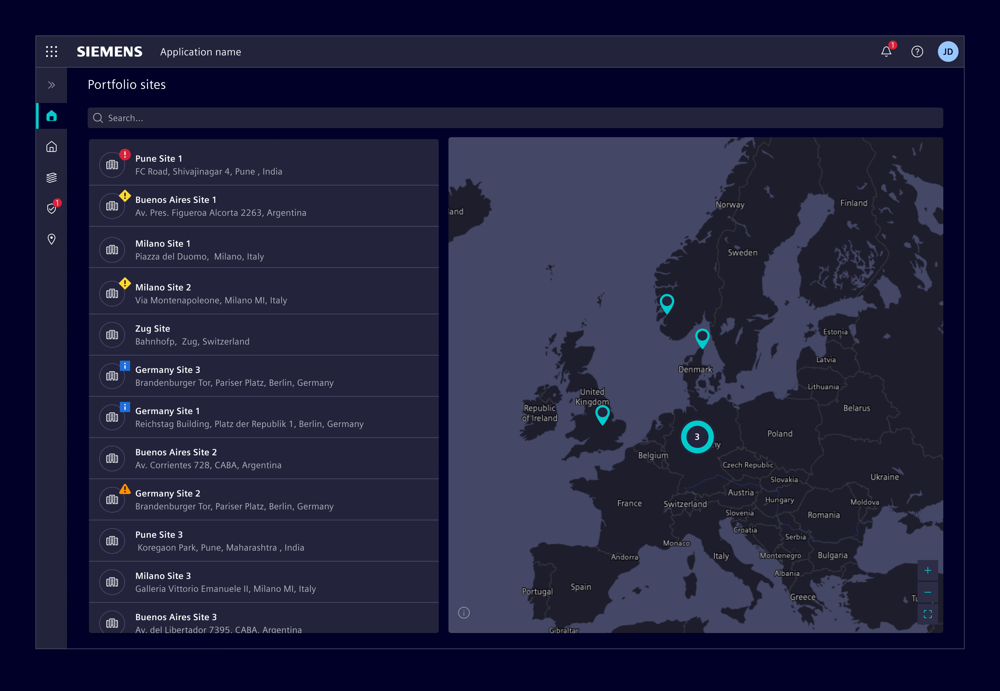
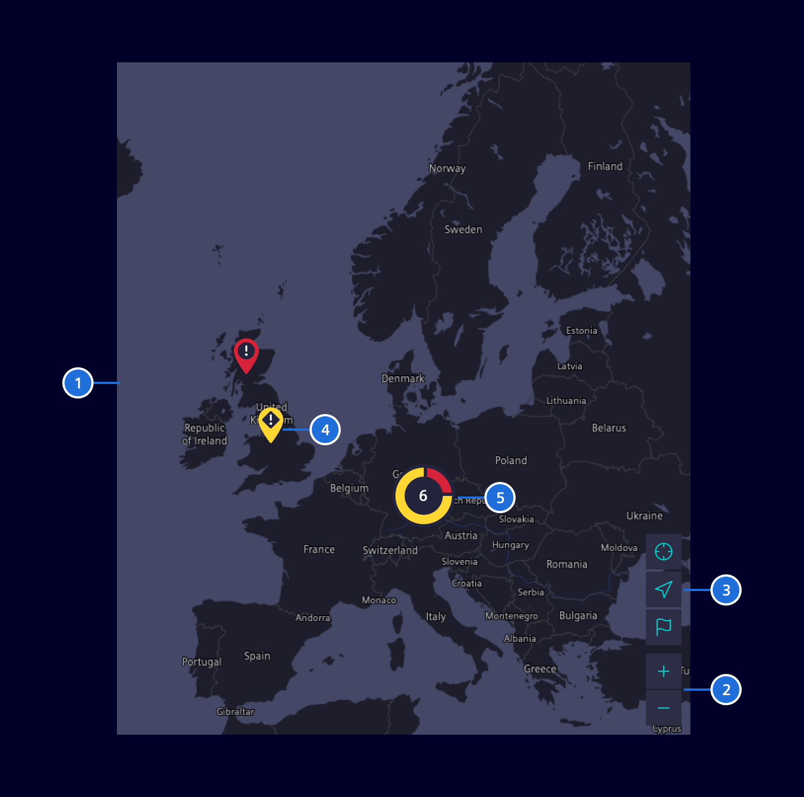
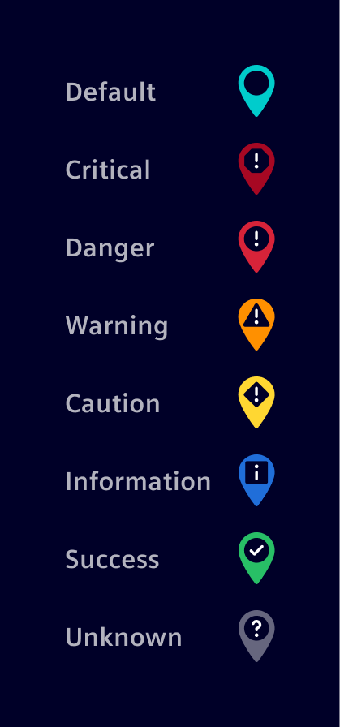
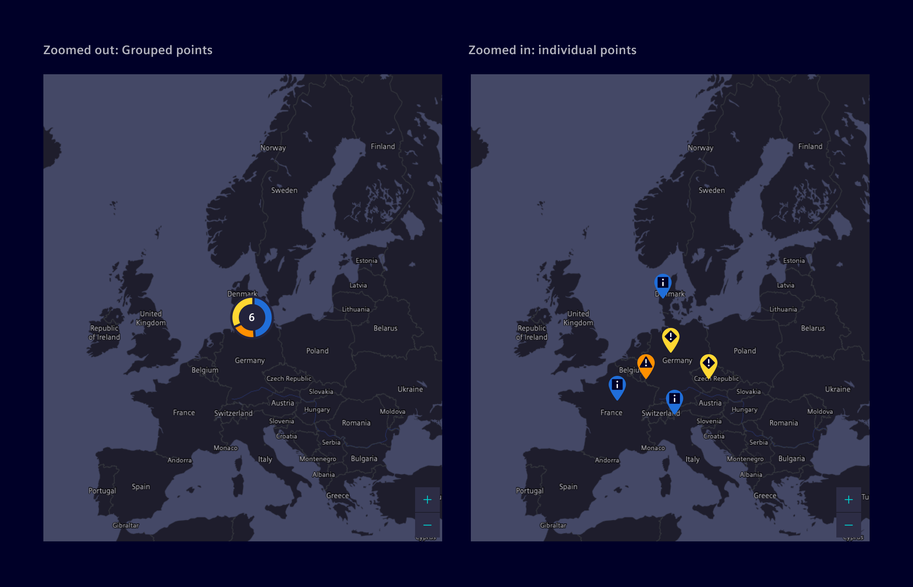

# Maps

Maps represent geographical information. They provide location-aware context and
help users understand the spatial relationship between a point, such as a site or
building, and surrounding landmarks.

## Usage ---

Interactive maps allow users to select locations, pan, and zoom to obtain further
information.

Element supports two implementation options:

- [Element Maps](element-maps.md): a ready-to-use, high-level Angular component based on
  OpenLayers, with built-in points, grouping, clusters, labels, tooltips, and popovers.
- [MapLibre](maplibre.md): a direct integration with `@maplibre/ngx-maplibre-gl`,
  complemented by Element control styles, theme-aware map styles, and translations.

### When to use

- Use it when users need to manage a large number of geographically dispersed locations.
- Use it to provide an overview of the current status of all locations.
- Use it to help users understand the surroundings of a specific location, such as a
  site or building.
- Maps are particularly useful for users who need to physically visit a location,
  such as facility managers.

## Best practices

- Maps require a large amount of screen space to be readable. If space is limited,
  provide options to expand, collapse, or hide the map.
- If a specific location is not the focus of the displayed information, a map might
  not provide additional value. A textual representation of the address is more efficient.
- Limit the number of map actions, such as _zoom_ and _find my location_, to five.

## Design ---

### Elements

> 1. Map, 2. Zoom actions, 3. Additional actions (optional), 4. Map pin, 5. Grouped locations

### Location representation

A _map pin_ represents a single location. Map pins can also represent different statuses.
Avoid mixing the [status color palette](../../fundamentals/colors/ui-colors.md#status)
with the default color.

When locations are geographically close, cluster them in a donut chart to visualize
their locations and statuses efficiently. When users zoom in, display the locations as
individual map pins to provide a more accurate view.

The number represents the amount of locations grouped in the chart. The size of each
slice indicates the relative number of locations in a specific state.

