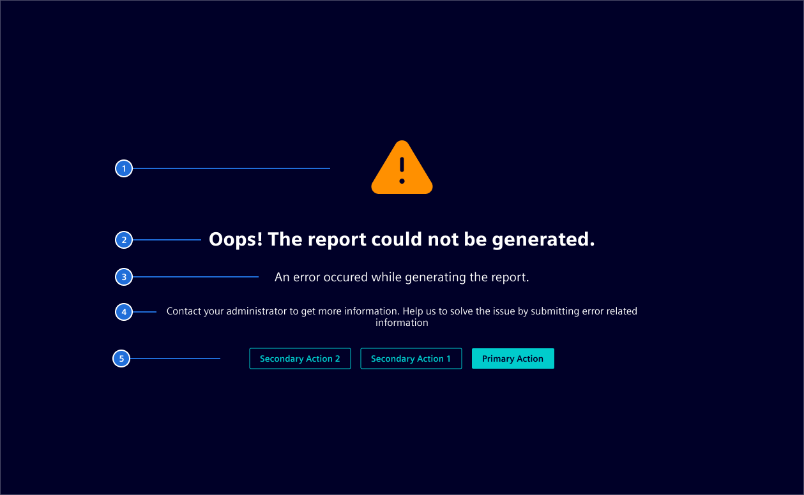

# Info page

**Info pages** are displayed when users encounter issues, such as broken links or general malfunctions, and are also used for informational purposes, such as invitations to join a company.
The goal is to inform the user about the topic and guide them towards a solution.

## Usage ---

Info pages can use icons, status icons or even illustrations to support meaning of the message and making it more understandable.


### When to use

- **Error reporting**: Display info pages when an error occurs to inform users about the issue and provide guidance on how to resolve it.
- **User information and actions**: Use info pages to inform users and prompt specific actions, such as inviting them to use an application or join a group.

## Design ---

The **info page** is a generic layout template to display an error or information to the user.



> 1. Image , 2. Title, 3. Copy text (optional), 4. Instructions (optional), 5. Actions

An info page consists of the following elements:

1. **Image**: The image can be an icon, status icon, or illustration that is semantically associated with the current view. The icon's color should reflect the severity of the message.
2. **Title**: A short and concise title to explain the topic. A simple wording should be used.
3. **Copy text**: A more detailed explanation, outlining the reasoning for it and how a user can resolve it (*optional*).
4. **Instructions**: A detailed instruction on how a user can resolve it, or explanation on what to do next (*optional*).
5. **Actions**: Allows the user to take actions to resolve the issue (*optional*).

## Code ---

### Usage

```ts
import { RouterModule } from '@angular/router';
import { SiInfoPageComponent } from '@siemens/element-ng/info-page';

@Component({
  imports: [SiInfoPageComponent, ..],
})
```

Use the `si-info-page` component on a page of
your application and set the input properties as needed. All input strings are sent to
the translate pipe by the component.

### Default info page

The component comes with an integrated icon. Configure the icon, icon color, set the text
as needed and provide a link to leave the page again.

<si-docs-component example="si-info-page/si-info-page" height="350"></si-docs-component>

### Stacked icon

Use the `&lt;si-icon/&gt;` component and add the `.si-info-image` CSS class to configure a
stacked icon according to your needs. Any elements with the `.si-info-image` class will replace
the internal icon component using content projection.

Use content projection and add the CSS class `.si-info-actions` to the surrounding element
to inject `Actions`.

<si-docs-component example="si-info-page/si-info-page-stacked-icon" height="350"></si-docs-component>

### Illustrations

Use the `&lt;img/&gt;` element and add the `.si-info-image` CSS class to change the info page image to
an illustration.

<si-docs-component example="si-info-page/si-info-page-illustration" height="650"></si-docs-component>

<si-docs-api component="SiInfoPageComponent"></si-docs-api>

<si-docs-types></si-docs-types>
