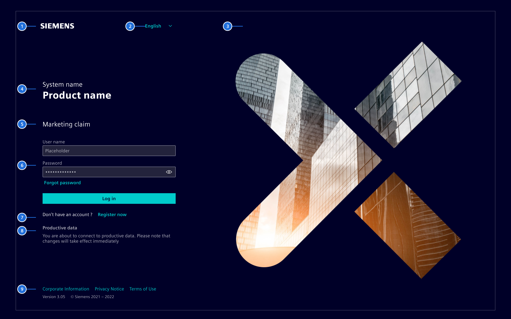
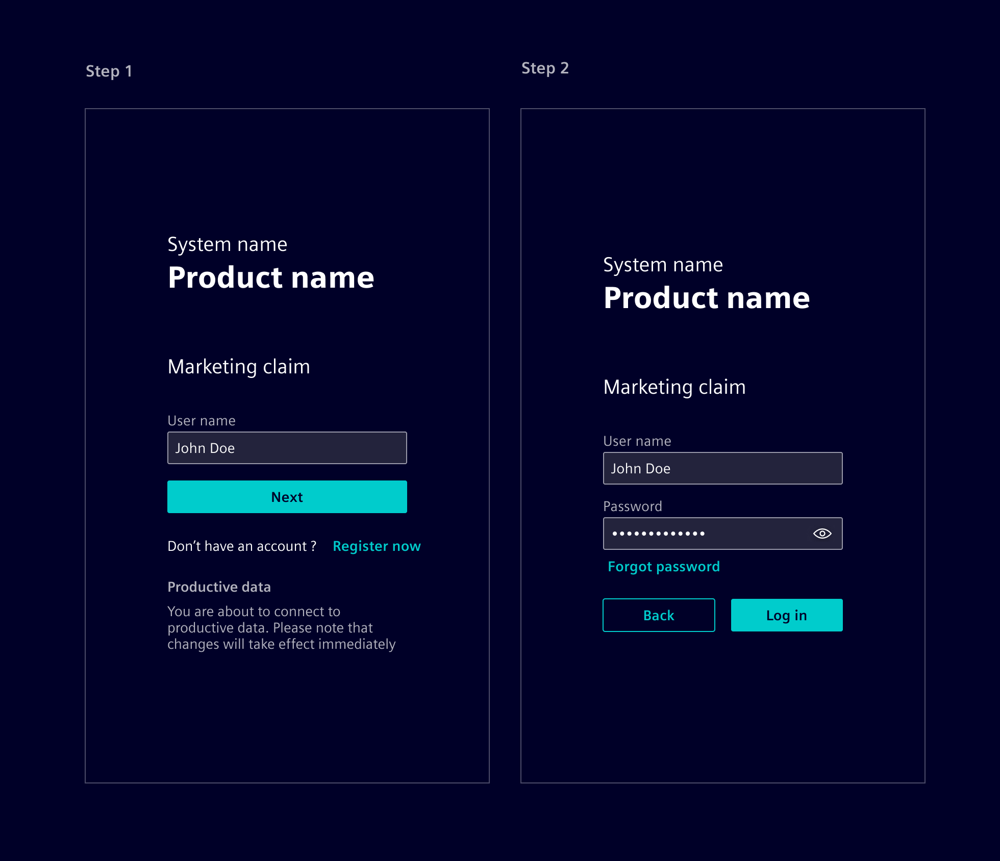
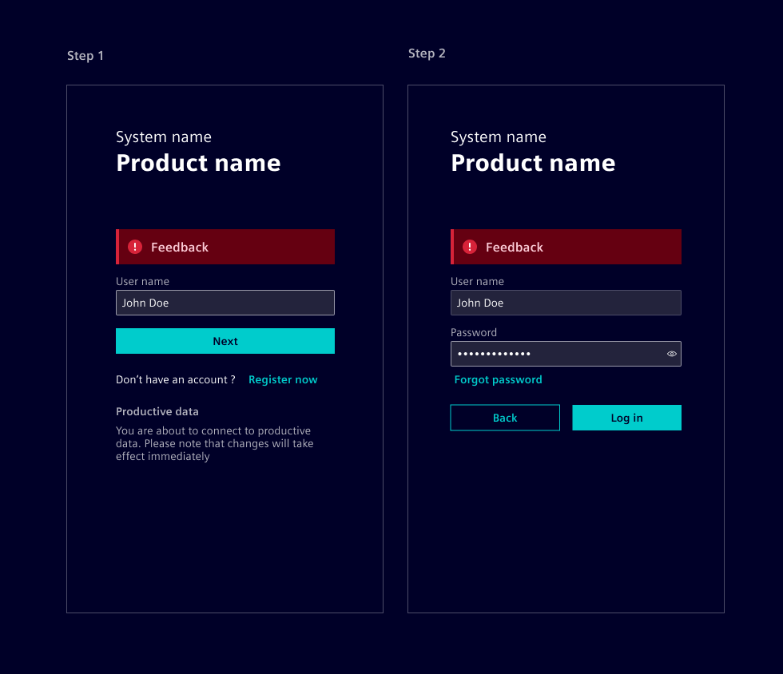
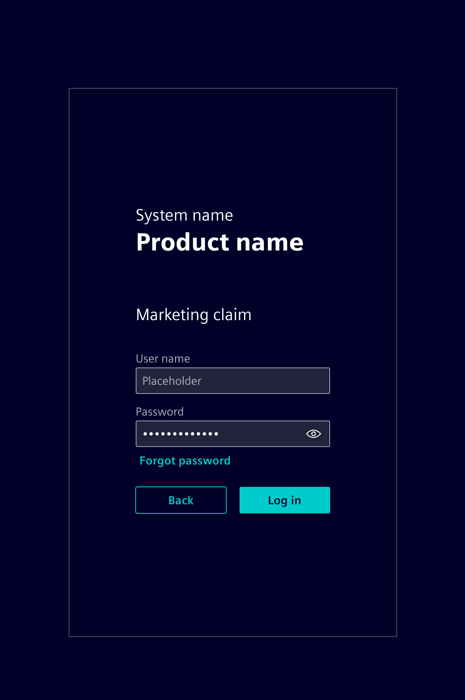
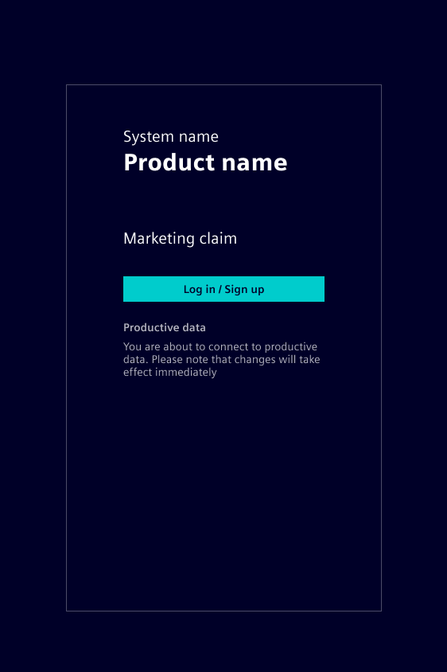
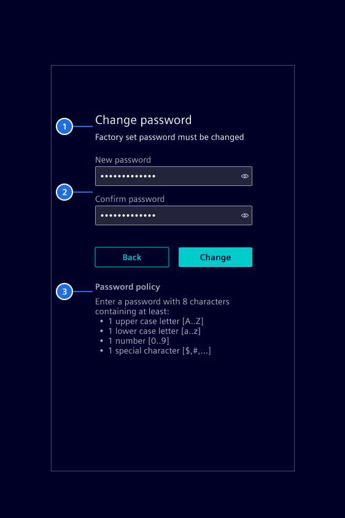
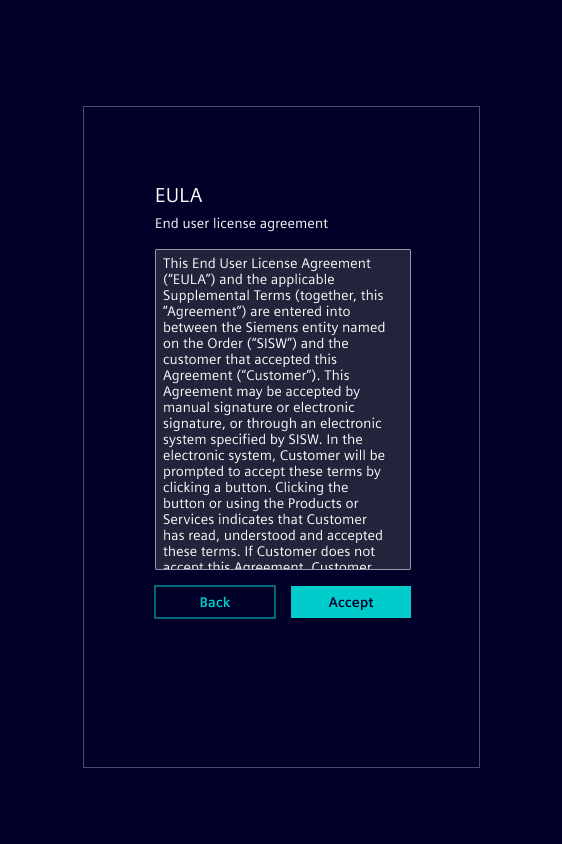
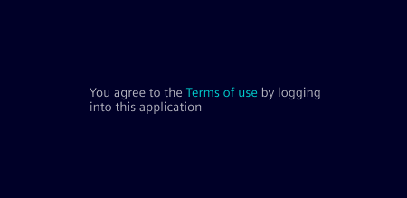
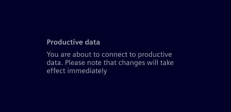

# Landing page

This component provides an application landing page, which is usually the first
page shown to a user.

## Usage ---

The landing page is a part of an overarching concept for guiding a user into a
product. Legal guidelines are crucial for the sign-up and sign-in process.

### When to use

- A user has to sign-up or sign-in before using the product.
- A user has to be informed about product usage conditions.

## Design ---

The landing page provides the first impression of a product to the users. It has
to meet multiple goals:

- **Functionality:** This is the major driver for having a landing page. The
  landing page should present the functionality in an easy way.
- **Legal information** Necessary legal artifacts must be provided to the user.
- **Market Communication** (MarCom): The landing page must provide a (visual)
  bridge to the marketing material of a product.
- **DevOps information**  The landing page shall inform about any product
  usage interruptive events as planned maintenance activities.

Covering those need solely for large screen might lead to overloaded content.
The design is therefore done using the **mobile first** approach.



> 1. Brand logo, 2. Language selector, 3. Marketing image, 4. Product info, 5.
> Marketing claim (Optional), 6. Functional UI elements, 7. Registration
> (Optional), 8. Additional legal info, 9. Footer with version (optional), copyright and legal links

### Functional UI elements

#### Two-step login

The *two step login* pattern should be used by default.



The user interaction is done in the following 2 steps:

1. **User name:** The user name has to be provided for selecting the correct next
   step based on the account type.
     - Company OpenID is registered (e.g. `@example.com`): The user is forwarded
       to the company OpenID environment (e.g. `ExampleORG`).
     - User name is registered as personal OpenID: The user is forwarded ot the
       registered (fallback) OpenID environment.
     - Role based or LDAP account: The UI shows a password sign-in step.
     - The user can register a new account (optional).
2. **Password** or **PKI card:** User provides his credentials according the
   guidance on the second step. The screen supports the "*Forgot password*" use
   case.

**Important:** Users should not be informed, if a user name does not exists, if
the creation of new accounts is not supported. A login failure should only be
shown when all the credentials (incl. password) were provided. This pattern
prevents user name enumeration attacks. The error message must be along the
lines of `Wrong credentials`.



#### User name / Password login (deprecated)

This is the classical way to login into a product.



This pattern can be used for LDAP and Role Based Accounts login only. OpenID
Connect Accounts are not supported.

**Important:** Users should not be informed, if a user name does not exists, if
the creation of new accounts is not supported. A login failure should only be
shown when all the credentials (incl. password) were provided. The error
message must be along the lines of `Wrong credentials`.


The *two step login* pattern should be used to provide an uniform experience.

#### Button forwarding login (deprecated)

The single button approach works for a single OpenID Connect provider only.



The *two step login* pattern should be used to provide an uniform experience.
This enables support for multiple OpenID Connect providers, LDAP and Role Based
accounts within the same product.

#### Initial password change

Some systems may require the user to perform a password change upon first login.



> 1. Heading / explanation, 2. Change password fields, 3. Password policy

### Legal UI elements

#### Footer

The footer shows the copyright information and links to legal artifacts.

#### Explicit legal acknowledge

Some legal artifact (e.g. EULA) needs to be explicitly acknowledged by a user.



#### Implicit legal acknowledge

Some legal artifact (e.g. Terms of Use) needs more attention by a user before
login to product.



#### Warning

A warning can be shown, if there is no legal artifact which needs immediate user
attention.



## Code ---

This component provides an application landing page, with a dynamic content
block where you can implement your login UI.

### Usage

```ts
import { SiLandingPageComponent } from '@siemens/element-ng/landing-page';

@Component({
  imports: [SiLandingPageComponent, ...]
})
```

### Landing page with two step login

The size of the logo is changeable with CSS Variable `--landing-page-logo-width`
(default: 180px) and `--landing-page-logo-height` (default: auto).

<si-docs-component example="si-landing-page/si-landing-page-two-step-login" height="500"></si-docs-component>

### Custom background image and logo

The background image can be changed with the input property `backgroundImageUrl`.
Note that the background image is `center` positioned by default so that the
focus stays on the center of the image for all the different resolutions and
screen sizes.

A custom logo can be set with `logoUrl` and the sizes can be configured with the
CSS variables `--landing-page-logo-width` (default: 180px) and
`--landing-page-logo-height` (default: 'fit-content').

#### Requirements for custom background images

A custom background image needs to meet some basic criteria to make sure it looks good on all devices and screen sizes (responsive):

- Photographs usually work better than graphics
- Texts or other graphic details can be problematic due to scaling effects where such elements are cut off or become either too small or too big
- Subjects like people or animals are difficult as body parts could be cut off
- The focus should be on the center of the image since the image is `center` positioned
- Aspect ratios of 15:10 and 16:9 have been proven to work well
- The resolution needs to be around 1920x1280 to reduce loading times without introducing blur
- The image should be in WebP format and optimized for web: `cwebp -q 80 input.jpg -o image.webp`
  (the cwebp tool can be downloaded [here](https://developers.google.com/speed/webp/download))

!!! tip "Testing Required"
    Every image is different and testing of all popular screen sizes is crucial.

<si-docs-component example="si-landing-page/si-landing-page-custom" height="500"></si-docs-component>

<si-docs-api component="SiLandingPageComponent"></si-docs-api>

<si-docs-types></si-docs-types>
