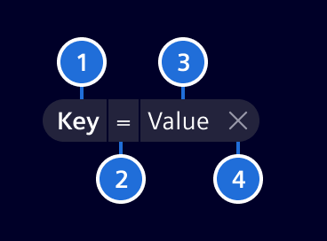
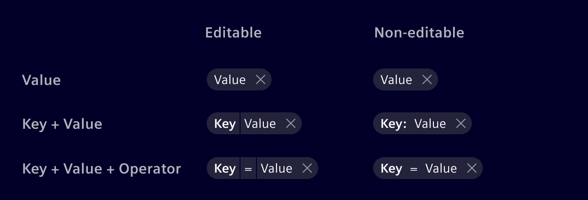
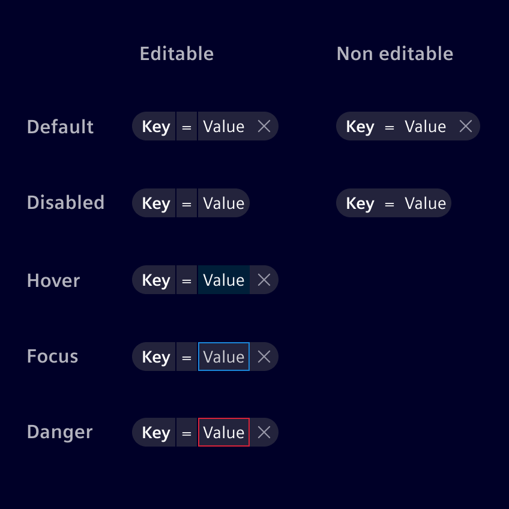

# Filter Pills

The **Filter Pills** represent a set of filters, allowing users to see which
ones are applied while also allowing to edit and/or remove them. They consume a
minimal amount of space while providing good situational awareness to users.

## Usage ---

Filter pills are used to visually represent applied filters in combination
with the [*Filter Bar*](filter-bar.md) and [*Filtered Search* component](filtered-search.md).

### Filter Pills Best Practices

- Only use pills without a key/category if the value on its own is easily
  understandable. E.g. `Last year` does not need the key `Time range`.
- Use 2 filter pills for value ranges (e.g. `From 1.1.2021` and `To 31.7.2021`).
- If they're not used for value ranges, use only one filter pill per category.
    - Show the selected value if only one option is selected (e.g.
      `City of owner: Munich`).
    - Show the criteria name in plural with a counter if more than one option is
      selected (e.g. `Cities of owner: 7 cities`).

## Design ---

### Elements

> 1. Key (optional), 2. Operator (optional), 3. Value, 4. Remove button
> (optional)

### Filter Anatomy

Filter pills can be editable or read-only, depending on the use case.

When used in combination with the [*Filter Bar* component](filter-bar.md), they
are read-only and cannot be edited.

When used in combination with the [*Filtered Search* component](filtered-search.md),
they are editable and support several different interaction states.

Filter pills are composed of three different elements:

- **Key:** Targeted property or category.
- **Value:** Specific value of the property you are looking for.
- **Operator:** The intended relation between *Key* and *Value* (e.g. `=`, `>`,
  `<`).

Combine the elements according to the required complexity.

### Interaction States

The filter pill container color should always be in contrast to its surrounding
background. Use `base-0` or `base-1` accordingly.

