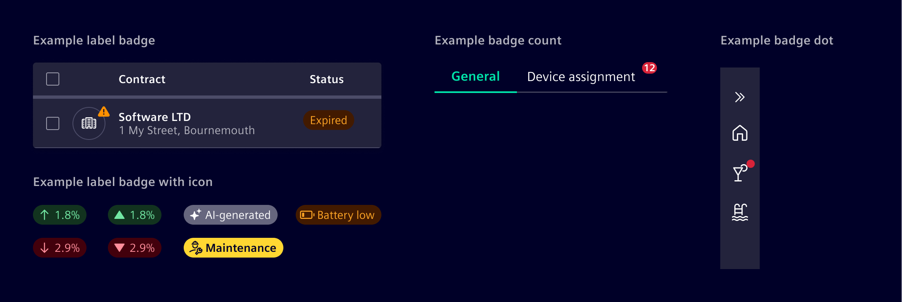
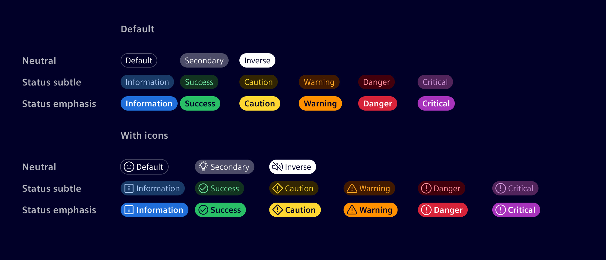
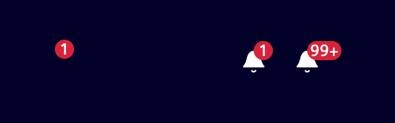

<!-- markdownlint-disable-file MD024 -->

# Badges

A **badge** is a small, non-interactive indicator attached to another element.
It can show a status, category, or count for the item it accompanies.

## Usage ---

Badges can display short text, numbers, or an icon.
Place them close to the item they describe so the meaning stays clear.



### When to use

- To label the state or category of an item.
- To count new, unread, or pending items on an icon, tab, or navigation entry.
- To signal that something changed since the user last looked.

### Best practices

- Keep badge text short and specific.
- Use whole numbers for counts.

## Design ---

### Badge label

A label badge shows the state or category of a single object, such as `Active` or `Draft`.
It is available in neutral or status colors (success, danger, etc).

Every status color comes in two styles.

- Use the **subtle** style by default.
- Use the **emphasis** style when the badge needs to stand out.



### Badge count

A badge count shows how many items need the user's attention,
such as unread messages or pending requests. Use it when the exact quantity of new items matters.
Keep counters to three characters or fewer, such as `99+`.



### Badge dot

A badge dot signals change without showing a count.
It tells the user that something changed since they last looked.


## Code ---

### Usage

```ts
import { SiBadgeComponent } from '@siemens/element-ng/badge';

@Component({
  template: `<si-badge type="success" icon="element-validation-success">Success</si-badge>`,
  imports: [SiBadgeComponent, ...]
})
```

### Background colors

To set a badge's background color, choose between the following status tokens:

| Status      | Bolder status       |
| ----------- | ------------------- |
| `default`   |                     |
| `inverse`   |                     |
| `primary`   |                     |
| `secondary` |                     |
| `info`      | `info-emphasis`     |
| `success`   | `success-emphasis`  |
| `caution`   | `caution-emphasis`  |
| `warning`   | `warning-emphasis`  |
| `danger`    | `danger-emphasis`   |
| `critical`  | `critical-emphasis` |

For a more prominent appearance use tokens with the `-emphasis` postfix.

```html
<!-- Angular component -->
<si-badge type="critical-emphasis">Critical</si-badge>
```

### Native HTML markup

There are also various badge CSS classes you can use on native HTML elements: `badge`, `badge-dot`, and `badge-text`.

To set a badge's background color, apply the `.bg-{status token}` utility classes:

```html
<div role="status" class="badge bg-critical-emphasis">Critical</div>
```

The `badge-dot` class provides a smaller dot that can be placed at the side of an icon:

```html
<i role="status" aria-label="notifications" class="icon element-alarm-filled badge-dot"></i>
```

The `badge-text` class provides the ability to apply a short text at the side of an icon:

```html
<div role="status" aria-label="More than 99 notifications">
  <i class="icon element-alarm-filled"></i>
  <span class="badge-text" aria-hidden="true">99+</span>
</div>
```

### Accessibility considerations

Badges can confuse users of screen readers and other assistive technologies because these users only hear the badge's content, not its visual styling.
To a screen reader, a badge may sound like a random word or number tacked onto the end of a sentence, link, or button, which obscures its intended purpose.

Unless the context is clear - you should add extra, descriptive text that is `visually-hidden` but available to screen readers.

### Examples

<si-docs-component example="badges/badges"></si-docs-component>

<si-docs-api component="SiBadgeComponent"></si-docs-api>

<si-docs-types></si-docs-types>
