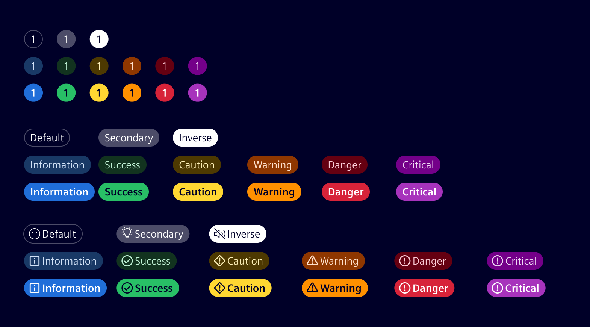

<!-- markdownlint-disable-file MD024 -->

# Badges

Badges act as visual aids notifying about a status of an object.
They carry different type of content such as a label or a counter to reflect a status.
Badges normally contain dynamic information.

## Usage ---

### Pill badge

Badges can display text or numbers, and may also include an icon. Choose between two visual styles: Default or Emphasis.



- Pill badges with text are usually integrated inside the data-tables and depicts each row's recent status.
- Used in conjunction with a single item or row to avoid ambiguity about which item is indicated.
- Pill badges can extend the width to fit desired text or numbers.
- Pill badges can also be used to indicate new or unread items with numbers.
- In case of a counter, the maximum count should be limited to 2 digits plus 1 character. For example `99+`.
- Status based categories are Default, Secondary, Inverse, Information, Success, Caution, Warning, Danger and Critical.

#### Best practices

- Consider the specified alignments while using Pill badges within the data-tables.
- Use status based categories to notify about a particular type of notification.
- Do not display status description in a badge.
- While showing a count, use integer numbers.
- If required, use tooltips for numbered badges to enhance user understanding.
- Place badges appropriately to identify the object they are informing or labelling.
- It is not recommended to use icons which are conflicting with semantic status color.

### Red dot tag with count


- These are global badges conveying a count and not a status.
- Use these to provide a visual cue of an object by notifying the recent changes.
- Maximum character count should be limited to 3 characters, i.e `99+`.

#### Best practices

- Use only natural numbers.
- Adjust the width to accommodate multiple digit numbers.
- Do not include text characters inside the badge.

### Red dot tag


- The red dot symbolizes a global notification update.
- If there is no content inside badge it can be represented with a simple dot.

#### Best practices

- Do not completely overlap the icon.
- Must be properly aligned to the upper right of the bounding box of the icon.
- Do not position badge out of the parent bounding box.

## Design ---

### Color variations - table

| Badges    | Status        | Fill Color                  | Text Style | Text Color                  |
| --------- | ------------- | --------------------------- | ---------- | --------------------------- |
| Default   | Default       | `$element-base-0`           | `Title 2`  | `$element-text-primary`     |
| Secondary | Secondary     | `$element-ui-3`             | `Title 2`  | `$element-text-primary`     |
| Inverse   | Inverse       | `$element-ui-1`             | `Title 2`  | `$element-text-inverse`     |
| Blue      | Informational | `$element-base-information` | `Title 2`  | `$element-text-information` |
| Green     | Success       | `$element-base-success`     | `Title 2`  | `$element-text-success`     |
| Yellow    | Caution       | `$element-base-caution`     | `Title 2`  | `$element-text-caution`     |
| Orange    | Warning       | `$element-base-warning`     | `Title 2`  | `$element-text-warning`     |
| Red       | Danger        | `$element-base-danger`      | `Title 2`  | `$element-text-danger`      |
| Magenta   | Critical      | `$element-base-critical`    | `Title 2`  | `$element-text-critical`    |

## Code ---

### Usage

```ts
import { SiBadgeComponent } from '@siemens/element-ng/badge';

@Component({
  template: `<si-badge type="success" icon="element-validation-success">Success</si-badge>`,
  imports: [SiBadgeComponent, ...]
})
```

### Background colors

To set a badge's background color, choose between the following status tokens:

| Status      | Bolder status       |
| ----------- | ------------------- |
| `default`   |                     |
| `inverse`   |                     |
| `primary`   |                     |
| `secondary` |                     |
| `info`      | `info-emphasis`     |
| `success`   | `success-emphasis`  |
| `caution`   | `caution-emphasis`  |
| `warning`   | `warning-emphasis`  |
| `danger`    | `danger-emphasis`   |
| `critical`  | `critical-emphasis` |

For a more prominent appearance use tokens with the `-emphasis` postfix.

```html
<!-- Angular component -->
<si-badge type="critical-emphasis">Critical</si-badge>
```

### Native HTML markup

There are also various badge CSS classes you can use on native HTML elements: `badge`, `badge-dot`, and `badge-text`.

To set a badge's background color apply the `.bg-{status token}` utility classes:

```html
<div role="status" class="badge bg-critical-emphasis">Critical</div>
```

The `badge-dot` class provides a smaller dot that can be placed at the side of an icon:

```html
<i role="status" aria-label="notifications" class="icon element-alarm-filled badge-dot"></i>
```

The `badge-text` class provides the ability to apply a short text at the side of an icon:

```html
<div role="status" aria-label="More than 99 notifications">
  <i class="icon element-alarm-filled"></i>
  <span class="badge-text" aria-hidden="true">99+</span>
</div>
```

### Accessibility considerations

Badges can confuse users of screen readers and other assistive technologies because these users only hear the badge's content, not its visual styling.
To a screen reader, a badge may sound like a random word or number tacked onto the end of a sentence, link, or button, which obscures its intended purpose.

Unless the context is clear - you should add extra, descriptive text that is `visually-hidden` but available to screen readers.

### Examples

<si-docs-component example="badges/badges"></si-docs-component>

<si-docs-api component="SiBadgeComponent"></si-docs-api>

<si-docs-types></si-docs-types>
