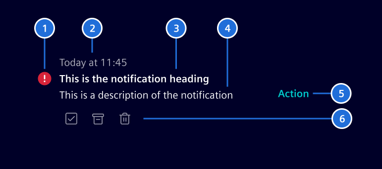
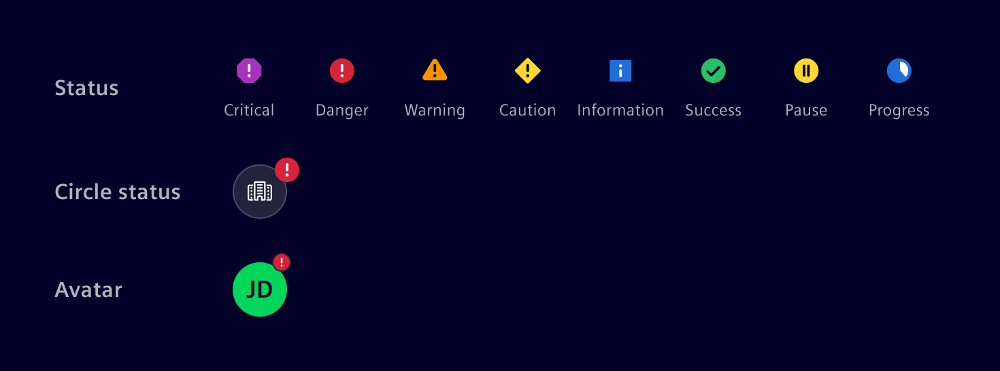
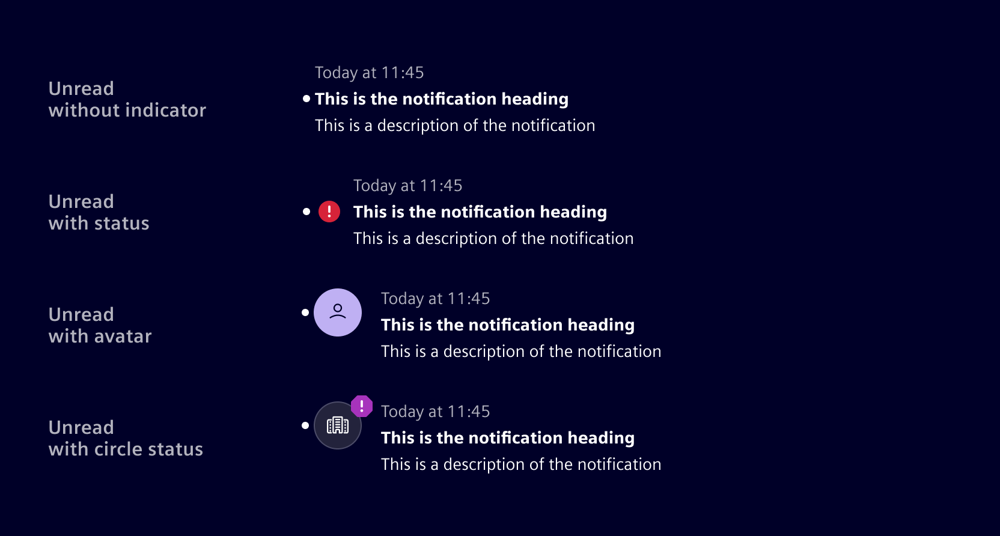

# Notification Item

## Usage ---

Notifications keep users updated on changes, prompt timely responses to important updates, and guide them through interactions.
They can be delivered through various channels, such as push notifications, emails, or texts.

Element provides [guidance](./../../patterns/notifications.md) on **in-app notifications**, which deliver updates and feedback within the application experience.

### Notification anatomy



Each notification typically consists of the following elements:

1. **Indicator:** Indicates priority and/or type using a color and icon.
1. **Timestamp:** Shows when the event occurred.
1. **Heading:** A concise phrase that quickly conveys what happened.
1. **Description:** Provides details if needed.
1. **Primary action:** The main action related to the notification.
   It can be a single button or a menu with multiple options.
1. **Quick actions:** Allows users to take quick action, such as dismissing or responding.

Except for the notification title and timestamp, all elements are optional.

### Notification indicators

The notification indicators reflect the state or condition of the notification, helping users understand its relevance.

- When differentiation is needed, **severity-based indicators** provide a clear response hierarchy.
  Each severity level is paired with a color and icon to ensure consistency.

- If needed, a [circle status](./circle-status.md) or [avatars](./avatar.md) can be used to provide further context.

- If the content itself provides enough context, no visual indicator is needed.



When a notification has read and unread states, the unread state is indicated by a dot and bold title text.



### Actions

The main purpose of a notification is to redirect users to the relevant page, task, or item it highlights. Depending on the notification's design, additional actions may also be available.

**Global actions** affect all notifications at once or adjust system-wide settings (e.g., settings, show all, dismiss all).

**Notification-level actions** apply to individual notifications for quick management. Common examples include:

- Dismiss: Removes the notification from the current view (e.g., popover, side panel, etc.)
  but keeps it in the notification center for future reference. Dismiss does not change the read and acknowledge states.
- Delete: Permanently deletes the notification from the system.
- Acknowledge: Confirms receipt, indicating that the user is informed and may take further action.
- Resolve: Used when the system can fix the issue automatically or the user is guided through a resolution process.

### Best practices

- Deliver notifications at the right moment to avoid unnecessary distractions.
- Categorize notifications to prioritize critical events.
- Allow users to manage notification settings where possible.
- Define clear thresholds for timestamps. Use relative time for recent events (e.g., "Just now", "5 minutes ago", "09:42", "Yesterday")
  and switch to absolute dates (e.g., "10/01/2024") for older events.
- Consider setting an expiration timeframe for transient notifications, but allow critical ones to persist until the issue is resolved.

## Code ---

### Usage

```ts
import { SiNotificationItemComponent } from '@siemens/element-ng/notification-item';

@Component({
  imports: [SiNotificationItemComponent],
  standalone: true
})
```

### Examples

<si-docs-component example="si-notification-item/si-notification-item" height="680"></si-docs-component>
