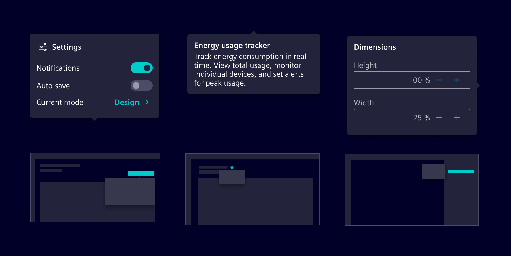
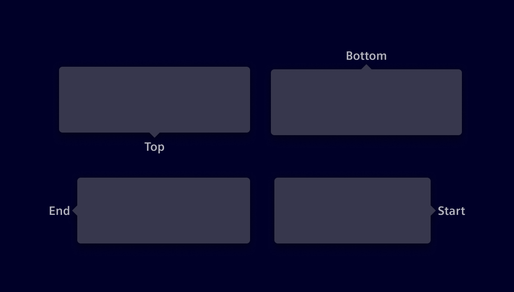
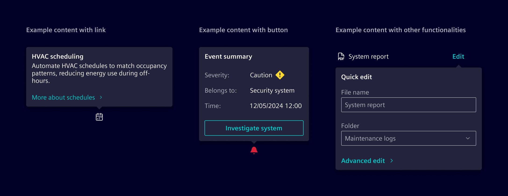

# Popover

A **popover** is a temporary overlay that displays above other content when users activate a trigger element.

## Usage ---

Popovers are used for brief, contextual information or temporary functionality that requires little screen space.
They appear when users select a specific control or interactive area and automatically close when
users select outside of them or complete an action within the popover.



### When to use

- To provide short, contextual information or additional functionality related to a control.
- For temporary content that doesn’t require a full page or modal view.
- To provide contextual help, guiding users with explanations or assistance specific to their current task.

### Best practices

- Limit functionality to a few related tasks or brief information.
- Avoid placing critical actions or decisions within a popover.
- Display only one popover at a time.
- Popovers should be just large enough to accommodate their content.

## Design ---

### Elements


> 1. Container, 2. Title (optional), 3. Body content, 4. Tip

### Placement

Four position options are available: **top**, **end**, **bottom** and **start**. Besides that,
**auto** option may be used to detect a position that fits the component on the screen. They should not cover too much of the screen or obscure important content.



### Content

Popovers can include text, links, buttons, and other interactive elements relevant to the task at hand.



### Tooltips vs. popovers

[Tooltips](../status-notifications/tooltip.md) are meant for supplementary,
non-essential information. They’re limited to brief, non-interactive text and **appear on hover**,
making them inaccessible on touch devices.

Popovers provide more comprehensive contextual information or functionality.
They open upon **user selection**.

| Component         | Tooltip                                            | Popover                                                  |
| ----------------- | -------------------------------------------------- | -------------------------------------------------------- |
| **Purpose**       | Provides supplementary, non-essential information. | Displays contextual information or interactive elements. |
| **Interaction**   | Appears on **hover**.                              | Opens on **selection**.                                  |
| **Dismissal**     | Disappears when the cursor moves away.             | Requires user interaction to close.                      |
| **Interactivity** | Non-interactive, only displays text.               | Can contain buttons, links, and inputs.                  |

## Code ---

The `si-popover` is meant to hold contextual content for a specific element.
It is implemented as a `role="dialog"`, thus following a common pattern for such elements.

### Popover trigger

The `siPopover` directive must always be attached to a `button`, the so-called trigger.
A popover trigger MUST NOT have any other actions attached to it.
The trigger button must have a descriptive label, such as `More information about component xyz`.
Do not provide generic labels like `more` or `here` as users may tab through the page without reading the context.

Use the `siPopover` directive to create a popover trigger.

```html
<button siPopover="..." type="button" class="btn btn-secondary">
  More information about component xyz
</button>
```

### Popover content

A popover always has a body and a title.
A popover will receive the `focus` when it's opened and the focus will be returned to the trigger when it's closed.
So the content may contain interactive elements, such as links or buttons.

The content can be provided in the following ways:

- using the inputs `siPopover` and `siPopoverTitle`
  ```html
  <button
    siPopover="Details Lorem ipsum ..."
    siPopoverTitle="Component xyz"
    type="button"
    class="btn btn-secondary"
  >
    More information about component xyz
  </button>
  ```
- using a template
  ```html
  <button siPopover="popoverContent" type="button" class="btn btn-secondary">
    More information about component xyz
  </button>
  <ng-template #popoverContent>
    <si-popover-title>Component xyz</si-popover-title>
    <si-popover-body> Details Lorem ipsum ... </si-popover-body>
  </ng-template>
  ```
- using a template and the title input
  ```html
  <button
    siPopover="popoverContent"
    siPopoverTitle="Component xyz"
    type="button"
    class="btn btn-secondary"
    >More information about component xyz</button
  >
  <ng-template #popoverContent>
    <!-- If siPopoverTitle is set, the content must NOT be wrapped in a si-popover-body element. -->
    Details Lorem ipsum ...
  </ng-template>
  ```

### Usage

Add the required imports to your component:

```ts
import {
  SiPopoverDirective,
  SiPopoverTitleDirective,
  SiPopoverBodyDirective
} from '@siemens/element-ng/popover';

@Component({
  imports: [SiPopoverDirective, SiPopoverTitleDirective, SiPopoverBodyDirective, ...]
})
```

<si-docs-component example="si-popover/si-popover" height="260"></si-docs-component>

<si-docs-api directive="SiPopoverDirective"></si-docs-api>

<si-docs-types></si-docs-types>
