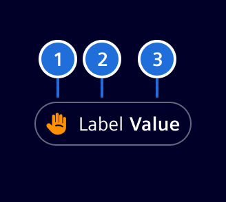
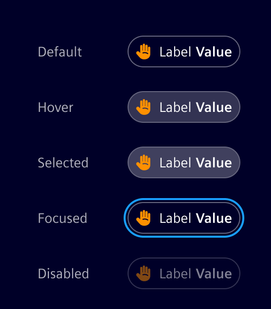

# Summary Chip

**Summary Chips** are compact components designed to quickly and concisely summarize data.
They are often used to provide a condensed overview, summarize states, and allow for filtering of information in a visually appealing manner.

## Usage ---

There are basically two main use cases for the summary chip component:

- **State indication**: To show values of different categories, such as `Override`, `Success`, `Issue`, `Not tested`, etc.
- **Filtering**: To filter datasets or information based on the specific categories.

### When to use

Arrange one or more Summary Chips in a horizontal layout above or near the related content.
Chips can be combined with other supporting elements, such as badges, buttons, or links, to enhance functionality.
Place them within a container that can use a background of `None`, `Base-0`, or `Base-1`, depending on the visual requirements.

## Design ---

### Elements

> 1. Category icon or composite icon, 2. Value

The summary chip can hold an icon or a composite icon representing a state.
The icon must be self-explanatory since there is no label.

### States

## Code ---

<si-docs-component example="si-summary-chip/si-summary-chip" height="250"></si-docs-component>

<si-docs-api component="SiSummaryChipComponent"></si-docs-api>

<si-docs-types></si-docs-types>
