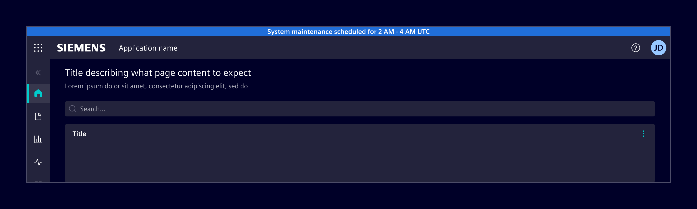
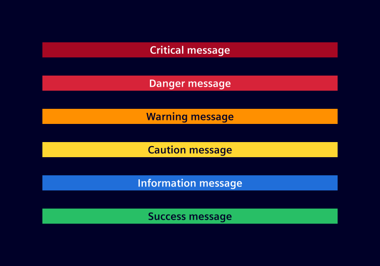

# System banner

The **system banner** is a prominent message displayed at the top of the screen to communicate system-wide updates, status changes, or information about the environment.

## Usage ---

The system banner is placed above the [application header](../layout-navigation/application-header.md) to highlight important system-wide messages.
It supports various status types, including `information`, `success`, `caution`, `warning`, `danger` and `critical`.



### When to use

- To inform users about critical updates or changes.
- To notify users of any errors or issues.
- To provide important notifications, such as maintenance schedules or security alerts.

### Best practices

- Keep messages brief and easy to understand.
- Use clear, simple language. Avoid jargon and technical terms.
- Limit system banners to essential information to prevent clutter.
- Display system banners only when relevant to the user's context.

## Design ---

### Elements


> 1. Background, 2. Text message

### Variants



## Code ---

### Usage

```ts
import { SiSystemBannerComponent } from '@siemens/element-ng/system-banner';

@Component({
  imports: [SiSystemBannerComponent, ...]
})
```

```html
<si-system-banner message="This is an information" [status]="'info'" />
```

To display a system banner above the [application header](../layout-navigation/application-header.md),
apply these classes:

- `.fixed-top` on `si-system-banner` places the banner at the top of the viewport.
- `.has-system-banner` on the outer layout container makes the application header,
  vertical navigation and side panel leave room for the banner. All affected components
  must be inside this container.
- `.has-application-header` or `.has-navbar-fixed-top` on the page-content wrapper adds
  padding so the content is not covered by the fixed header and banner.

If [si-side-panel](../layout-navigation/side-panel.md) is the outer layout container, put
`.has-system-banner` on `si-side-panel` itself, not just on its inner content wrapper:

```html
<si-side-panel class="has-system-banner">
  <div class="has-navbar-fixed-top">
    <si-system-banner class="fixed-top" message="Scheduled maintenance" status="info" />
    <si-application-header>...</si-application-header>
    <!-- Page content -->
  </div>
  <si-side-panel-content heading="Details">...</si-side-panel-content>
</si-side-panel>
```

When the banner is hidden, remove `.has-system-banner` as well. For a conditional banner,
use the same visibility condition for rendering the banner and applying this class.

<si-docs-component example="si-layouts/anatomy" height="500"></si-docs-component>

### System banner with different statuses

<si-docs-component example="si-system-banner/si-system-banner" height="250"></si-docs-component>

<si-docs-api component="SiSystemBannerComponent"></si-docs-api>

<si-docs-types></si-docs-types>
