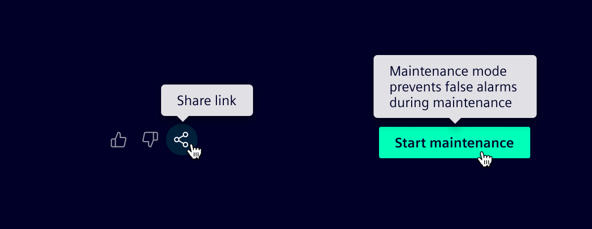
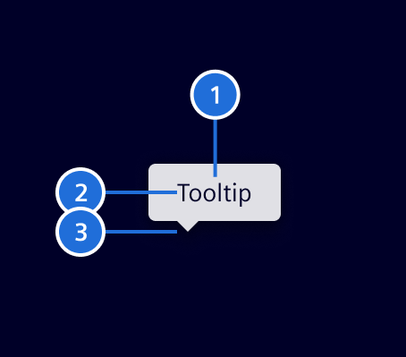
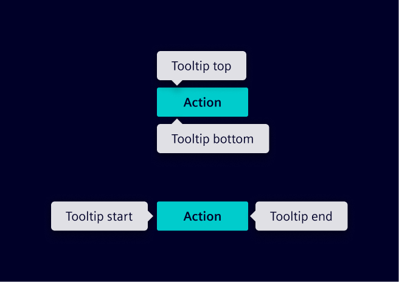
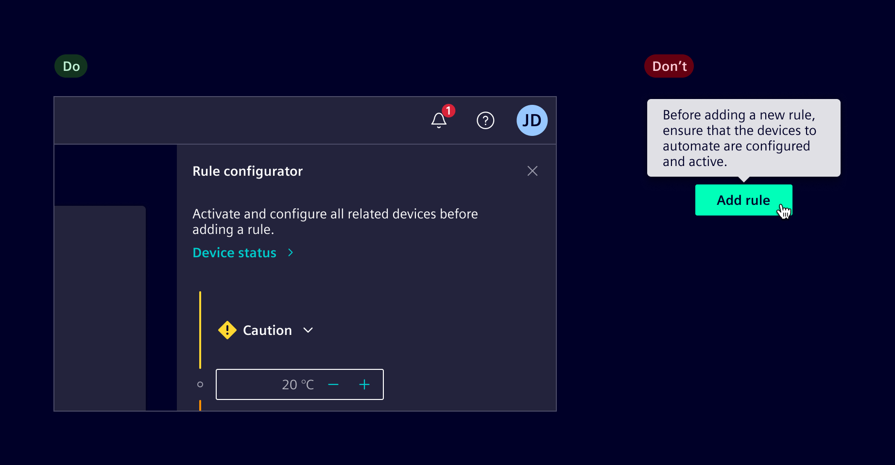
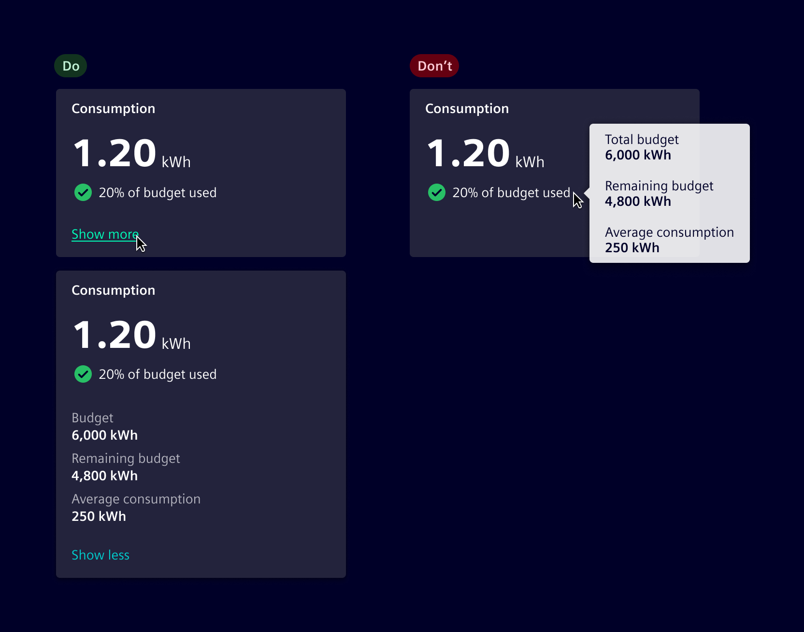

# Tooltip

**Tooltips** provide concise supplementary information when users hover over or focus
on a UI element, typically buttons or icons.

## Usage ---

Tooltips briefly appear over other content to provide additional context.
They are triggered by **hover or focus**, making them particularly useful for desktop interactions.

Since tooltips are temporary and generally not accessible on touch devices,
**they should not contain critical or primary information.**



Tooltips are applied to controls that rely solely on an icon, such as [icon buttons](../buttons-menus/buttons.md),
[icon-only tabs](../layout-navigation/tabs.md), [application header](../layout-navigation/application-header.md) and collapsed versions of [vertical navigation](../layout-navigation/vertical-navigation.md) and the [side panel](../layout-navigation/side-panel.md).

They may also reveal truncated text **only when the element is focusable**, for example a
[tree node](../lists-tables-trees/tree-view.md).


### When to use

- To clarify an element’s function or provide extra context for icons or buttons.
- For supplementary, non-essential information only.

### Best practices

- Keep text brief.
- Do not include interactive elements.
- Use sparingly to reduce visual noise.
- Apply tooltips only to interactive, keyboard-focusable elements.
- Never add tooltips on disabled elements.
- When implementing tooltips on touch devices, ensure they appear on tap and that this interaction
  does not conflict with other functionalities.
- Always use the tooltip component, not the browser’s native tooltip.
- Use a 500ms show delay and dismiss on pointer leave or focus loss.

## Design ---

### Elements



> 1. Container, 2. Text content, 3. Tip

### Placement

Four position options are available: **top**, **end**, **bottom** and **start**. Besides that,
**auto** option may be used to detect a position that fits the component on the screen.



### Alternatives to tooltips

Tooltips are temporary, implicit interactions that can interrupt the user’s flow. Because of these limitations, **tooltips should be considered a last resort.**
Consider these strategies instead:

#### Reevaluate the need for tooltips

Consider whether the tooltip is actually needed.
Avoid using them to repeat information that users can easily access.


#### The right time and place

Think about where and when information will be most useful to users.
Place key details directly on the interface in a clear, accessible spot,
ensuring information is available at the right moment.



#### Use disclosures

Leverage expandable elements like dropdowns, [accordions](../layout-navigation/accordion.md),
or show/hide buttons to reveal additional information as needed, providing deeper context only when required.



#### Use intuitive icons and labels

Tooltips should only replace labels for universally understood icons (e.g., edit, share).
For complex or less intuitive icons, always display labels.
If space is limited, ensure the legend is accessible elsewhere for users to understand the meaning.

#### Use popovers

For information that needs detailed explanation, use [popovers](../status-notifications/popover.md), which are triggered explicitly and can hold more content.

| Component         | Tooltip                                            | Popover                                                  |
| ----------------- | -------------------------------------------------- | -------------------------------------------------------- |
| **Purpose**       | Provides supplementary, non-essential information. | Displays contextual information or interactive elements. |
| **Interaction**   | Appears on **hover**.                              | Opens on **selection**.                                  |
| **Dismissal**     | Disappears when the cursor moves away.             | Requires user interaction to close.                      |
| **Interactivity** | Non-interactive, only displays text.               | Can contain buttons, links, and inputs.                  |

## Code ---

### Usage

Use `siTooltip` directive to display the tooltip.

```ts
import { SiTooltipDirective } from '@siemens/element-ng/tooltip';

@Component({
  imports: [SiTooltipDirective, ...]
})
```

<si-docs-component example="si-tooltip/si-tooltip"></si-docs-component>

<si-docs-api directive="SiTooltipDirective"></si-docs-api>

<si-docs-types></si-docs-types>
