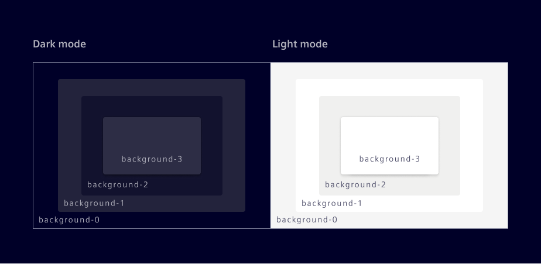
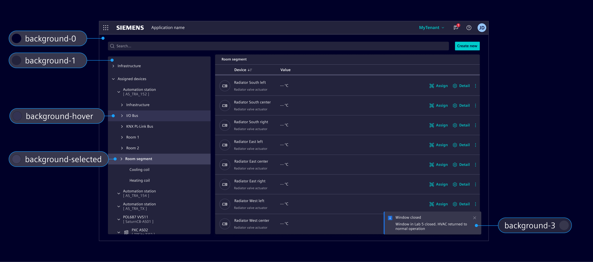
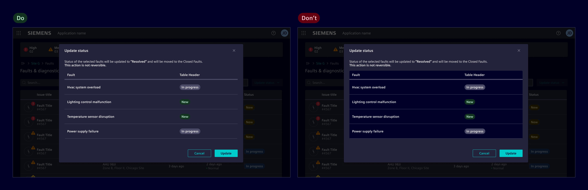
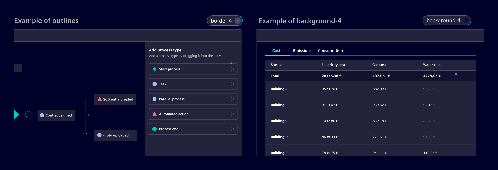
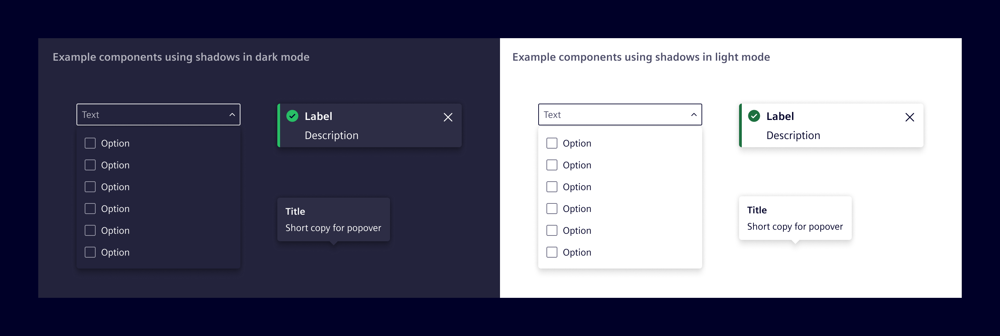

# Elevation

Elevation of a surface is represented by its distance from the page's background along the z-axis,
creating a sense of depth and establishing content hierarchy within an application.

## Usage ---

In the Element Design System, elevation is achieved through a combination of layered
**background colors** and **drop shadows**,
creating depth and spatial associations without unnecessary stylistic elements.

### Background color layers

At the core of the layering model are the `background-0` and `background-1` tokens:

- **background-0**: Is placed on the lowest position of the stack order, serving as the foundational background for the UI.
- **background-1**: Is placed on top of background-0 and is the default layer for container elements like cards, vertical navigation, and side panels.
- **background-2**: Is placed on background-1 when a stronger distinction is needed, especially to highlight a container. It can also be layered on background-0.
- **background-3**: Used to layer content above other content. It works best with shadows and is reserved for components like popovers and toasts to enhance depth in low-light environments.



Complementary tokens like `background-hover` and `background-selected` are used
to indicate interaction states while maintaining the visual layering logic.
These are independent color tokens and are designed to work across all base layers.



The system is intentionally designed to be mostly flat, minimizing unnecessary layers or
'boxes within boxes' to maintain clarity and ease of use.



However, in specific cases where additional differentiation is necessary:

- Use an outline with `border-4` to define boundaries between elements on the same layer,
  such as layout sections or grouped content
- Use `background-4` when a stronger distinction is needed, especially to highlight a container.



### Shadows

Shadows are used selectively to indicate physical overlap between components.
Shadows are reserved for components that float above or overlap other content,
such as [menus](../components/buttons-menus/menu.md), modals, popover and toasts.

**Components without overlapping behavior, such as cards, must not have shadows.**



The `shadow` tokens represent increasing levels of shadows.

`shadow-2`: The active token used for overlapping components like menus, popovers, and toasts, establishing the standard elevation for floating elements.

The other tokens are retained for flexibility in custom visualizations, interactive
illustrations, or animations to enhance depth and spatial relationships.

- `shadow-1`: For minimal elevation effects and subtle layering.
- `shadow-3`: For elements requiring stronger visual prominence, such as multi-layered highlights.
- `shadow-4`: Reserved for rare or critical cases requiring maximum elevation distinction.

--8<-- "si-themes.md:si-sys-effects-shadow"

### Elevation (deprecated)

| Elevation | Token                  | Color            | Opacity (light) | Opacity (dark) | X   | Y    | Blur |
| --------- | ---------------------- | ---------------- | --------------- | -------------- | --- | ---- | ---- |
| Level 1   | `$element-elevation-1` | `$element-black` | 16%             | 40%            | 0px | 0px  | 4px  |
|           |                        | `$element-black` | 8%              | 20%            | 0px | 4px  | 4px  |
| Level 2   | `$element-elevation-2` | `$element-black` | 16%             | 40%            | 0px | 0px  | 8px  |
|           |                        | `$element-black` | 8%              | 20%            | 0px | 8px  | 8px  |
| Level 3   | `$element-elevation-3` | `$element-black` | 16%             | 40%            | 0px | 0px  | 16px |
|           |                        | `$element-black` | 8%              | 20%            | 0px | 40px | 16px |
| Level 4   | `$element-elevation-4` | `$element-black` | 16%             | 40%            | 0px | 0px  | 32px |
|           |                        | `$element-black` | 8%              | 20%            | 0px | 32px | 32px |

## Code ---

Four shadow levels and a `none` option are available as CSS utility classes.
Choose the level according to the usage guidance above.

<si-docs-component example="elevation/elevation" height="120"></si-docs-component>

Use a system token when a utility class is not suitable. The Sass variables
resolve to theme-aware CSS custom properties and automatically adapt to the
active theme.

```scss
@use '@siemens/element-theme/src/styles/variables';

.my-element {
  box-shadow: variables.$si-sys-effects-shadow-2;
}
```
