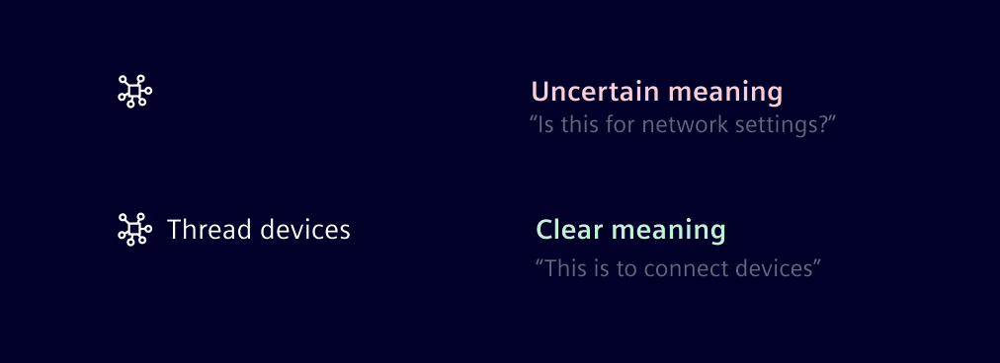
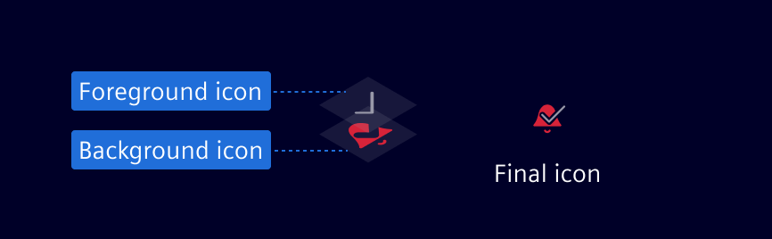

# Icons

<!-- markdownlint-disable MD033 MD024-->

**Icons** are graphical representations that symbolize objects, functions, processes, or concepts.

!!! info "Element icons are not open source"

    The Element icons have not (yet) been open-sourced and are only available to
    Siemens employees. Without access to the Element icon library, the icons
    shown in the documentation and the examples are likely not available to you.

    We are working on making a subset of icons available to the public.

## Usage ---

Icons are used to draw attention to high-priority elements or to convey information in a simple and recognizable manner.
If the necessity or clarity of an icon is uncertain, it is better to omit it.

Visit the [_Common Actions_](../fundamentals/ux-text-style-guide/frequent-app-functions.md/#common-actions) for further
definitions of a common icon usage.

### When to use icons

- To draw attention to key elements of the interface, making them stand out.
- To convey intuitive visual cues (e.g., a downward chevron for opening a menu).
- To symbolically replace text when space is limited. For this use case, ensure that the icon is universally understood without labels.

### Best practices

- Icons should stay true to their meaning across the application.
- Use icons sparsely on a page to not overwhelm users.
- Avoid using icons as mere decorations; they must add functional value to the interface.
- Prevent redundancy, such as adding icons to actions like "Save" and "Cancel," where the value of an icon is minimal.

## Design ---

### Style

**Outlined** icons are the default style for most UI elements.
Filled icons are used sparingly to highlight important actions or indicate active states.

### Colors

Icons should be used in a single, consistent color to maintain a cohesive look and ensure high contrast against the background.
Use tokens `$element-ui-1` and `$element-ui-2` as the default colors for their versatility and clarity.

With the exception of `$element-base-*` tokens, any color can be used for icons.
Be mindful of the purpose behind the color choice. Refer to the [color guidance](../fundamentals/colors/ui-colors.md) for further details.

### Supporting labels

Universal icons like delete, edit, and home can be used without labels due to their widely recognized meanings.
For all other icons, provide labels at least once to ensure that users understand their meanings.

Position labels either below or to the right (RTL languages) of the icons based on available space.

### Composite icons

Composite icons combine two overlapping icons with different colors to create better contrast and convey complex meanings,
e.g., event states or severity symbols.

## Code ---

All icons start with the `element-` prefix and can be copied directly from the
internal icon catalog.

To use the icons within your HTML template, add the `<i>`-tag and define the
desired icon name as CSS class. Besides the icon class, all other text utility
classes such size and color can be used. The CSS class `icon` applies the default
icon size.

There is also a specific [si-icon](../components/status-notifications/icon.md)
component, which can be used to show icons. It includes a fallback alternative
text to make icons more accessible.

Some symbols require overlapping of two icons, which is also supported by the
[si-icon](../components/status-notifications/icon.md) component.

<si-docs-component example="icons/icons"></si-docs-component>
