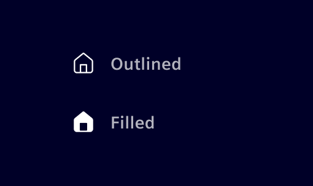

# Icons

<!-- markdownlint-disable MD033 MD024-->

**Icons** are graphical representations that symbolize objects, functions, processes, or concepts.

## Usage ---

Icons are used to draw attention to high-priority elements or to convey information in a simple and recognizable manner.
If the necessity or clarity of an icon is uncertain, it is better to omit it.

Visit the [common actions](../fundamentals/ux-text-style-guide/frequent-app-functions.md/#common-actions) for further
definitions of a common icon usage.

Icons are available in three predefined sizes.

- **Small (16px):** Used in dense UI or compact contexts, such as labels or inline helper actions
  (e.g., [help button](../components/buttons-menus/help-button.md)).
- **Default (20px):** The most common size and pairs well with `body` and `body-bold` text.
- **Large (24px):** Used for more prominent contexts and pairs well with `body-lg` and `body-bold-lg` text.

Additional sizes may be created in 4px increments only when necessary.

### When to use icons

- To draw attention to key elements of the interface, making them stand out.
- To convey intuitive visual cues (e.g., a downward chevron for opening a menu).
- To symbolically replace text when space is limited. For this use case, ensure that the icon is universally understood without labels.

### Best practices

- Icons should stay true to their meaning across the application.
- Use icons sparsely on a page to not overwhelm users.
- Avoid using icons as mere decorations; they must add functional value to the interface.
- Prevent redundancy, such as adding icons to actions like "Save" and "Cancel," where the value of an icon is minimal.

## Design ---

### Grid

Icons are built on a square grid that defines proportions, alignment, and stroke behavior to ensure visual
consistency and optical balance.

They are constructed on a `32×32px` grid as a scalable foundation,
with a built-in `2px` safe zone to preserve balance across all sizes.

The icon set is based on simple key shapes of squares, circles, and rectangles (portrait and landscape),
which provide a consistent structural foundation.

Icons use a uniform `2px` stroke width.
A flat front-facing style is preferred to avoid visual blur.

Rounded shapes have a consistent corner radius of `2px.`
Additional radius adjustments may be applied to better reflect the real-world form of the object.

### Style

**Outlined** icons are the default style for most UI elements.
Filled icons are used sparingly to highlight important actions or indicate active states.

### Colors

Icons should be used in a single, consistent color to maintain a cohesive look and ensure high contrast against the background.
Use tokens `$element-ui-1` and `$element-ui-2` as the default colors for their versatility and clarity.

With the exception of `$element-base-*` tokens, any color can be used for icons.
Be mindful of the purpose behind the color choice. Refer to the [color guidance](../fundamentals/colors/ui-colors.md) for further details.

### Supporting labels

Universal icons like delete, edit, and home can be used without labels due to their widely recognized meanings.
For all other icons, provide labels at least once to ensure that users understand their meanings.

Position labels either below or to the right (RTL languages) of the icons based on available space.

### Composite icons

Composite icons combine two overlapping icons with different colors to create better contrast and convey complex meanings,
e.g., event states or severity symbols.

## Code ---

All icons start with the `element-` prefix and can be copied directly from the
internal icon catalog.

To use the icons within your HTML template, add the `<i>`-tag and define the
desired icon name as CSS class. Besides the icon class, all other text utility
classes such size and color can be used. The CSS class `icon` applies the default
icon size.

There is also a specific [si-icon](../components/status-notifications/icon.md)
component, which can be used to show icons. It supports stacking of icons to build
compositions and also supports SVG-based icons.

<si-docs-component example="icons/icons"></si-docs-component>
