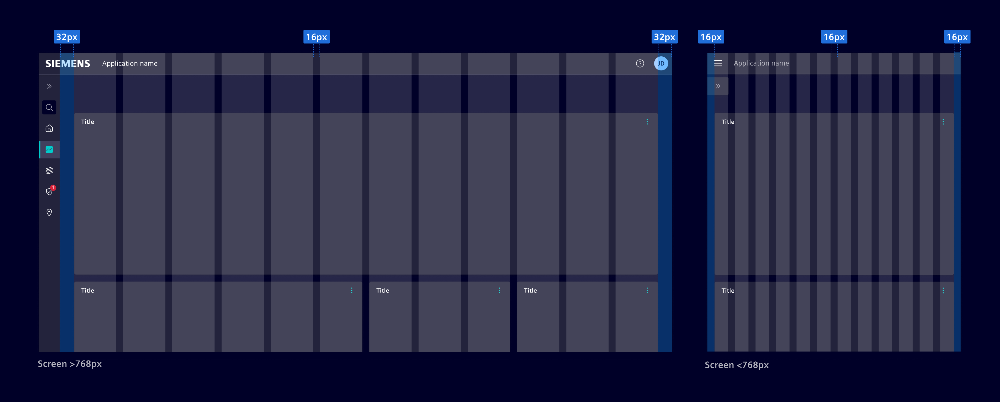

# Layouts

**Layout principles** allow the arrangement of elements in an interface.
They help developers and designers to ensure consistency, efficiency,
and effective communication in the user experience.

Effective layout design presents the information in a logical, coherent way and makes
the content easier to understand.

## Design grid

Layouts use a `8px` grid that is used to dictate the placement of all elements within the UI.
If needed, it is possible to use a `4px` grid to smaller adjustments.

## Margin, columns and gutters

The placement of content follows a flexible 12-column system where each column
has a [gutter](../layouts/gutters.md) of `16px`.

For screens wider than `768px`, use a `32px` horizontal margin. For screens
narrower than `768px`, reduce the margin to `16px`.

## Fluid vs. fixed layout

Choose between a fluid or fixed layout width based on content requirements.

**Fixed layouts** have a maximum width defined for the content area.

**Fluid layouts** consume all the available screen space. It stretches the
content to accommodate the browser window's width, regardless of how wide it
becomes.

## Best practices

- Know your use case. Understand how the information on the page will be used.
- Always use the grid system to create consistent alignment and organization of elements on the page.
- Avoid center-aligning elements; prefer left alignment.
- Group related content in cards.
- Arrange elements on the page based on their importance and the intended user flow.
- Use size, spacing, and visual cues to guide users attention and emphasize key information.
