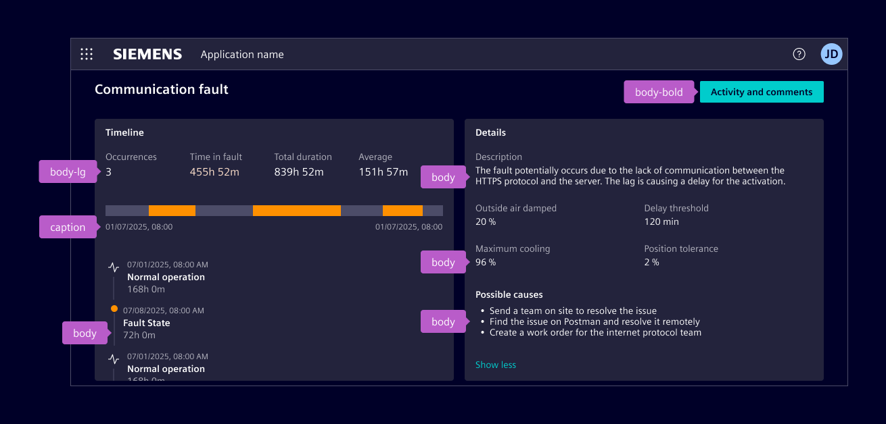
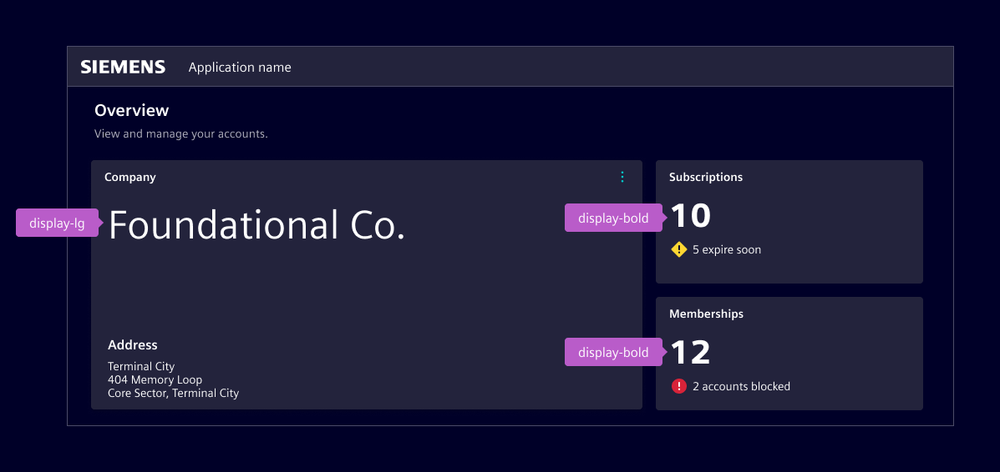
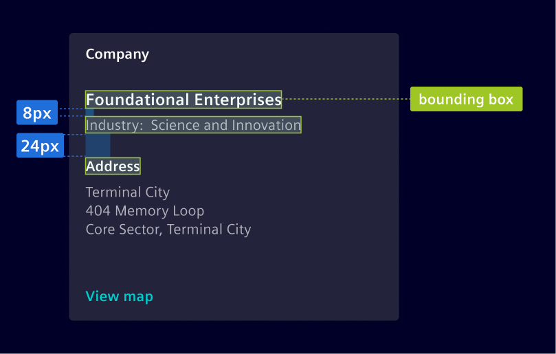

# Typography

<!-- markdownlint-disable MD013 -->

> **Note:** The Siemens font is part of the official Siemens branding and must
> not be used in non-Siemens applications. Element uses a default font that is
> not associated with Siemens branding. Please note that the default theme is
> currently undocumented.

Typographic hierarchy is defined by text size and color. Each style can use
color variants if necessary.

## Usage ---

For a cohesive typography experience, Element's type scale uses the Siemens
Sans typeface.
Hierarchy is communicated through differences in font weight (Roman and Bold) and
size.

<si-docs-component example="typography/typography" editor="false" height="380"></si-docs-component>

### Best practices

- Respect the typographic scale order for consistent and hierarchical design.
- Consider the purpose and context of the text when selecting a type style.
  Headings, subheadings, and body text each serve distinct functions and should be chosen accordingly.
- Combine font weight, size, and color to establish hierarchy, utilizing lighter colors
  or smaller font sizes to de-emphasize secondary content.
- Avoid style changes like bold and italic in the middle of a paragraph.

## Design ---

Element’s typography is divided into body, headings and display styles.

### Body

Body text is used for the main content, often following a heading or as part of UI components.

- Use `body` as the default style for most components and text blocks.
- Use `body-lg` for larger and more prominent text.
- Use `caption` for small, supportive text like annotations or metadata.



| Style     | Font size | Line height | Font weight |
| --------- | --------- | ----------- | ----------- |
| `body-lg` | 16 px     | 20 px       | 400 / Roman |
| `body`    | 14 px     | 16 px       | 400 / Roman |
| `caption` | 12 px     | 16 px       | 400 / Roman |

All body styles are also available in **bold** and _italic_.
Bold is used to add emphasis or draw attention to key information, and is also applied in specific
UI elements, such as button labels, or highlighted values in tables and lists.

Italic is used sparingly, for cases like technical terms.

### Headings

Headings communicate the structure and visual hierarchy of content on the page.
They are defined semantically from `h1` to `h6`.

- Use `h1` as the visual style for the largest headings.
- Use `h2` as main page headings.
- Use `h3` as section headings.
- Use `h4` as secondary section titles.
- `h5/h6` share the same visual style, used for smaller content blocks like cards or tertiary titles.

| Style     | Font size | Line height | Font weight     |
| --------- | --------- | ----------- | --------------- |
| `h1-bold` | 30 px     | 36 px       | 700 / Bold      |
| `h1`      | 30 px     | 36 px       | 400 / Roman     |
| `h2`      | 20 px     | 24 px       | 600 / Semi Bold |
| `h3`      | 18 px     | 24 px       | 600 / Semi Bold |
| `h4`      | 16 px     | 20 px       | 600 / Semi Bold |
| `h4-bold` | 16 px     | 20 px       | 700 / Bold      |
| `h5`      | 14 px     | 16 px       | 600 / Semi Bold |
| `h5-bold` | 14 px     | 16 px       | 700 / Bold      |

In order to adhere to [accessibility best practices](https://www.w3.org/WAI/tutorials/page-structure/headings/),
each page should be structured according to the semantic hierarchy `h1`, `h2`, ... `h6`, starting from
`h1` and maintaining a logical order without skipping levels.

Web browsers, plug-ins, and assistive technologies rely on this structure to provide in-page navigation.
When visual requirements do not align with the semantic hierarchy, the appropriate HTML elements
(`h1`, `h2`, ... `h6`) should still be used, with the desired visual style applied through CSS classes.

When the visual style of `h1` is too prominent for typical in-page headings,
such as the [page header](layouts/header.md),
the `h2` style is used instead for visual balance.

In this pattern, the `h1` tag is assigned to the application name in the [application header](../components/layout-navigation/application-header.md).
This preserves both visual hierarchy and correct semantic structure for assistive technologies.


#### Links

- [WCAG SC 2.4.10](https://www.w3.org/WAI/WCAG22/Understanding/section-headings.html)
- [WCAG technique G141](https://www.w3.org/WAI/WCAG22/Techniques/general/G141)
- [WCAG technique G69](https://www.w3.org/WAI/WCAG22/Techniques/html/H69)
- [WCAG tutorial page structure](https://www.w3.org/WAI/tutorials/page-structure/)

### Display

Display styles are used for high-impact content, such as hero sections, widgets, or dashboards.
They should be used sparingly to maintain clarity.



| Style          | Font size | Line height | Font weight |
| -------------- | --------- | ----------- | ----------- |
| `display-xl`   | 56 px     | 72 px       | 400 / Roman |
| `display-lg`   | 48 px     | 64 px       | 400 / Roman |
| `display-bold` | 40 px     | 52 px       | 700 / Bold  |
| `display`      | 40 px     | 52 px       | 400 / Roman |

### Using the bounding box

The vertical height of the text, known as the bounding box, is determined by the line-height.
The value of the line-height is critical to make sure text aligns to the 8px grid.

Use the height of the bounding box together with top and bottom margin to determine spacing.



### Line length

Wide lines of text are harder to read;
aim for 45-75 characters per line on desktop, and 30-45 on mobile for optimal readability.


### Color usage

Color is used in text to communicate information to the user. Color variants
have meaning and are used to call attention to an action. The color of text
must follow one of the [predefined color variants](colors/ui-colors.md) and must not
use any of the other defined colors.

<style>
si-docs-color {
  display: block;
  height: 30px;
  width: 30px;
  border-radius: 50%;
}
</style>

See the [Text Colors](colors/ui-colors.md#text) chapter.

## Code ---

### Type styles classes

Implementation of typography is done via [Bootstrap's typography system](https://getbootstrap.com/docs/5.1/content/typography/).
Most scenarios allow you to use the HTML semantic (e.g. `h1`, `p`) directly, all the required
styles are set by default.

In case you can't use the HTML semantic (_e.g. apply a text style to a non_
_associated HTML tag_) or you have to use a type style without matching
semantic, you can use the `.si-` text classes.

<si-docs-component example="typography/type-styles" height="300"></si-docs-component>

### Display styles classes

The display styles are provided as `si-display*` and are
mapped to the related Bootstrap classes.

<si-docs-component example="typography/display-styles" height="280"></si-docs-component>

### Typography specification

All font-sizes, line-heights and font-weights are specified as SASS
variables, which can be used if required. The variables come in the form of
`$si-font-size-[name]`, `$si-line-height-[name]`, `$si-font-weight-[name]` and
are defined in [\_typography.scss](https://github.com/siemens/element/tree/main/projects/element-theme/src/styles/variables/_typography.scss).

```scss
@use '@siemens/element-theme/src/styles/variables';

font-size: variables.$si-font-size-h1;
line-height: variables.$si-line-height-h1;
font-weight: variables.$si-font-weight-h1;
```

We use the specifications for defining the style CSS classes and for configuring
Bootstrap's typography system.

### Color variants classes

Changing the color of a text can be done using bootstraps utility classes,
without the need to of any custom SASS styling and is recommended in most cases.
The default text color is applied automatically and only has to be defined, if
a higher level component overwrites it.

<si-docs-component example="typography/color-variants" height="380"></si-docs-component>

All color variants can also be applied alternatively using SASS. It is heavily
recommended to use the contextual colors for this:

```scss
@use '@siemens/element-theme/src/styles/variables';

color: variables.$element-text-primary;
color: variables.$element-text-secondary;
color: variables.$element-text-disabled;
color: variables.$element-text-active;
background-color: variables.$element-base-warning;
background-color: variables.$element-base-danger;
color: variables.$element-status-danger-contrast;
background-color: variables.$element-status-danger;
```

See [\_semantic-tokens](https://github.com/siemens/element/tree/main/projects/element-theme/src/styles/variables/_semantic-tokens.scss).

### Bootstrap typography utilities

Further typographical styling can be done using Bootstrap's wide range of font
and text utility classes. They closely follow the HTML semantic and can be used
without any additional styling.

<si-docs-component example="typography/bootstrap" height="400"></si-docs-component>
