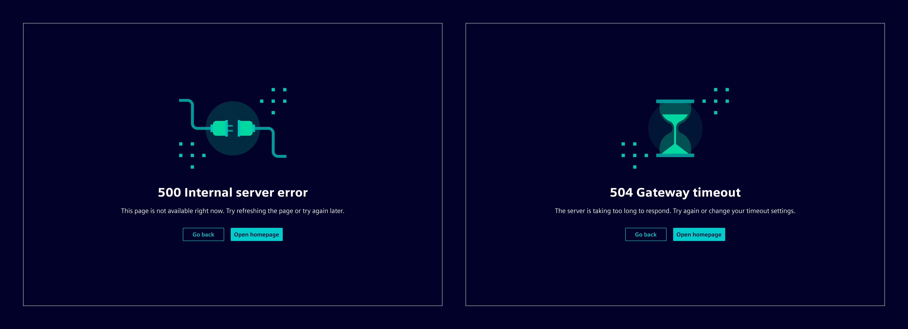
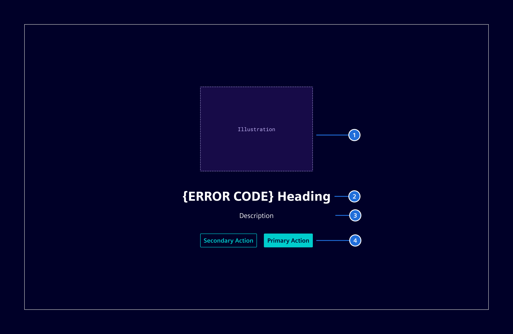

# HTTP error pages

**HTTP error pages** explain why a request failed and guide users to a meaningful next step.

## Usage ---

HTTP error pages are full-page messages for request failures such as missing pages,
missing permissions, or server errors.

They are built with the [info page](../components/pages/info-page.md) component
as the base layout.

### When to use

- When navigation to a page fails because the requested resource is unavailable or blocked.
- When an application route represents a standalone error state, such as `401`, `403`, `404`, or `500`.

### Best practices

- Do not use them for transient background failures that can be communicated with
  [inline notifications](../components/status-notifications/inline-notification.md) or
  [toast notifications](../components/status-notifications/toast-notification.md).
- Codes can be remapped deliberately (on server side) when necessary, for example showing a
  404 page for a 403 error to avoid revealing that a restricted resource exists.

## Design ---

### Anatomy

1. **Illustration**
2. **Heading**: State the problem in a short, human-readable way with the error code.
3. **Description (optional)**: Briefly explain what happened or what could have caused it.
4. **Actions (optional)**: Offer a relevant escape path or recovery action.

### Visual guidance

There are five predefined illustrations mapped to different error codes.

| Illustration  | Use for                                   | Meaning                                                                     | Mapped codes                                                                                         |
| ------------- | ----------------------------------------- | --------------------------------------------------------------------------- | ---------------------------------------------------------------------------------------------------- |
| **Document**  | Request errors and unsupported requests   | The request cannot be processed in its current form.                        | `400`, `405`, `406`, `409`, `411` `412`, `413`, `414`, `415`, `417` `421`, `422`, `428`, `431` |
| **Lock**      | Authentication and access restrictions    | The user must sign in, does not have access, or the resource is restricted. | `401`, `403`, `407` `423`, `451`, `511`                                                           |
| **Magnifier** | Missing resources                         | The page or resource cannot be found or is no longer available.             | `404`, `410`                                                                                         |
| **Hourglass** | Timeout and temporary availability issues | The service is busy, delayed, or temporarily unavailable.                   | `408`, `425`, `429`, `504`                                                                           |
| **Plug**      | Server and backend failures               | The application or an upstream service failed unexpectedly.                 | `500`, `501`, `502`, `503` `505`, `506`, `507`, `508`, `510`                                      |

- Dedicated [UX writing copy](../fundamentals/ux-text-style-guide/error-pages.md) already exists for common error types.
- For less common errors that do not have dedicated UX writing copy, use the error code together
  with the official HTTP status title from the
  [IANA HTTP status code registry](https://www.iana.org/assignments/http-status-codes/http-status-codes.xhtml).

## Code ---
