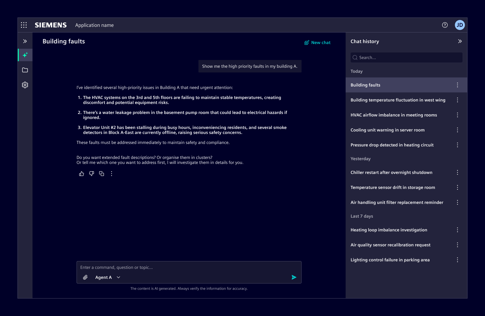
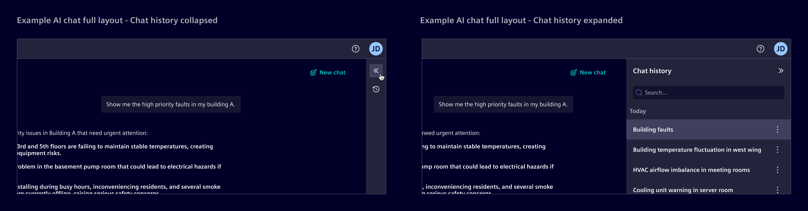
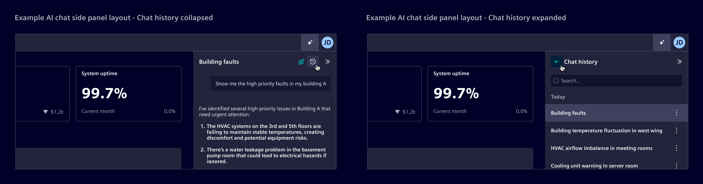
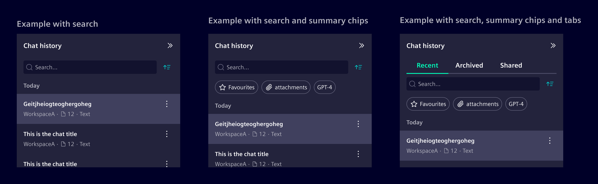

# AI chat history

The **chat history** displays previous conversations between the user and the AI.

## Usage ---

Chat history helps users maintain context, revisit previous interactions, and continue
conversations across longer tasks.

This pattern is a combination of list item and the [side panel](../../components/layout-navigation/side-panel.md).

### Best practices

- Refer to [conversational design](https://ix.siemens.io/docs/guidelines/conversational-design/getting-started) guidelines.
- Use auto-generated or user-defined titles for chat conversations,
  as they provide a stable reference for each conversation.
- A preview may replace the title when conversations are short-lived or primarily accessed in recent context.

## Design ---

### Elements

> 1\. Title, 2. Metadata (optional), 3. Actions (optional)

### Actions

Actions allow users to manage chat conversations (for example rename, move, archive, delete, or export).

- If a chat history item has only one action, display it directly and associate it clearly with the item.
- If there are multiple actions, group them in an overflow menu.

### Metadata

It is typically displayed as text-based informational attributes.
Icons may be added when they improve recognition.
[Badges](../../components/status-notifications/badges.md) can be used for explicit
states or applied labels that should stand out visually.

Each metadata element can be replaced by a [link](../../components/buttons-menus/links.md),
styled with `text-secondary`.

If space remains insufficient due to a high number of metadata elements, consider prioritizing
the most relevant attributes and progressively removing secondary ones to preserve clarity.

### Layouts

#### Full page layout

When the AI chat is integrated as a full page layout, 
the chat history is displayed in a collapsible side panel.

#### Side panel layout

If AI chat is already handled in a side panel, chat history is accessed within the same panel.
Selecting a conversation replaces the current chat content inside that panel.

#### Chat organization

Conversations may be organized into temporal sections (e.g., Today, Yesterday, Last 7 days, Last 30 days, Older).

Additional grouping methods can be used when further organization is needed.

- Use [tabs](../../components/layout-navigation/tabs.md) for broad, mutually exclusive
  categories to help users focus on one category at a time.
- Use [summary chips](../../components/status-notifications/summary-chip.md) to provide a
  quick overview of grouped conversations

If additional refinement is needed, consider using filters.

## Code ---

