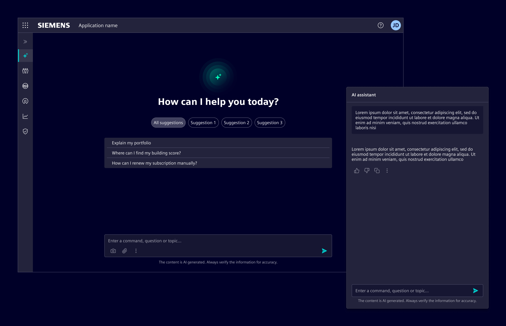
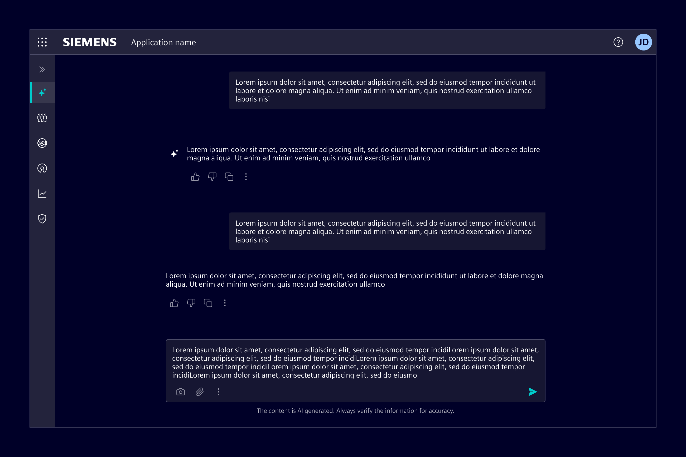
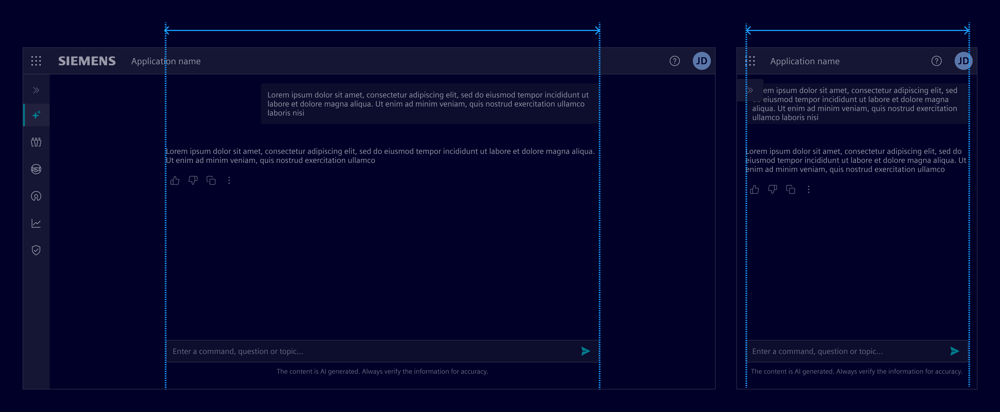
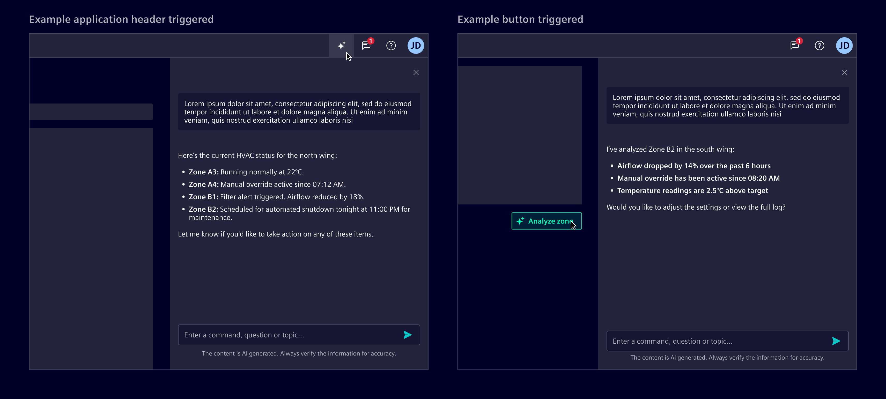
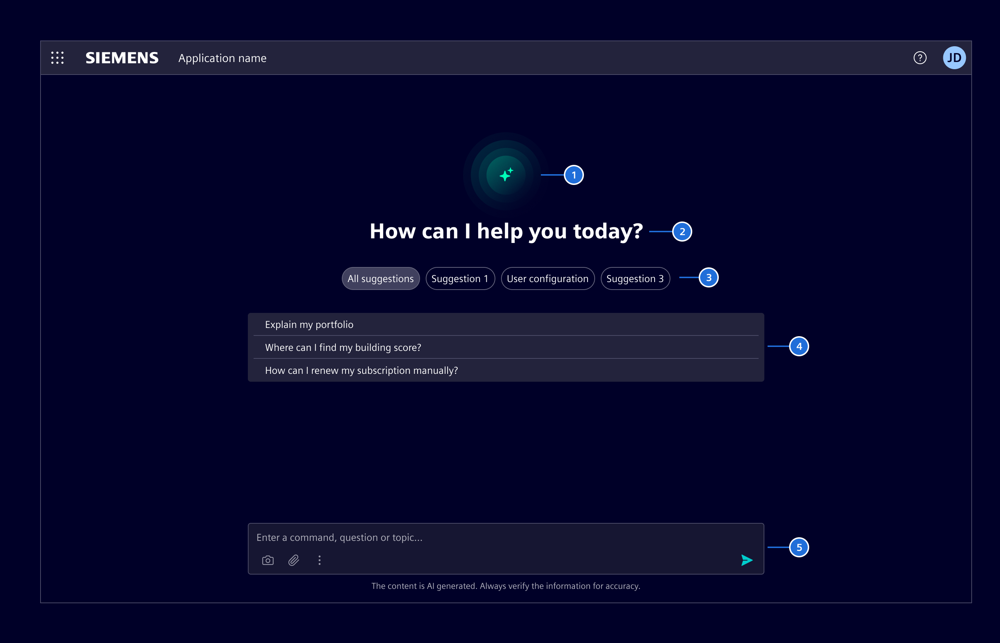
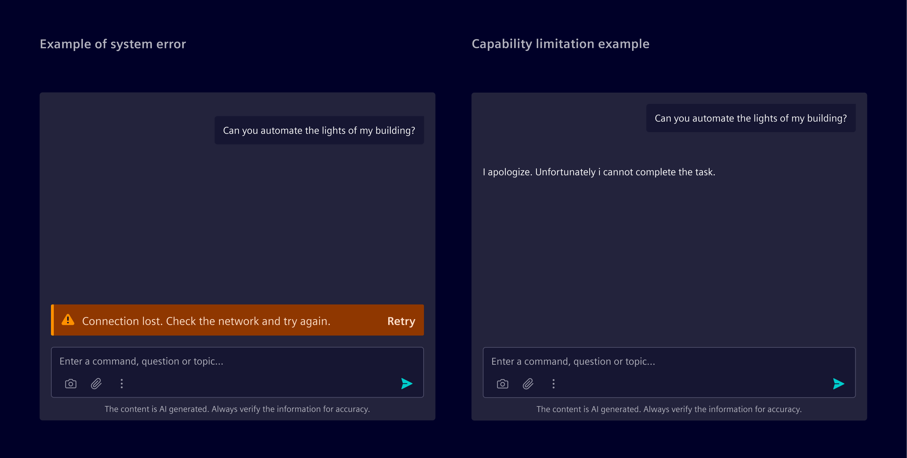

# AI chat

AI chat enables users to interact with the product using natural language.
It supports tasks that benefit from suggestions, step-by-step help, or open-ended input.

## Usage ---

AI chat is useful when users describe tasks in their own words and expect structured responses or guidance.

### When to use

- For tasks that are complex, open-ended, or benefit from iteration.
- When natural language input improves user experience.
- When users need help without navigating multiple UI elements.

### Best practices

- Refer to [conversational design](https://ix.siemens.io/docs/guidelines/conversational-design/getting-started) guidelines.
- Always allow users to review, edit, or retry.
- Keep the conversation focused, avoid unnecessary messages.
- Place the AI in a clearly defined visual space.
- Output can be styled as needed using the [typography system](../../fundamentals/typography.md).

## Design ---

### Elements

1. [Chat input](../../components/chat-messages/chat-input.md)
2. [AI message](../../components/chat-messages/ai-message.md)
3. [User message](../../components/chat-messages/user-message.md)

### Layouts

#### Full page layout

Use it when AI is the main feature.
Typically triggered from a dedicated navigation item, this layout makes AI functionality easily accessible as a primary experience.

The chat content area has a maximum width of 720px.
It scales fluidly on smaller screens and remains centered on larger ones to maintain readability and visual balance.

#### Side panel layout

Use it when AI supports tasks within the current view.
In this case, the AI appears as an on-demand assistant without disrupting the workflow in a
[side panel](../../components/layout-navigation/side-panel.md).

- When the AI feature is globally accessible, the side panel can be triggered from the
[application header](../../components/layout-navigation/application-header.md), ensuring consistent entry across all screens.
- For contextual use, place the trigger near the related feature or content.

### Initial screen

Before the first message, show an initial screen to set expectations and explain what the AI can do.
As soon as the user prompts a message, the initial screen should dissapear.

1. AI icon
1. Salutation: A brief, welcoming message that sets a conversational tone.
1. Prompt categories (optional): When suggestions exceed a manageable number, group them by topic or function using
  [summary chips](../../components/status-notifications/summary-chip.md)
1. Prompt suggestions (optional): Curated prompts or example questions that reflect common or relevant actions.
1. [Chat input](../../components/chat-messages/chat-input.md)

### Errors and AI limitations

System errors, such as timeouts or backend crashes, occur outside the AI’s reasoning.
These should be represented with [inline notifications](../../components/status-notifications/inline-notification.md),
placed above the input prompt.

When the AI cannot complete a task due to a known limitation, it should respond within the conversation.
These are not treated as errors and do not require a separate notification.

## Code ---

The **si-chat-container** component provides a complete AI chat interface, it should be inserted into a layout with fixed height, if no fixed height is provided, please set a height in pixels.

<si-docs-component example="si-ai-chat/si-chat-container"></si-docs-component>

<si-docs-api component="SiChatContainerComponent"></si-docs-api>

<si-docs-types></si-docs-types>
